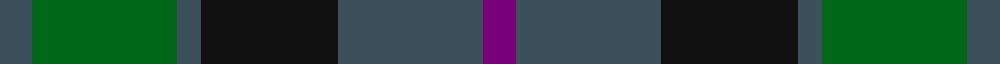

In pattern [BBKBGB](/stripes/bbkbgb/).

This was sourced from tartans-authority.  It is a [6 stripe tartan](/stripes/stripes6/).

Original link http://www.tartansauthority.com/tartan-ferret/display/2510/

## Thread count
N/8 G36 N6 K34 N36 P/8

## Palette
Each colour and its ΔE from the base-6 reference it is a variant of.

| Colour | Shade | Base | ΔE (OKLab) |
|---|---|---|---|
| G | <code style="background-color:#006818;">#006818</code> `#006818` | G <code style="background-color:#006100;">#006100</code> | 0.02 |
| K | <code style="background-color:#101010;">#101010</code> `#101010` | K <code style="background-color:#000000;">#000000</code> | 0.17 |
| N | <code style="background-color:#3C505C;">#3C505C</code> `#3C505C` | B <code style="background-color:#2A418A;">#2A418A</code> | 0.10 |
| P | <code style="background-color:#780078;">#780078</code> `#780078` | B <code style="background-color:#2A418A;">#2A418A</code> | 0.17 |

# Sample pattern

## Nearest tartans

The nearest existing variants by ΔTartan distance.

1. [Scottish Airports](/setts/s6/n4g18n3k17n18p4~x2/) — ΔT 0.40
1. [Murray #3](/setts/s6/db2k2db12k8dg11r2~x2/) — ΔT 0.79
1. [Ferguson of Balquhidder #3](/setts/s6/k3dg12k12r2db12k3~x2/) — ΔT 0.81
1. [Tennant (Yules)](/setts/s7/r1dy7g7db7g7db7r1~x8/) — ΔT 0.92
1. [MacKay (Bonner)](/setts/s6/dg1db5dg1k5dg6ly1~x2/) — ΔT 1.03
1. [MacCallum #2](/setts/s7/k6dg6r1dg6k6db6k1~x2/) — ΔT 1.04
1. [Harbour Town Hilton Head, The](/setts/s6/dt3g11dt3dr11dt18lo3~x2/) — ΔT 1.05
1. [Thompson/Thomson/MacTavish Hunting](/setts/s6/t4dy28dg6t12k12t3~x2/) — ΔT 1.12
1. [Strange of Balcaskie (Clan)](/setts/s7/g32dy7g7dy16db32ly3dy8~x2/) — ΔT 1.14
1. [MacKay Clan Tartan Tartan Number: 703. Earliest known date: 1816 Wilson's of Bannockburn (1819) record the same sett with blue changed to purple. Logan calls the colour 'corbeau' which is in fact a dark shade of green. The pattern shows a marked similarity to the Gunn tartan in all but colour, suggesting a territorial origin for both. Recently historians of Scottish dress have tended to stress the geographical sources, rather than the clan associations of the earliest Highland tartans. A sample was signed and sealed by the Chief for Highland Society of London in 1816. See products available Copyright © Blair Urquhart, Comrie, 2015](/setts/s6/k3g14k14g2dt14g3~x2/) — ΔT 1.14

## Neighbour map

Every grey dot is one of 14299 variants placed by the first two principal components of the ΔTartan feature space (44% of its variance). Red is this tartan; blue dots are its nearest — click one to open its page.

<svg viewBox="0 0 640 380" role="img" style="max-width:100%;height:auto;border:1px solid #e0e0e0;border-radius:4px;display:block" xmlns="http://www.w3.org/2000/svg"><image href="/nn/cloud.v1.png" width="640" height="380"/><a href="/setts/s6/n4g18n3k17n18p4~x2/"><circle cx="211.4" cy="275.0" r="4" fill="#3465a4"><title>Scottish Airports</title></circle></a><a href="/setts/s6/db2k2db12k8dg11r2~x2/"><circle cx="217.4" cy="272.4" r="4" fill="#3465a4"><title>Murray #3</title></circle></a><a href="/setts/s6/k3dg12k12r2db12k3~x2/"><circle cx="225.1" cy="280.0" r="4" fill="#3465a4"><title>Ferguson of Balquhidder #3</title></circle></a><a href="/setts/s7/r1dy7g7db7g7db7r1~x8/"><circle cx="208.3" cy="280.5" r="4" fill="#3465a4"><title>Tennant (Yules)</title></circle></a><a href="/setts/s6/dg1db5dg1k5dg6ly1~x2/"><circle cx="212.9" cy="265.6" r="4" fill="#3465a4"><title>MacKay (Bonner)</title></circle></a><a href="/setts/s7/k6dg6r1dg6k6db6k1~x2/"><circle cx="220.8" cy="296.4" r="4" fill="#3465a4"><title>MacCallum #2</title></circle></a><a href="/setts/s6/dt3g11dt3dr11dt18lo3~x2/"><circle cx="278.0" cy="277.7" r="4" fill="#3465a4"><title>Harbour Town Hilton Head, The</title></circle></a><a href="/setts/s6/t4dy28dg6t12k12t3~x2/"><circle cx="249.9" cy="241.5" r="4" fill="#3465a4"><title>Thompson/Thomson/MacTavish Hunting</title></circle></a><a href="/setts/s7/g32dy7g7dy16db32ly3dy8~x2/"><circle cx="243.8" cy="240.5" r="4" fill="#3465a4"><title>Strange of Balcaskie (Clan)</title></circle></a><a href="/setts/s6/k3g14k14g2dt14g3~x2/"><circle cx="250.6" cy="291.6" r="4" fill="#3465a4"><title>MacKay Clan Tartan Tartan Number: 703. Earliest known date: 1816 Wilson's of Bannockburn (1819) record the same sett with blue changed to purple. Logan calls the colour 'corbeau' which is in fact a dark shade of green. The pattern shows a marked similarity to the Gunn tartan in all but colour, suggesting a territorial origin for both. Recently historians of Scottish dress have tended to stress the geographical sources, rather than the clan associations of the earliest Highland tartans. A sample was signed and sealed by the Chief for Highland Society of London in 1816. See products available Copyright © Blair Urquhart, Comrie, 2015</title></circle></a><circle cx="222.8" cy="280.7" r="5" fill="#c00000"/></svg>

ID: /setts/s6/dp4n18k17n3g18n4~x2/
