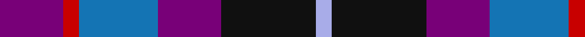
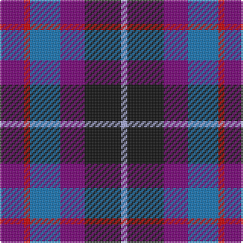

In pattern [BRBBKW](/stripes/brbbkw/).

This was sourced from tartans-authority.  It is a [6 stripe tartan](/stripes/stripes6/).

Original link http://www.tartansauthority.com/tartan-ferret/display/3665/

## Attestations

This cloth appears in 2 source records; the oldest owns this page.

- pre 2002 — Benreay Medical Centre (Corporate) (tartans-authority, [record](http://www.tartansauthority.com/tartan-ferret/display/3665/))
- undated — Benreay Medical Centre (register-of-tartans, [record](https://www.tartanregister.gov.uk/tartanDetails.aspx?ref=5166))

## Register references

External register numbers recorded for this tartan.

- Scottish Register of Tartans: [5166](https://www.tartanregister.gov.uk/tartanDetails.aspx?ref=5166)
- Scottish Tartans Authority (ITI): 3665

## Thread count
P/16 R4 B20 P16 K24 LP/4

## Palette
Each colour and its ΔE from the base-6 reference it is a variant of.

| Colour | Shade | Base | ΔE (OKLab) |
|---|---|---|---|
| B | <code style="background-color:#1474B4;">#1474B4</code> `#1474B4` | B <code style="background-color:#2A418A;">#2A418A</code> | 0.15 |
| K | <code style="background-color:#101010;">#101010</code> `#101010` | K <code style="background-color:#000000;">#000000</code> | 0.17 |
| LP | <code style="background-color:#A8ACE8;">#A8ACE8</code> `#A8ACE8` | W <code style="background-color:#F7F7F7;">#F7F7F7</code> | 0.23 |
| P | <code style="background-color:#780078;">#780078</code> `#780078` | B <code style="background-color:#2A418A;">#2A418A</code> | 0.17 |
| R | <code style="background-color:#C80000;">#C80000</code> `#C80000` | R <code style="background-color:#CC0000;">#CC0000</code> | 0.01 |

# Sample pattern

## Nearest tartans

The nearest existing variants by ΔTartan distance.

1. [Kintore (Fashion)](/setts/s6/dp2r1dp5k4db5lb1~x4/) — ΔT 1.11
1. [Fife (McGill)](/setts/s6/db31t4db6k19r20ly4~x2/) — ΔT 1.27
1. [Pownall (2015)](/setts/s5/dp30y7w6db30ly8~x2/) — ΔT 1.27
1. [Williamson (Personal)](/setts/s6/r7db20r4k18o20dp5~x2/) — ΔT 1.34
1. [Blue](/setts/s7/r2db11r3db11t12db10w2~x2/) — ΔT 1.35
1. [Fox-Eves Wedding](/setts/s6/r9dt6db13dt21y18w4~x2/) — ΔT 1.41
1. [Pownall (2015)](/setts/s5/dp30lo7w6db30ly8~x2/) — ΔT 1.41
1. [Soroptimist International Corporate Tartan Tartan Number: 3097. Earliest known date: 2002 Non-repeating sett. Launched at the Federation of Great Britain & Ireland Conference in 2002 during the Presidency of Lynn Dunning. The design and the colours have been chosen carefully to symbolise the purple heather of the mountains and hills of Scotland together with the blue and gold of Soroptimist International woven together with the white hand of Peace. See products available Copyright © Blair Urquhart, Comrie, 2015](/setts/s6/w2k1dp10k6db12ly2~x2/) — ΔT 1.49
1. [Bryson (2000)](/setts/s5/g5dp2db5dp10ly2~x2/) — ΔT 1.50
1. [Isle of Gigha (District)](/setts/s7/lo2db4k1db4m4lo4db1~x8/) — ΔT 1.52

## Neighbour map

Every grey dot is one of 14299 variants placed by the first two principal components of the ΔTartan feature space (44% of its variance). Red is this tartan; blue dots are its nearest — click one to open its page.

<svg viewBox="0 0 640 380" role="img" style="max-width:100%;height:auto;border:1px solid #e0e0e0;border-radius:4px;display:block" xmlns="http://www.w3.org/2000/svg"><image href="/nn/cloud.v1.png" width="640" height="380"/><a href="/setts/s6/dp2r1dp5k4db5lb1~x4/"><circle cx="165.1" cy="256.6" r="4" fill="#3465a4"><title>Kintore (Fashion)</title></circle></a><a href="/setts/s6/db31t4db6k19r20ly4~x2/"><circle cx="188.6" cy="209.0" r="4" fill="#3465a4"><title>Fife (McGill)</title></circle></a><a href="/setts/s5/dp30y7w6db30ly8~x2/"><circle cx="136.5" cy="223.6" r="4" fill="#3465a4"><title>Pownall (2015)</title></circle></a><a href="/setts/s6/r7db20r4k18o20dp5~x2/"><circle cx="79.5" cy="239.7" r="4" fill="#3465a4"><title>Williamson (Personal)</title></circle></a><a href="/setts/s7/r2db11r3db11t12db10w2~x2/"><circle cx="163.1" cy="237.8" r="4" fill="#3465a4"><title>Blue</title></circle></a><a href="/setts/s6/r9dt6db13dt21y18w4~x2/"><circle cx="123.0" cy="254.4" r="4" fill="#3465a4"><title>Fox-Eves Wedding</title></circle></a><a href="/setts/s5/dp30lo7w6db30ly8~x2/"><circle cx="134.8" cy="222.5" r="4" fill="#3465a4"><title>Pownall (2015)</title></circle></a><a href="/setts/s6/w2k1dp10k6db12ly2~x2/"><circle cx="170.2" cy="188.9" r="4" fill="#3465a4"><title>Soroptimist International Corporate Tartan Tartan Number: 3097. Earliest known date: 2002 Non-repeating sett. Launched at the Federation of Great Britain &amp; Ireland Conference in 2002 during the Presidency of Lynn Dunning. The design and the colours have been chosen carefully to symbolise the purple heather of the mountains and hills of Scotland together with the blue and gold of Soroptimist International woven together with the white hand of Peace. See products available Copyright © Blair Urquhart, Comrie, 2015</title></circle></a><a href="/setts/s5/g5dp2db5dp10ly2~x2/"><circle cx="218.3" cy="261.6" r="4" fill="#3465a4"><title>Bryson (2000)</title></circle></a><a href="/setts/s7/lo2db4k1db4m4lo4db1~x8/"><circle cx="115.5" cy="249.7" r="4" fill="#3465a4"><title>Isle of Gigha (District)</title></circle></a><circle cx="142.6" cy="240.9" r="5" fill="#c00000"/></svg>

ID: /setts/s6/dp4r1b5dp4k6lb1~x4/
