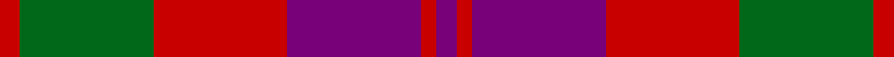

**Bands:** [RGRBRB](/stripes/rgrbrb/) · **Stripes:** [R G R DP R DP](/stripes/stripes6/) R G R DP R DP

This was sourced from house-of-tartan.  It is a [6 band tartan](/bands/bands6/).

Original link http://www.house-of-tartan.scotland.net/house/TartanViewjs.asp?colr=Def&tnam=463

## Also known as

This cloth is also recorded under:

- Unidentified #21
- Unidentified 16

## Thread count
R/8 G52 R52 P52 R6 P/8

## Palette
Each colour and its ΔE from the base-6 reference it is a variant of.

| Colour | Shade | Base | ΔE (OKLab) |
|---|---|---|---|
| G | <code style="background-color:#006818;">#006818</code> `#006818` | G <code style="background-color:#006100;">#006100</code> | 0.02 |
| P | <code style="background-color:#780078;">#780078</code> `#780078` | B <code style="background-color:#2A418A;">#2A418A</code> | 0.17 |
| R | <code style="background-color:#C80000;">#C80000</code> `#C80000` | R <code style="background-color:#CC0000;">#CC0000</code> | 0.01 |

# Sample pattern

## Nearest tartans

The nearest existing variants by ΔTartan distance.

1. [Unidentified 16](/setts/s6/r4g26r26p26r3p4~x2/) — ΔT 0.37
1. [Unidentified #21](/setts/s6/dp4r3dp26r26dg26r4~x2/) — ΔT 0.80
1. [MacNab (Macgregor - Hastie)](/setts/s6/dg3dp3dg19dp18r19dp3~x2/) — ΔT 0.84
1. [Scottish Netball Association](/setts/s7/p3r14g2p10r2g14p3~x2/) — ΔT 0.86
1. [Scottish Netball (1986) (Corporate)](/setts/s7/dp3g14m2dp10g2m14dp3~x2/) — ΔT 1.09
1. [MacFadyan (MacGregor Hastie)](/setts/s7/db3r25db17r5g22r9db3~x2/) — ΔT 1.10
1. [MacNab #2](/setts/s6/g1m1g7m4r7m1~x4/) — ΔT 1.20
1. [Moray of Abercairney #2](/setts/s5/r8r1dg4r1db4~x2/) — ΔT 1.21
1. [MacNab 1](/setts/s6/dp3r19dp18g19dp3g3~x2/) — ΔT 1.23
1. [Thompson/Thomson/MacTavish (Bonner)](/setts/s6/db4r30k6db13k13db3~x2/) — ΔT 1.31

## Neighbour map

Every grey dot is one of 14299 variants placed by the first two principal components of the ΔTartan feature space (44% of its variance). Red is this tartan; blue dots are its nearest — click one to open its page.

<svg viewBox="0 0 640 380" role="img" style="max-width:100%;height:auto;border:1px solid #e0e0e0;border-radius:4px;display:block" xmlns="http://www.w3.org/2000/svg"><image href="/nn/cloud.v1.png" width="640" height="380"/><a href="/setts/s6/r4g26r26p26r3p4~x2/"><circle cx="240.3" cy="231.3" r="4" fill="#3465a4"><title>Unidentified 16</title></circle></a><a href="/setts/s6/dp4r3dp26r26dg26r4~x2/"><circle cx="232.6" cy="229.3" r="4" fill="#3465a4"><title>Unidentified #21</title></circle></a><a href="/setts/s6/dg3dp3dg19dp18r19dp3~x2/"><circle cx="226.3" cy="251.0" r="4" fill="#3465a4"><title>MacNab (Macgregor - Hastie)</title></circle></a><a href="/setts/s7/p3r14g2p10r2g14p3~x2/"><circle cx="220.1" cy="240.3" r="4" fill="#3465a4"><title>Scottish Netball Association</title></circle></a><a href="/setts/s7/dp3g14m2dp10g2m14dp3~x2/"><circle cx="239.7" cy="250.0" r="4" fill="#3465a4"><title>Scottish Netball (1986) (Corporate)</title></circle></a><a href="/setts/s7/db3r25db17r5g22r9db3~x2/"><circle cx="266.1" cy="233.3" r="4" fill="#3465a4"><title>MacFadyan (MacGregor Hastie)</title></circle></a><a href="/setts/s6/g1m1g7m4r7m1~x4/"><circle cx="261.6" cy="251.4" r="4" fill="#3465a4"><title>MacNab #2</title></circle></a><a href="/setts/s5/r8r1dg4r1db4~x2/"><circle cx="239.8" cy="231.3" r="4" fill="#3465a4"><title>Moray of Abercairney #2</title></circle></a><a href="/setts/s6/dp3r19dp18g19dp3g3~x2/"><circle cx="210.6" cy="245.5" r="4" fill="#3465a4"><title>MacNab 1</title></circle></a><a href="/setts/s6/db4r30k6db13k13db3~x2/"><circle cx="255.9" cy="216.2" r="4" fill="#3465a4"><title>Thompson/Thomson/MacTavish (Bonner)</title></circle></a><circle cx="249.6" cy="235.9" r="5" fill="#c00000"/></svg>

ID: /setts/s6/dp4r3dp26r26g26r4~x2/
