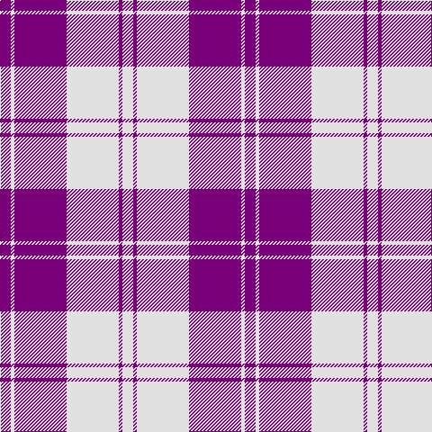

In pattern [BWBWBW](/stripes/bwbwbw/).

This was sourced from house-of-tartan.  It is a [6 stripe tartan](/stripes/stripes6/).

Original link http://www.house-of-tartan.scotland.net/house/TartanViewjs.asp?colr=Def&tnam=6534

## Thread count
P/12 LN4 P58 LN58 P4 LN/12

## Palette
Each colour and the base-6 reference it is a variant of.

| Colour | Shade | Base |
|---|---|---|
| LN | <code style="background-color:#E0E0E0;">#E0E0E0</code> `oklch(90.7% 0.000 89.9)` <small>#E0E0E0</small> | W <code style="background-color:#F7F7F7;">#F7F7F7</code> |
| P | <code style="background-color:#780078;">#780078</code> `oklch(40.2% 0.185 328.4)` <small>#780078</small> | B <code style="background-color:#2A418A;">#2A418A</code> |

# Sample pattern

## Nearest tartans

The nearest existing variants by ΔTartan distance.

1. [Erskine Purple (Dance)](/setts/s6/dp2w1dp9w9dp1w2~x6/) — ΔT 0.85
1. [MacLachlan (Chief's Dress) Blue](/setts/s8/b6ly2b21ly2b6ly24b2ly6~x2/) — ΔT 1.36
1. [Erskine Dress Burgandy Clan Tartan Tartan Number: 1972. Earliest known date: 1971 A popular Dress tartan for Scottish Highland Dancing. See products available Copyright © Blair Urquhart, Comrie, 2015](/setts/s6/r5w2r25w25r2w5~x2/) — ΔT 1.39
1. [Erskine, Burgundy (Dance)](/setts/s6/r6w2r29w29r2w6~x2/) — ΔT 1.46
1. [Erskine Blue (Dance)](/setts/s6/db6w2db29w29db2w6~x2/) — ΔT 1.64
1. [Buchanan #5](/setts/s6/k2w28r13w2r13w2~x2/) — ΔT 1.76
1. [Glen App](/setts/s5/m13w3m1k3w1~x6/) — ΔT 1.77
1. [Dunlop, dress](/setts/s8/w3db1w30db1p28w1p1w3~x2/) — ΔT 1.90
1. [Ailsa, Navy (Dance)](/setts/s6/db8w3db28w32k3w4~x2/) — ΔT 1.91
1. [Buchanan Dress Blue (Dance)](/setts/s6/w5db16w5db16w33r3~x2/) — ΔT 1.93

## Neighbour map

Every grey dot is one of 14299 variants placed by the first two principal components of the ΔTartan feature space (44% of its variance). Red is this tartan; blue dots are its nearest — click one to open its page.

<svg viewBox="0 0 640 380" role="img" style="max-width:100%;height:auto;border:1px solid #e0e0e0;border-radius:4px;display:block" xmlns="http://www.w3.org/2000/svg"><image href="/nn/cloud.v1.png" width="640" height="380"/><a href="/setts/s6/dp2w1dp9w9dp1w2~x6/"><circle cx="309.8" cy="203.3" r="4" fill="#3465a4"><title>Erskine Purple (Dance)</title></circle></a><a href="/setts/s8/b6ly2b21ly2b6ly24b2ly6~x2/"><circle cx="326.3" cy="188.7" r="4" fill="#3465a4"><title>MacLachlan (Chief's Dress) Blue</title></circle></a><a href="/setts/s6/r5w2r25w25r2w5~x2/"><circle cx="341.3" cy="192.0" r="4" fill="#3465a4"><title>Erskine Dress Burgandy Clan Tartan Tartan Number: 1972. Earliest known date: 1971 A popular Dress tartan for Scottish Highland Dancing. See products available Copyright © Blair Urquhart, Comrie, 2015</title></circle></a><a href="/setts/s6/r6w2r29w29r2w6~x2/"><circle cx="332.5" cy="178.6" r="4" fill="#3465a4"><title>Erskine, Burgundy (Dance)</title></circle></a><a href="/setts/s6/db6w2db29w29db2w6~x2/"><circle cx="320.1" cy="190.1" r="4" fill="#3465a4"><title>Erskine Blue (Dance)</title></circle></a><a href="/setts/s6/k2w28r13w2r13w2~x2/"><circle cx="322.9" cy="170.6" r="4" fill="#3465a4"><title>Buchanan #5</title></circle></a><a href="/setts/s5/m13w3m1k3w1~x6/"><circle cx="392.1" cy="184.9" r="4" fill="#3465a4"><title>Glen App</title></circle></a><a href="/setts/s8/w3db1w30db1p28w1p1w3~x2/"><circle cx="376.5" cy="107.4" r="4" fill="#3465a4"><title>Dunlop, dress</title></circle></a><a href="/setts/s6/db8w3db28w32k3w4~x2/"><circle cx="279.3" cy="189.9" r="4" fill="#3465a4"><title>Ailsa, Navy (Dance)</title></circle></a><a href="/setts/s6/w5db16w5db16w33r3~x2/"><circle cx="283.7" cy="194.6" r="4" fill="#3465a4"><title>Buchanan Dress Blue (Dance)</title></circle></a><circle cx="341.5" cy="186.5" r="5" fill="#c00000"/></svg>

ID: /setts/s6/dp6w2dp29w29dp2w6~x2/
