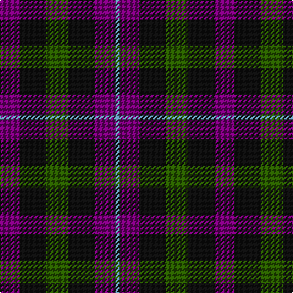

In pattern [BBKGKB](/stripes/bbkgkb/).

This was sourced from register-of-tartans.  It is a [6 stripe tartan](/stripes/stripes6/).

Original link https://www.tartanregister.gov.uk/tartanDetails.aspx?ref=4756

## Register references

External register numbers recorded for this tartan.

- Scottish Register of Tartans: [4756](https://www.tartanregister.gov.uk/tartanDetails.aspx?ref=4756)
- Scottish Tartans Authority (ITI): 1896
- Scottish Tartans World Register: 1896

## Thread count
P/16 K22 G18 K22 P16 B/4

## Palette
Each colour and its ΔE from the base-6 reference it is a variant of.

| Colour | Shade | Base | ΔE (OKLab) |
|---|---|---|---|
| B | <code style="background-color:#5C8CA8;">#5C8CA8</code> `#5C8CA8` | B <code style="background-color:#2A418A;">#2A418A</code> | 0.23 |
| G | <code style="background-color:#285800;">#285800</code> `#285800` | G <code style="background-color:#006100;">#006100</code> | 0.03 |
| K | <code style="background-color:#101010;">#101010</code> `#101010` | K <code style="background-color:#000000;">#000000</code> | 0.17 |
| P | <code style="background-color:#780078;">#780078</code> `#780078` | B <code style="background-color:#2A418A;">#2A418A</code> | 0.17 |

# Sample pattern

## Nearest tartans

The nearest existing variants by ΔTartan distance.

1. [Unidentified No 60](/setts/s4/dp6k5dg5r1~x2/) — ΔT 1.34
1. [Wilson's No 97](/setts/s7/k11dg12k2dg12k12dp12w3~x2/) — ΔT 1.36
1. [Abercrombie (Wilsons No 2/64)](/setts/s7/k6dg6ly1dg6k6dp6k1~x4/) — ΔT 1.36
1. [Wilson's No.173](/setts/s8/dg6dp3k3dp3k3dp3dg6k2~x2/) — ΔT 1.37
1. [Norwich Collection No. 60](/setts/s4/dp8k11g9r2~x2/) — ΔT 1.41
1. [Austin (Wilson's No 137)](/setts/s5/dp3k3dp3dg6r2~x2/) — ΔT 1.41
1. [Tulsa, City of](/setts/s6/dg14db8dg14r14k3r14~x2/) — ΔT 1.50
1. [Wilson's No.137](/setts/s8/g6dp3k3dp3k3dp3g6r2~x2/) — ΔT 1.54
1. [Scott, Sir Walter](/setts/s10/dp9k11t2g9k3g9t2k11dp9k3~x2/) — ΔT 1.58
1. [Wilson's No.228](/setts/s4/g9k11dp8t2~x2/) — ΔT 1.60

## Neighbour map

Every grey dot is one of 14299 variants placed by the first two principal components of the ΔTartan feature space (44% of its variance). Red is this tartan; blue dots are its nearest — click one to open its page.

<svg viewBox="0 0 640 380" role="img" style="max-width:100%;height:auto;border:1px solid #e0e0e0;border-radius:4px;display:block" xmlns="http://www.w3.org/2000/svg"><image href="/nn/cloud.v1.png" width="640" height="380"/><a href="/setts/s4/dp6k5dg5r1~x2/"><circle cx="170.6" cy="301.2" r="4" fill="#3465a4"><title>Unidentified No 60</title></circle></a><a href="/setts/s7/k11dg12k2dg12k12dp12w3~x2/"><circle cx="165.1" cy="274.7" r="4" fill="#3465a4"><title>Wilson's No 97</title></circle></a><a href="/setts/s7/k6dg6ly1dg6k6dp6k1~x4/"><circle cx="192.7" cy="278.7" r="4" fill="#3465a4"><title>Abercrombie (Wilsons No 2/64)</title></circle></a><a href="/setts/s8/dg6dp3k3dp3k3dp3dg6k2~x2/"><circle cx="136.0" cy="300.3" r="4" fill="#3465a4"><title>Wilson's No.173</title></circle></a><a href="/setts/s4/dp8k11g9r2~x2/"><circle cx="157.4" cy="296.1" r="4" fill="#3465a4"><title>Norwich Collection No. 60</title></circle></a><a href="/setts/s5/dp3k3dp3dg6r2~x2/"><circle cx="122.6" cy="315.6" r="4" fill="#3465a4"><title>Austin (Wilson's No 137)</title></circle></a><a href="/setts/s6/dg14db8dg14r14k3r14~x2/"><circle cx="182.4" cy="290.0" r="4" fill="#3465a4"><title>Tulsa, City of</title></circle></a><a href="/setts/s8/g6dp3k3dp3k3dp3g6r2~x2/"><circle cx="131.9" cy="295.3" r="4" fill="#3465a4"><title>Wilson's No.137</title></circle></a><a href="/setts/s10/dp9k11t2g9k3g9t2k11dp9k3~x2/"><circle cx="167.0" cy="250.4" r="4" fill="#3465a4"><title>Scott, Sir Walter</title></circle></a><a href="/setts/s4/g9k11dp8t2~x2/"><circle cx="167.6" cy="308.9" r="4" fill="#3465a4"><title>Wilson's No.228</title></circle></a><circle cx="194.2" cy="298.3" r="5" fill="#c00000"/></svg>

ID: /setts/s6/dp8k11dg9k11dp8t2~x2/
