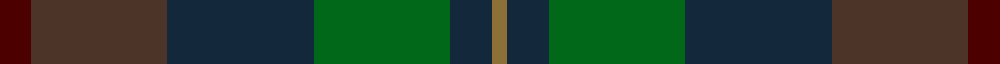

In pattern [BBBGBG](/stripes/bbbgbg/).

This was sourced from tartans-authority.  It is a [6 stripe tartan](/stripes/stripes6/).

Original link http://www.tartansauthority.com/tartan-ferret/display/5219/

## Thread count
DR/12 T52 DN56 G52 DN16 LT/6

## Palette
Each colour and the base-6 reference it is a variant of.

| Colour | Shade | Base |
|---|---|---|
| DN | <code style="background-color:#14283C;">#14283C</code> `oklch(27.1% 0.046 249.9)` <small>#14283C</small> | B <code style="background-color:#2A418A;">#2A418A</code> |
| DR | <code style="background-color:#4C0000;">#4C0000</code> `oklch(26.2% 0.107 29.2)` <small>#4C0000</small> | B <code style="background-color:#2A418A;">#2A418A</code> |
| G | <code style="background-color:#006818;">#006818</code> `oklch(45.0% 0.142 145.0)` <small>#006818</small> | G <code style="background-color:#006100;">#006100</code> |
| LT | <code style="background-color:#8C7038;">#8C7038</code> `oklch(56.0% 0.082 83.0)` <small>#8C7038</small> | G <code style="background-color:#006100;">#006100</code> |
| T | <code style="background-color:#4C3428;">#4C3428</code> `oklch(34.9% 0.040 47.5)` <small>#4C3428</small> | B <code style="background-color:#2A418A;">#2A418A</code> |

# Sample pattern

## Nearest tartans

The nearest existing variants by ΔTartan distance.

1. [House of Bruar](/setts/s10/do26dt28g26dt8y3dt8g26dt28do26dr6~x2/) — ΔT 1.20
1. [Cairngorm #2](/setts/s7/n5t4n22k15y22o4y4~x2/) — ΔT 1.24
1. [Williamson/Smart](/setts/s8/dt10y3dt10r3k21dg20k15r3~x2/) — ΔT 1.31
1. [Swankie](/setts/s7/dg3dt22dr10o5dg21r6dt3~x2/) — ΔT 1.34
1. [Bennachie (Whisky)](/setts/s7/dt14k5dp5k5dt14dg32r4~x2/) — ΔT 1.42
1. [Baron of Crawfordjohn (Personal)](/setts/s7/dt8db10dt22dg7g10dg22dp3~x2/) — ΔT 1.47
1. [Dewar (WCWM)](/setts/s6/dt1dy1dt7dy5y7lr1~x4/) — ΔT 1.59
1. [Bennett, John Paul (Personal)](/setts/s7/r4n38k4n6k41dg62y4/) — ΔT 1.62
1. [Passion of Scotland, Pewter (Fashion](/setts/s5/n8o3n34k34dp3~x2/) — ΔT 1.63
1. [Styrian (Fashion)](/setts/s5/g8n19dg29o16r4~x2/) — ΔT 1.63

## Neighbour map

Every grey dot is one of 14299 variants placed by the first two principal components of the ΔTartan feature space (44% of its variance). Red is this tartan; blue dots are its nearest — click one to open its page.

<svg viewBox="0 0 640 380" role="img" style="max-width:100%;height:auto;border:1px solid #e0e0e0;border-radius:4px;display:block" xmlns="http://www.w3.org/2000/svg"><image href="/nn/cloud.v1.png" width="640" height="380"/><a href="/setts/s10/do26dt28g26dt8y3dt8g26dt28do26dr6~x2/"><circle cx="249.2" cy="268.1" r="4" fill="#3465a4"><title>House of Bruar</title></circle></a><a href="/setts/s7/n5t4n22k15y22o4y4~x2/"><circle cx="218.4" cy="268.9" r="4" fill="#3465a4"><title>Cairngorm #2</title></circle></a><a href="/setts/s8/dt10y3dt10r3k21dg20k15r3~x2/"><circle cx="265.4" cy="277.9" r="4" fill="#3465a4"><title>Williamson/Smart</title></circle></a><a href="/setts/s7/dg3dt22dr10o5dg21r6dt3~x2/"><circle cx="217.3" cy="248.4" r="4" fill="#3465a4"><title>Swankie</title></circle></a><a href="/setts/s7/dt14k5dp5k5dt14dg32r4~x2/"><circle cx="252.6" cy="242.9" r="4" fill="#3465a4"><title>Bennachie (Whisky)</title></circle></a><a href="/setts/s7/dt8db10dt22dg7g10dg22dp3~x2/"><circle cx="242.0" cy="294.3" r="4" fill="#3465a4"><title>Baron of Crawfordjohn (Personal)</title></circle></a><a href="/setts/s6/dt1dy1dt7dy5y7lr1~x4/"><circle cx="256.2" cy="272.5" r="4" fill="#3465a4"><title>Dewar (WCWM)</title></circle></a><a href="/setts/s7/r4n38k4n6k41dg62y4/"><circle cx="291.5" cy="211.6" r="4" fill="#3465a4"><title>Bennett, John Paul (Personal)</title></circle></a><a href="/setts/s5/n8o3n34k34dp3~x2/"><circle cx="314.0" cy="246.4" r="4" fill="#3465a4"><title>Passion of Scotland, Pewter (Fashion</title></circle></a><a href="/setts/s5/g8n19dg29o16r4~x2/"><circle cx="194.8" cy="273.2" r="4" fill="#3465a4"><title>Styrian (Fashion)</title></circle></a><circle cx="251.6" cy="272.8" r="5" fill="#c00000"/></svg>

ID: /setts/s6/dr6do26dt28g26dt8y3~x2/
