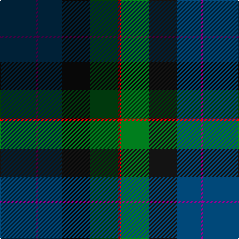

This page is one **sett** — a single exact thread-count. It belongs to the [tartan](/tartans/db18p1db12k14g14r2/)
(the same proportion at any scale), whose colour order is pattern [BBBKGR](/stripes/bbbkgr/).

Sourced from register-of-tartans.  It is a [6 stripe tartan](/stripes/stripes6/).

Original link https://www.tartanregister.gov.uk/tartanDetails.aspx?ref=2579

2 attestations — the source records this cloth was collapsed from (oldest owns this page)

<ul>
<li>01/01/2007 — Mackison (register-of-tartans, <a href="https://www.tartanregister.gov.uk/tartanDetails.aspx?ref=2579">record</a>)</li>
<li>Janaury 2007 — Mackison (Clan?) (tartans-authority, <a href="http://www.tartansauthority.com/tartan-ferret/display/7089/">record</a>)</li>
</ul>

## Register references

External register numbers recorded for this tartan.

- Scottish Register of Tartans: [2579](https://www.tartanregister.gov.uk/tartanDetails.aspx?ref=2579)
- Scottish Tartans Authority (ITI): 7089

## Thread count
DB/36 P2 DB24 K28 G28 R/4

## Palette
Each colour and the base-6 reference it is a variant of.

| Colour | Shade | Base |
|---|---|---|
| DB | <code style="background-color:#003C64;">#003C64</code> `oklch(34.5% 0.089 246.0)` <small>#003C64</small> | B <code style="background-color:#2A418A;">#2A418A</code> |
| G | <code style="background-color:#006818;">#006818</code> `oklch(45.0% 0.142 145.0)` <small>#006818</small> | G <code style="background-color:#006100;">#006100</code> |
| K | <code style="background-color:#101010;">#101010</code> `oklch(17.3% 0.000 89.9)` <small>#101010</small> | K <code style="background-color:#000000;">#000000</code> |
| P | <code style="background-color:#780078;">#780078</code> `oklch(40.2% 0.185 328.4)` <small>#780078</small> | B <code style="background-color:#2A418A;">#2A418A</code> |
| R | <code style="background-color:#C80000;">#C80000</code> `oklch(52.3% 0.215 29.2)` <small>#C80000</small> | R <code style="background-color:#CC0000;">#CC0000</code> |

# Sample pattern

## Nearest tartans

The nearest existing variants by ΔTartan distance, with this tartan at the top so the swatches line up against it.

ΔTartan

Tartan

Sett

—

<a href="/ttd/edit/#slug=dt18dp1dt12k14g14r2~x2">Mackison</a> <a class="nn-out" href="/setts/s6/dt18dp1dt12k14g14r2~x2/" title="open its dictionary page">↗</a>

1.33

<a href="/ttd/edit/#slug=r3db22k11dg32ly3~x2">Cultoquhey Hotel Corporate Tartan Tartan Number: 3393. Earliest known date: circa1990 Designed by Peter MacDonald as a Cook tartan for the former owners (David &amp; Anna) of the Cultoquhey Hotel near Crieff. When they left, if became the house tartan of the hotel See products available Copyright © Blair Urquhart, Comrie, 2015</a> <a class="nn-out" href="/setts/s5/r3db22k11dg32ly3~x2/" title="open its dictionary page">↗</a>

1.45

<a href="/ttd/edit/#slug=db22n5dr9dg14db10lo2~x2">Belfrage</a> <a class="nn-out" href="/setts/s6/db22n5dr9dg14db10lo2~x2/" title="open its dictionary page">↗</a>

1.47

<a href="/ttd/edit/#slug=g31dg7lo3dg14g8db18dp5~x2">Reidy Wedding</a> <a class="nn-out" href="/setts/s7/g31dg7lo3dg14g8db18dp5~x2/" title="open its dictionary page">↗</a>

1.48

<a href="/ttd/edit/#slug=dt37dg37o8k3dp5~x2">Dallard Personal Tartan Tartan Number: 7424. Earliest known date: 2007 The material was going towards a kilt for my wedding in June 2008. See products available Copyright © Blair Urquhart, Comrie, 2015</a> <a class="nn-out" href="/setts/s5/dt37dg37o8k3dp5~x2/" title="open its dictionary page">↗</a>

1.49

<a href="/ttd/edit/#slug=dg20k2dg20dp25w2n3~x2">Lawrence of Broughty Ferry</a> <a class="nn-out" href="/setts/s6/dg20k2dg20dp25w2n3~x2/" title="open its dictionary page">↗</a>

1.51

<a href="/ttd/edit/#slug=k4dg16db11r16dg25lo2t3~x2">Mayo, County (District)</a> <a class="nn-out" href="/setts/s7/k4dg16db11r16dg25lo2t3~x2/" title="open its dictionary page">↗</a>

1.55

<a href="/ttd/edit/#slug=dt20dg6dt6lb2dg20r8dg6r4dg10lr3~x2">MacConnell</a> <a class="nn-out" href="/setts/s10/dt20dg6dt6lb2dg20r8dg6r4dg10lr3~x2/" title="open its dictionary page">↗</a>

1.55

<a href="/ttd/edit/#slug=lb2dt19k4dt4k4g9db2k1~x4">Dollar Academy (1999)</a> <a class="nn-out" href="/setts/s8/lb2dt19k4dt4k4g9db2k1~x4/" title="open its dictionary page">↗</a>

1.55

<a href="/ttd/edit/#slug=m4dg9w2dg24dt37r3~x2">Hardie (Name)</a> <a class="nn-out" href="/setts/s6/m4dg9w2dg24dt37r3~x2/" title="open its dictionary page">↗</a>

1.56

<a href="/ttd/edit/#slug=dp5db8dt13g21db34dt55o3">Bouncing Blackie (Personal)</a> <a class="nn-out" href="/setts/s7/dp5db8dt13g21db34dt55o3/" title="open its dictionary page">↗</a>

## Neighbour map

Every grey dot is one of 14299 variants placed by the first two principal components of the ΔTartan feature space (44% of its variance). Red is this tartan; blue dots are its nearest — click one to open its page.

<svg viewBox="0 0 640 380" role="img" style="max-width:100%;height:auto;border:1px solid #e0e0e0;border-radius:4px;display:block" xmlns="http://www.w3.org/2000/svg"><image href="/nn/cloud.v1.png" width="640" height="380"/><a href="/setts/s5/r3db22k11dg32ly3~x2/"><circle cx="271.4" cy="243.3" r="4" fill="#3465a4"><title>Cultoquhey Hotel Corporate Tartan Tartan Number: 3393. Earliest known date: circa1990 Designed by Peter MacDonald as a Cook tartan for the former owners (David &amp; Anna) of the Cultoquhey Hotel near Crieff. When they left, if became the house tartan of the hotel See products available Copyright © Blair Urquhart, Comrie, 2015</title></circle></a><a href="/setts/s6/db22n5dr9dg14db10lo2~x2/"><circle cx="270.8" cy="247.5" r="4" fill="#3465a4"><title>Belfrage</title></circle></a><a href="/setts/s7/g31dg7lo3dg14g8db18dp5~x2/"><circle cx="245.7" cy="231.1" r="4" fill="#3465a4"><title>Reidy Wedding</title></circle></a><a href="/setts/s5/dt37dg37o8k3dp5~x2/"><circle cx="287.7" cy="237.0" r="4" fill="#3465a4"><title>Dallard Personal Tartan Tartan Number: 7424. Earliest known date: 2007 The material was going towards a kilt for my wedding in June 2008. See products available Copyright © Blair Urquhart, Comrie, 2015</title></circle></a><a href="/setts/s6/dg20k2dg20dp25w2n3~x2/"><circle cx="360.6" cy="237.3" r="4" fill="#3465a4"><title>Lawrence of Broughty Ferry</title></circle></a><a href="/setts/s7/k4dg16db11r16dg25lo2t3~x2/"><circle cx="285.2" cy="211.5" r="4" fill="#3465a4"><title>Mayo, County (District)</title></circle></a><a href="/setts/s10/dt20dg6dt6lb2dg20r8dg6r4dg10lr3~x2/"><circle cx="279.0" cy="225.0" r="4" fill="#3465a4"><title>MacConnell</title></circle></a><a href="/setts/s8/lb2dt19k4dt4k4g9db2k1~x4/"><circle cx="306.3" cy="182.4" r="4" fill="#3465a4"><title>Dollar Academy (1999)</title></circle></a><a href="/setts/s6/m4dg9w2dg24dt37r3~x2/"><circle cx="333.9" cy="200.9" r="4" fill="#3465a4"><title>Hardie (Name)</title></circle></a><a href="/setts/s7/dp5db8dt13g21db34dt55o3/"><circle cx="344.6" cy="218.4" r="4" fill="#3465a4"><title>Bouncing Blackie (Personal)</title></circle></a><circle cx="293.1" cy="235.6" r="5" fill="#c00000"/></svg>

ID: /setts/s6/dt18dp1dt12k14g14r2~x2/
