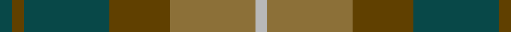
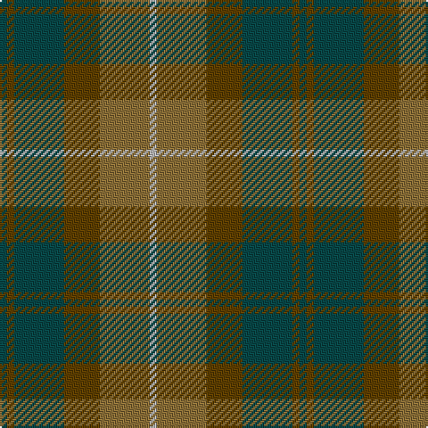

**Bands:** [BGBGGY](/stripes/bgbggy/) · **Stripes:** [DT DY DT DY Y LR](/stripes/stripes6/) DT DY DT DY Y LR

This was sourced from register-of-tartans.  It is a [6 band tartan](/bands/bands6/).

Original link https://www.tartanregister.gov.uk/tartanDetails.aspx?ref=925

## Attestations

This cloth appears in 2 source records; the oldest owns this page.

- 01/01/1979 — Dewar (WCWM) (register-of-tartans, [record](https://www.tartanregister.gov.uk/tartanDetails.aspx?ref=925))
- pre 1979 — Dewar (Fashion) (tartans-authority, [record](http://www.tartansauthority.com/tartan-ferret/display/4675/))

## Register references

External register numbers recorded for this tartan.

- Scottish Register of Tartans: [925](https://www.tartanregister.gov.uk/tartanDetails.aspx?ref=925)
- Scottish Tartans Authority (ITI): 4675

## Thread count
G/4 T4 G28 T20 LT28 N/4

## Palette
Each colour and its ΔE from the base-6 reference it is a variant of.

| Colour | Shade | Base | ΔE (OKLab) |
|---|---|---|---|
| G | <code style="background-color:#084848;">#084848</code> `#084848` | B <code style="background-color:#2A418A;">#2A418A</code> | 0.13 |
| LT | <code style="background-color:#8C7038;">#8C7038</code> `#8C7038` | G <code style="background-color:#006100;">#006100</code> | 0.18 |
| N | <code style="background-color:#B8B8B8;">#B8B8B8</code> `#B8B8B8` | Y <code style="background-color:#F2BF00;">#F2BF00</code> | 0.17 |
| T | <code style="background-color:#604000;">#604000</code> `#604000` | G <code style="background-color:#006100;">#006100</code> | 0.14 |

# Sample pattern

## Nearest tartans

The nearest existing variants by ΔTartan distance.

1. [Canadian Fancy](/setts/s6/g4dy25g6t12g12t3~x2/) — ΔT 1.23
1. [Ancient Universal (Fashion?)](/setts/s8/y12dg2y2dg2y2dy8y8dy1~x2/) — ΔT 1.34
1. [Dorward](/setts/s7/o7r3o9g15db19o14r4~x2/) — ΔT 1.38
1. [Dorward/Dogwood](/setts/s7/dy7r3dy9g15db19dy14r4~x2/) — ΔT 1.48
1. [MacNab WI 2](/setts/s4/dg15r3n11b2~x2/) — ΔT 1.51
1. [MacNab WI2](/setts/s4/dg15r3n11b2/) — ΔT 1.51
1. [McMoosie Htg (Fashion)](/setts/s5/dy46g23b23r4ly4~x2/) — ΔT 1.52
1. [Trinity Bicycles](/setts/s5/dy4lg11dy14o30r4~x2/) — ΔT 1.52
1. [Cairngorm #2](/setts/s7/n5t4n22k15y22o4y4~x2/) — ΔT 1.52
1. [Lawrence's Seven Pillars of Khaki](/setts/s9/g3t12g10t6g8g6g8o23r3~x2/) — ΔT 1.55

## Neighbour map

Every grey dot is one of 14313 variants placed by the first two principal components of the ΔTartan feature space (44% of its variance). Red is this tartan; blue dots are its nearest — click one to open its page.

<svg viewBox="0 0 640 380" role="img" style="max-width:100%;height:auto;border:1px solid #e0e0e0;border-radius:4px;display:block" xmlns="http://www.w3.org/2000/svg"><image href="/nn/cloud.v1.png" width="640" height="380"/><a href="/setts/s6/g4dy25g6t12g12t3~x2/"><circle cx="302.4" cy="289.0" r="4" fill="#3465a4"><title>Canadian Fancy</title></circle></a><a href="/setts/s8/y12dg2y2dg2y2dy8y8dy1~x2/"><circle cx="283.7" cy="227.1" r="4" fill="#3465a4"><title>Ancient Universal (Fashion?)</title></circle></a><a href="/setts/s7/o7r3o9g15db19o14r4~x2/"><circle cx="230.3" cy="278.1" r="4" fill="#3465a4"><title>Dorward</title></circle></a><a href="/setts/s7/dy7r3dy9g15db19dy14r4~x2/"><circle cx="229.6" cy="279.7" r="4" fill="#3465a4"><title>Dorward/Dogwood</title></circle></a><a href="/setts/s4/dg15r3n11b2~x2/"><circle cx="335.6" cy="299.8" r="4" fill="#3465a4"><title>MacNab WI 2</title></circle></a><a href="/setts/s4/dg15r3n11b2/"><circle cx="335.6" cy="299.8" r="4" fill="#3465a4"><title>MacNab WI2</title></circle></a><a href="/setts/s5/dy46g23b23r4ly4~x2/"><circle cx="283.5" cy="238.8" r="4" fill="#3465a4"><title>McMoosie Htg (Fashion)</title></circle></a><a href="/setts/s5/dy4lg11dy14o30r4~x2/"><circle cx="317.6" cy="270.1" r="4" fill="#3465a4"><title>Trinity Bicycles</title></circle></a><a href="/setts/s7/n5t4n22k15y22o4y4~x2/"><circle cx="218.3" cy="268.6" r="4" fill="#3465a4"><title>Cairngorm #2</title></circle></a><a href="/setts/s9/g3t12g10t6g8g6g8o23r3~x2/"><circle cx="198.5" cy="236.4" r="4" fill="#3465a4"><title>Lawrence's Seven Pillars of Khaki</title></circle></a><circle cx="256.3" cy="272.4" r="5" fill="#c00000"/></svg>

ID: /setts/s6/dt1dy1dt7dy5y7lr1~x4/
