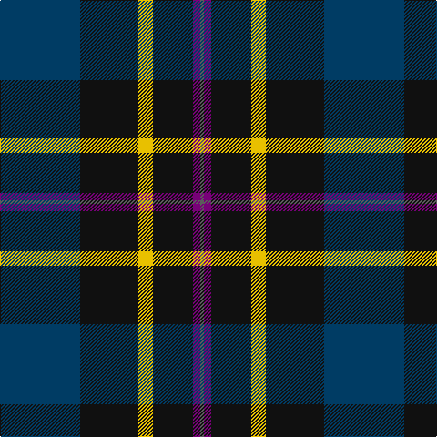

In pattern [BBKYKB](/stripes/bbkykb/).

This was sourced from register-of-tartans.  It is a [6 stripe tartan](/stripes/stripes6/).

Original link https://www.tartanregister.gov.uk/tartanDetails.aspx?ref=11580

## Register references

External register numbers recorded for this tartan.

- Scottish Register of Tartans: [11580](https://www.tartanregister.gov.uk/tartanDetails.aspx?ref=11580)

## Thread count
DB/88 K64 Y16 K44 P8 N/4

## Palette
Each colour and the base-6 reference it is a variant of.

| Colour | Shade | Base |
|---|---|---|
| DB | <code style="background-color:#003C64;">#003C64</code> `oklch(34.5% 0.089 246.0)` <small>#003C64</small> | B <code style="background-color:#2A418A;">#2A418A</code> |
| K | <code style="background-color:#101010;">#101010</code> `oklch(17.3% 0.000 89.9)` <small>#101010</small> | K <code style="background-color:#000000;">#000000</code> |
| N | <code style="background-color:#5C5C5C;">#5C5C5C</code> `oklch(47.5% 0.000 89.9)` <small>#5C5C5C</small> | B <code style="background-color:#2A418A;">#2A418A</code> |
| P | <code style="background-color:#780078;">#780078</code> `oklch(40.2% 0.185 328.4)` <small>#780078</small> | B <code style="background-color:#2A418A;">#2A418A</code> |
| Y | <code style="background-color:#E8C000;">#E8C000</code> `oklch(81.9% 0.168 93.7)` <small>#E8C000</small> | Y <code style="background-color:#F2BF00;">#F2BF00</code> |

# Sample pattern

## Nearest tartans

The nearest existing variants by ΔTartan distance, with this tartan at the top so the swatches line up against it.

ΔTartan

Tartan

Sett

—

<a href="/ttd/edit/#slug=dt22k16ly4k11dp2n1~x4">Martinez, Clément (Personal)</a> <a class="nn-out" href="/setts/s6/dt22k16ly4k11dp2n1~x4/" title="open its dictionary page">↗</a>

1.12

<a href="/ttd/edit/#slug=db24k8dg8r2dg8k1ly2~x2">MacLaren</a> <a class="nn-out" href="/setts/s7/db24k8dg8r2dg8k1ly2~x2/" title="open its dictionary page">↗</a>

1.13

<a href="/ttd/edit/#slug=db24k8dg8r2dg8k1lr2~x2">Fergusson</a> <a class="nn-out" href="/setts/s7/db24k8dg8r2dg8k1lr2~x2/" title="open its dictionary page">↗</a>

1.13

<a href="/ttd/edit/#slug=db24k8dg8r2dg8k1lr2">Fergusson</a> <a class="nn-out" href="/setts/s7/db24k8dg8r2dg8k1lr2/" title="open its dictionary page">↗</a>

1.14

<a href="/ttd/edit/#slug=k2w1k12g5db11r1~x2">New England (Fashion)</a> <a class="nn-out" href="/setts/s6/k2w1k12g5db11r1~x2/" title="open its dictionary page">↗</a>

1.18

<a href="/ttd/edit/#slug=db26k1db2k18ly2g16k16~x2">Mowat</a> <a class="nn-out" href="/setts/s7/db26k1db2k18ly2g16k16~x2/" title="open its dictionary page">↗</a>

1.18

<a href="/ttd/edit/#slug=db19k8lb1g10m3~x2">Unidentified #50</a> <a class="nn-out" href="/setts/s5/db19k8lb1g10m3~x2/" title="open its dictionary page">↗</a>

1.20

<a href="/ttd/edit/#slug=db24k8g8dp2g8k1w2~x2">Alexander</a> <a class="nn-out" href="/setts/s7/db24k8g8dp2g8k1w2~x2/" title="open its dictionary page">↗</a>

1.22

<a href="/ttd/edit/#slug=k62db15b15dy20ly5db5k15~x2">Black Raven (Fashion)</a> <a class="nn-out" href="/setts/s7/k62db15b15dy20ly5db5k15~x2/" title="open its dictionary page">↗</a>

1.22

<a href="/ttd/edit/#slug=db4k2db16lr1k8dg24r4~x2">Colqhoun VS</a> <a class="nn-out" href="/setts/s7/db4k2db16lr1k8dg24r4~x2/" title="open its dictionary page">↗</a>

1.26

<a href="/ttd/edit/#slug=db24k8dg8r2dg8k1lb2">Fergusson</a> <a class="nn-out" href="/setts/s7/db24k8dg8r2dg8k1lb2/" title="open its dictionary page">↗</a>

## Neighbour map

Every grey dot is one of 14299 variants placed by the first two principal components of the ΔTartan feature space (44% of its variance). Red is this tartan; blue dots are its nearest — click one to open its page.

<svg viewBox="0 0 640 380" role="img" style="max-width:100%;height:auto;border:1px solid #e0e0e0;border-radius:4px;display:block" xmlns="http://www.w3.org/2000/svg"><image href="/nn/cloud.v1.png" width="640" height="380"/><a href="/setts/s7/db24k8dg8r2dg8k1ly2~x2/"><circle cx="267.5" cy="169.2" r="4" fill="#3465a4"><title>MacLaren</title></circle></a><a href="/setts/s7/db24k8dg8r2dg8k1lr2~x2/"><circle cx="268.1" cy="169.3" r="4" fill="#3465a4"><title>Fergusson</title></circle></a><a href="/setts/s7/db24k8dg8r2dg8k1lr2/"><circle cx="268.1" cy="169.3" r="4" fill="#3465a4"><title>Fergusson</title></circle></a><a href="/setts/s6/k2w1k12g5db11r1~x2/"><circle cx="238.4" cy="203.6" r="4" fill="#3465a4"><title>New England (Fashion)</title></circle></a><a href="/setts/s7/db26k1db2k18ly2g16k16~x2/"><circle cx="286.9" cy="198.7" r="4" fill="#3465a4"><title>Mowat</title></circle></a><a href="/setts/s5/db19k8lb1g10m3~x2/"><circle cx="248.5" cy="201.3" r="4" fill="#3465a4"><title>Unidentified #50</title></circle></a><a href="/setts/s7/db24k8g8dp2g8k1w2~x2/"><circle cx="255.0" cy="159.1" r="4" fill="#3465a4"><title>Alexander</title></circle></a><a href="/setts/s7/k62db15b15dy20ly5db5k15~x2/"><circle cx="304.8" cy="196.0" r="4" fill="#3465a4"><title>Black Raven (Fashion)</title></circle></a><a href="/setts/s7/db4k2db16lr1k8dg24r4~x2/"><circle cx="248.6" cy="171.1" r="4" fill="#3465a4"><title>Colqhoun VS</title></circle></a><a href="/setts/s7/db24k8dg8r2dg8k1lb2/"><circle cx="254.2" cy="162.3" r="4" fill="#3465a4"><title>Fergusson</title></circle></a><circle cx="296.5" cy="188.9" r="5" fill="#c00000"/></svg>

ID: /setts/s6/dt22k16ly4k11dp2n1~x4/
