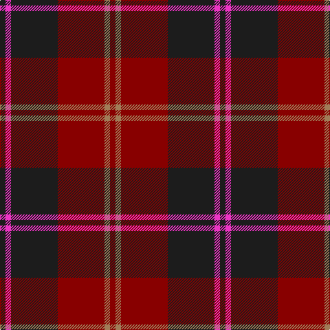

In pattern [BRBRRR](/stripes/brbrrr/).

This was sourced from register-of-tartans.  It is a [6 stripe tartan](/stripes/stripes6/).

Original link https://www.tartanregister.gov.uk/tartanDetails.aspx?ref=1089

## Register references

External register numbers recorded for this tartan.

- Scottish Register of Tartans: [1089](https://www.tartanregister.gov.uk/tartanDetails.aspx?ref=1089)
- Scottish Tartans Authority (ITI): 4797

## Thread count
K/8 LR8 K68 DR68 LT8 DR/8

## Palette
Each colour and the base-6 reference it is a variant of.

| Colour | Shade | Base |
|---|---|---|
| DR | <code style="background-color:#880000;">#880000</code> `oklch(39.4% 0.162 29.2)` <small>#880000</small> | R <code style="background-color:#CC0000;">#CC0000</code> |
| K | <code style="background-color:#1C1C1C;">#1C1C1C</code> `oklch(22.6% 0.000 89.9)` <small>#1C1C1C</small> | B <code style="background-color:#2A418A;">#2A418A</code> |
| LR | <code style="background-color:#EC34C4;">#EC34C4</code> `oklch(65.8% 0.255 338.8)` <small>#EC34C4</small> | R <code style="background-color:#CC0000;">#CC0000</code> |
| LT | <code style="background-color:#A07C58;">#A07C58</code> `oklch(61.2% 0.067 66.0)` <small>#A07C58</small> | R <code style="background-color:#CC0000;">#CC0000</code> |

# Sample pattern

## Nearest tartans

The nearest existing variants by ΔTartan distance, with this tartan at the top so the swatches line up against it.

ΔTartan

Tartan

Sett

—

<a href="/ttd/edit/#slug=dt2m2dt17r17o2r2~x4">Eglington</a> <a class="nn-out" href="/setts/s6/dt2m2dt17r17o2r2~x4/" title="open its dictionary page">↗</a>

1.29

<a href="/ttd/edit/#slug=k4r2k22r22k3r4lb2~x2">Menzies of Culdares</a> <a class="nn-out" href="/setts/s7/k4r2k22r22k3r4lb2~x2/" title="open its dictionary page">↗</a>

1.31

<a href="/ttd/edit/#slug=dg6r2dr2dg4dr2r12k1~x2">MacNab VS</a> <a class="nn-out" href="/setts/s7/dg6r2dr2dg4dr2r12k1~x2/" title="open its dictionary page">↗</a>

1.41

<a href="/ttd/edit/#slug=o5t13dr4r4dr27t3dr4o5">Daks, Blue Loden</a> <a class="nn-out" href="/setts/s8/o5t13dr4r4dr27t3dr4o5/" title="open its dictionary page">↗</a>

1.41

<a href="/ttd/edit/#slug=g4r28db6g10k10g3~x2">Canadian Autumn</a> <a class="nn-out" href="/setts/s6/g4r28db6g10k10g3~x2/" title="open its dictionary page">↗</a>

1.45

<a href="/ttd/edit/#slug=r1db6r1dg6r12lr1~x2">Fraser VS</a> <a class="nn-out" href="/setts/s6/r1db6r1dg6r12lr1~x2/" title="open its dictionary page">↗</a>

1.46

<a href="/ttd/edit/#slug=r9k4r9k25o3dp18k4~x2">Wounded Warriors Canada</a> <a class="nn-out" href="/setts/s7/r9k4r9k25o3dp18k4~x2/" title="open its dictionary page">↗</a>

1.47

<a href="/setts/s6/k50dt3ly3r50~x2/">Hungerford RFC</a>

1.49

<a href="/ttd/edit/#slug=k8r49k8lb3k20lo3~x2">Dunbar (District)</a> <a class="nn-out" href="/setts/s6/k8r49k8lb3k20lo3~x2/" title="open its dictionary page">↗</a>

1.51

<a href="/ttd/edit/#slug=k4r5k4dp28k4g5k4~x2">Montgomrie/Montgomery of Eglinton</a> <a class="nn-out" href="/setts/s7/k4r5k4dp28k4g5k4~x2/" title="open its dictionary page">↗</a>

1.52

<a href="/ttd/edit/#slug=k50dt3ly3r50~x2">Hungerford RFC (Corporate)</a> <a class="nn-out" href="/setts/s4/k50dt3ly3r50~x2/" title="open its dictionary page">↗</a>

## Neighbour map

Every grey dot is one of 14299 variants placed by the first two principal components of the ΔTartan feature space (44% of its variance). Red is this tartan; blue dots are its nearest — click one to open its page.

<svg viewBox="0 0 640 380" role="img" style="max-width:100%;height:auto;border:1px solid #e0e0e0;border-radius:4px;display:block" xmlns="http://www.w3.org/2000/svg"><image href="/nn/cloud.v1.png" width="640" height="380"/><a href="/setts/s7/k4r2k22r22k3r4lb2~x2/"><circle cx="371.1" cy="218.2" r="4" fill="#3465a4"><title>Menzies of Culdares</title></circle></a><a href="/setts/s7/dg6r2dr2dg4dr2r12k1~x2/"><circle cx="319.9" cy="211.6" r="4" fill="#3465a4"><title>MacNab VS</title></circle></a><a href="/setts/s8/o5t13dr4r4dr27t3dr4o5/"><circle cx="307.6" cy="202.2" r="4" fill="#3465a4"><title>Daks, Blue Loden</title></circle></a><a href="/setts/s6/g4r28db6g10k10g3~x2/"><circle cx="267.8" cy="226.5" r="4" fill="#3465a4"><title>Canadian Autumn</title></circle></a><a href="/setts/s6/r1db6r1dg6r12lr1~x2/"><circle cx="298.9" cy="196.9" r="4" fill="#3465a4"><title>Fraser VS</title></circle></a><a href="/setts/s7/r9k4r9k25o3dp18k4~x2/"><circle cx="256.2" cy="226.2" r="4" fill="#3465a4"><title>Wounded Warriors Canada</title></circle></a><a href="/setts/s6/k50dt3ly3r50~x2/"><circle cx="328.8" cy="175.0" r="4" fill="#3465a4"><title>Hungerford RFC</title></circle></a><a href="/setts/s6/k8r49k8lb3k20lo3~x2/"><circle cx="371.7" cy="182.9" r="4" fill="#3465a4"><title>Dunbar (District)</title></circle></a><a href="/setts/s7/k4r5k4dp28k4g5k4~x2/"><circle cx="332.7" cy="227.4" r="4" fill="#3465a4"><title>Montgomrie/Montgomery of Eglinton</title></circle></a><a href="/setts/s4/k50dt3ly3r50~x2/"><circle cx="355.9" cy="221.0" r="4" fill="#3465a4"><title>Hungerford RFC (Corporate)</title></circle></a><circle cx="323.8" cy="219.4" r="5" fill="#c00000"/></svg>

ID: /setts/s6/dt2m2dt17r17o2r2~x4/
