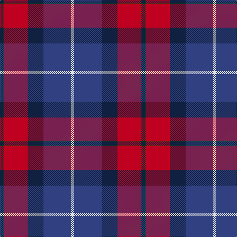

In pattern [BGRBBW](/stripes/bgrbbw/).

This was sourced from weddslist.  It is a [6 stripe tartan](/stripes/stripes6/).

Original link http://www.weddslist.com/cgi-bin/tartans/pg.pl?source=sts

## Thread count
DB/6 DG2 R48 DB32 B56 LN/6

## Palette
Each colour and the base-6 reference it is a variant of.

| Colour | Shade | Base |
|---|---|---|
| B | <code style="background-color:#304080;">#304080</code> `oklch(39.4% 0.109 270.2)` <small>#304080</small> | B <code style="background-color:#2A418A;">#2A418A</code> |
| DB | <code style="background-color:#102040;">#102040</code> `oklch(24.9% 0.065 262.6)` <small>#102040</small> | B <code style="background-color:#2A418A;">#2A418A</code> |
| DG | <code style="background-color:#004010;">#004010</code> `oklch(32.3% 0.098 146.3)` <small>#004010</small> | G <code style="background-color:#006100;">#006100</code> |
| LN | <code style="background-color:#E0E0E0;">#E0E0E0</code> `oklch(90.7% 0.000 89.9)` <small>#E0E0E0</small> | W <code style="background-color:#F7F7F7;">#F7F7F7</code> |
| R | <code style="background-color:#C00020;">#C00020</code> `oklch(50.9% 0.206 24.5)` <small>#C00020</small> | R <code style="background-color:#CC0000;">#CC0000</code> |

# Sample pattern

## Nearest tartans

The nearest existing variants by ΔTartan distance.

1. [McKnight #2 (Personal)](/setts/s7/t4ly1r28db24k5t5k3~x4/) — ΔT 0.92
1. [Diaspora (Fashion)](/setts/s5/lb3db28k12r22dg1~x2/) — ΔT 1.02
1. [Diaspora](/setts/s6/db3dg1r22k12db28lb3~x2/) — ΔT 1.10
1. [McKnight (Personal)](/setts/s7/db4ly1r28db25k10db5k3~x2/) — ΔT 1.11
1. [Hegarty, Philip David (Personal)](/setts/s6/dg3k24lo1r18db18w1~x2/) — ΔT 1.22
1. [Ferguson Unidentified](/setts/s7/dp72k40dg23r4dg23k2w4~x2/) — ΔT 1.23
1. [Harrower, John Anthony (Personal)](/setts/s8/dg8db5k1db17r10db2r10o2~x2/) — ΔT 1.25
1. [Nibley (Personal)](/setts/s6/w3dg18db22r19dg1r2~x2/) — ΔT 1.29
1. [Ross Dempster (Personal)](/setts/s7/db4dg2r18r10dg10db29b4~x2/) — ΔT 1.32
1. [Royal Scottish Assurance](/setts/s9/db26dg11r8k2r2w2r4w1r15~x2/) — ΔT 1.34

## Neighbour map

Every grey dot is one of 14299 variants placed by the first two principal components of the ΔTartan feature space (44% of its variance). Red is this tartan; blue dots are its nearest — click one to open its page.

<svg viewBox="0 0 640 380" role="img" style="max-width:100%;height:auto;border:1px solid #e0e0e0;border-radius:4px;display:block" xmlns="http://www.w3.org/2000/svg"><image href="/nn/cloud.v1.png" width="640" height="380"/><a href="/setts/s7/t4ly1r28db24k5t5k3~x4/"><circle cx="249.4" cy="128.7" r="4" fill="#3465a4"><title>McKnight #2 (Personal)</title></circle></a><a href="/setts/s5/lb3db28k12r22dg1~x2/"><circle cx="264.5" cy="179.8" r="4" fill="#3465a4"><title>Diaspora (Fashion)</title></circle></a><a href="/setts/s6/db3dg1r22k12db28lb3~x2/"><circle cx="282.0" cy="165.6" r="4" fill="#3465a4"><title>Diaspora</title></circle></a><a href="/setts/s7/db4ly1r28db25k10db5k3~x2/"><circle cx="225.6" cy="135.4" r="4" fill="#3465a4"><title>McKnight (Personal)</title></circle></a><a href="/setts/s6/dg3k24lo1r18db18w1~x2/"><circle cx="212.3" cy="148.3" r="4" fill="#3465a4"><title>Hegarty, Philip David (Personal)</title></circle></a><a href="/setts/s7/dp72k40dg23r4dg23k2w4~x2/"><circle cx="281.4" cy="144.3" r="4" fill="#3465a4"><title>Ferguson Unidentified</title></circle></a><a href="/setts/s8/dg8db5k1db17r10db2r10o2~x2/"><circle cx="247.8" cy="174.9" r="4" fill="#3465a4"><title>Harrower, John Anthony (Personal)</title></circle></a><a href="/setts/s6/w3dg18db22r19dg1r2~x2/"><circle cx="224.6" cy="179.7" r="4" fill="#3465a4"><title>Nibley (Personal)</title></circle></a><a href="/setts/s7/db4dg2r18r10dg10db29b4~x2/"><circle cx="224.9" cy="183.7" r="4" fill="#3465a4"><title>Ross Dempster (Personal)</title></circle></a><a href="/setts/s9/db26dg11r8k2r2w2r4w1r15~x2/"><circle cx="252.3" cy="125.7" r="4" fill="#3465a4"><title>Royal Scottish Assurance</title></circle></a><circle cx="243.4" cy="158.4" r="5" fill="#c00000"/></svg>

ID: /setts/s6/dt3dg1r24dt16db28w3~x2/
