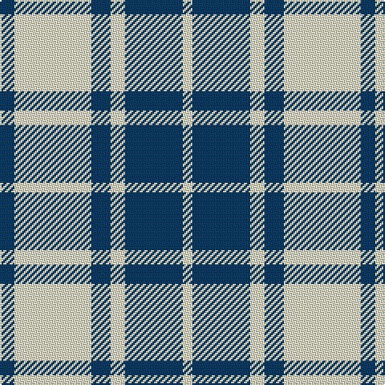

In pattern [BWBWBW](/stripes/bwbwbw/).

This was sourced from tartans-authority.  It is a [6 stripe tartan](/stripes/stripes6/).

Original link http://www.tartansauthority.com/tartan-ferret/display/2657/

## Attestations

This cloth appears in 2 source records; the oldest owns this page.

- 1999 — MacMugen (tartans-authority, [record](http://www.tartansauthority.com/tartan-ferret/display/2657/))
- 01/03/2000 — MacMugen (Personal) (register-of-tartans, [record](https://www.tartanregister.gov.uk/tartanDetails.aspx?ref=2663))

## Register references

External register numbers recorded for this tartan.

- Scottish Register of Tartans: [2663](https://www.tartanregister.gov.uk/tartanDetails.aspx?ref=2663)
- Scottish Tartans Authority (ITI): 2657
- Scottish Tartans World Register: 2657

## Thread count
DB/9 LY48 DB12 LY9 DB36 LY/6

## Palette
Each colour and the base-6 reference it is a variant of.

| Colour | Shade | Base |
|---|---|---|
| DB | <code style="background-color:#003C64;">#003C64</code> `oklch(34.5% 0.089 246.0)` <small>#003C64</small> | B <code style="background-color:#2A418A;">#2A418A</code> |
| LY | <code style="background-color:#FCF0C8;">#FCF0C8</code> `oklch(95.5% 0.053 93.3)` <small>#FCF0C8</small> | W <code style="background-color:#F7F7F7;">#F7F7F7</code> |

# Sample pattern

## Nearest tartans

The nearest existing variants by ΔTartan distance.

1. [Erskine (Black and White)](/setts/s6/k2w1k9w9k1w2~x6/) — ΔT 0.99
1. [MacLeod Black & White](/setts/s5/w14k2w14k19w2~x2/) — ΔT 1.00
1. [Scott (Abbreviated)](/setts/s7/w2k1w6k6w2k1w1~x2/) — ΔT 1.03
1. [Erskine BW MINI Design Tartan Tartan Number: 12466. Earliest known date: Generated for display purposes. Reduced copy of the original 1246 Erskine BW. See products available Copyright © Blair Urquhart, Comrie, 2015](/setts/s6/k2w1k9w9k1w2~x3/) — ΔT 1.24
1. [MacPhee (Black and White)](/setts/s4/k22w3k3w22~x2/) — ΔT 1.25
1. [Unidentified (Shirt)](/setts/s6/w7db16w20db3w3ly3~x2/) — ΔT 1.33
1. [Erskine Blanket](/setts/s6/db1w1db5w5db1w1~x8/) — ΔT 1.34
1. [Barbie's Moss Plaid (Blue & White)](/setts/s6/w20dt20w3dt3~x2/) — ΔT 1.37
1. [Erskine Green](/setts/s6/dg6w2dg29w29dg2w6~x2/) — ΔT 1.46
1. [Forbes Dress (Clans Originaux)](/setts/s7/w6b3w20k2w3k25w3~x2/) — ΔT 1.49

## Neighbour map

Every grey dot is one of 14299 variants placed by the first two principal components of the ΔTartan feature space (44% of its variance). Red is this tartan; blue dots are its nearest — click one to open its page.

<svg viewBox="0 0 640 380" role="img" style="max-width:100%;height:auto;border:1px solid #e0e0e0;border-radius:4px;display:block" xmlns="http://www.w3.org/2000/svg"><image href="/nn/cloud.v1.png" width="640" height="380"/><a href="/setts/s6/k2w1k9w9k1w2~x6/"><circle cx="294.5" cy="213.5" r="4" fill="#3465a4"><title>Erskine (Black and White)</title></circle></a><a href="/setts/s5/w14k2w14k19w2~x2/"><circle cx="313.1" cy="233.7" r="4" fill="#3465a4"><title>MacLeod Black &amp; White</title></circle></a><a href="/setts/s7/w2k1w6k6w2k1w1~x2/"><circle cx="299.8" cy="231.1" r="4" fill="#3465a4"><title>Scott (Abbreviated)</title></circle></a><a href="/setts/s6/k2w1k9w9k1w2~x3/"><circle cx="299.2" cy="217.4" r="4" fill="#3465a4"><title>Erskine BW MINI Design Tartan Tartan Number: 12466. Earliest known date: Generated for display purposes. Reduced copy of the original 1246 Erskine BW. See products available Copyright © Blair Urquhart, Comrie, 2015</title></circle></a><a href="/setts/s4/k22w3k3w22~x2/"><circle cx="284.4" cy="248.4" r="4" fill="#3465a4"><title>MacPhee (Black and White)</title></circle></a><a href="/setts/s6/w7db16w20db3w3ly3~x2/"><circle cx="286.1" cy="218.6" r="4" fill="#3465a4"><title>Unidentified (Shirt)</title></circle></a><a href="/setts/s6/db1w1db5w5db1w1~x8/"><circle cx="280.7" cy="247.2" r="4" fill="#3465a4"><title>Erskine Blanket</title></circle></a><a href="/setts/s6/w20dt20w3dt3~x2/"><circle cx="325.2" cy="245.8" r="4" fill="#3465a4"><title>Barbie's Moss Plaid (Blue &amp; White)</title></circle></a><a href="/setts/s6/dg6w2dg29w29dg2w6~x2/"><circle cx="327.0" cy="199.6" r="4" fill="#3465a4"><title>Erskine Green</title></circle></a><a href="/setts/s7/w6b3w20k2w3k25w3~x2/"><circle cx="282.1" cy="169.7" r="4" fill="#3465a4"><title>Forbes Dress (Clans Originaux)</title></circle></a><circle cx="294.2" cy="226.2" r="5" fill="#c00000"/></svg>

ID: /setts/s6/dt3w16dt4w3dt12w2~x3/
