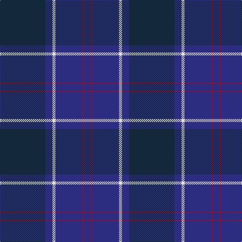

**Bands:** [BRBWBB](/stripes/brbwbb/) · **Stripes:** [DB R DB W DB DT](/stripes/stripes6/) DB R DB W DB DT

This was sourced from tartans-authority.  It is a [6 band tartan](/bands/bands6/).

Original link http://www.tartansauthority.com/tartan-ferret/display/80/

## Variants

Other setts woven to the same stripe pattern.

- [US Navy Edzell](/setts/s6/dt104db16w8db66r3db16/)

## Thread count
DN/90 DB14 LN6 DB54 R2 DB/14

## Palette
Each colour and its ΔE from the base-6 reference it is a variant of.

| Colour | Shade | Base | ΔE (OKLab) |
|---|---|---|---|
| DB | <code style="background-color:#2C2C80;">#2C2C80</code> `#2C2C80` | B <code style="background-color:#2A418A;">#2A418A</code> | 0.06 |
| DN | <code style="background-color:#14283C;">#14283C</code> `#14283C` | B <code style="background-color:#2A418A;">#2A418A</code> | 0.15 |
| LN | <code style="background-color:#E0E0E0;">#E0E0E0</code> `#E0E0E0` | W <code style="background-color:#F7F7F7;">#F7F7F7</code> | 0.07 |
| R | <code style="background-color:#C80000;">#C80000</code> `#C80000` | R <code style="background-color:#CC0000;">#CC0000</code> | 0.01 |

# Sample pattern

## Nearest tartans

The nearest existing variants by ΔTartan distance.

1. [Scottish Canals (Corporate)](/setts/s7/g2db1db29db2g9db26ly2~x2/) — ΔT 1.44
1. [Potts (Personal)](/setts/s6/k1y3db3do28db36y1~x2/) — ΔT 1.46
1. [Dalziel Rugby Club (Corporate)](/setts/s7/db56k4w1db6k20w2k20~x2/) — ΔT 1.49
1. [Potts (Personal)](/setts/s6/y1db36do28db3y3ly1~x2/) — ΔT 1.55
1. [Earl Blue Marl](/setts/s6/db80k28dp9k3m5k12~x2/) — ΔT 1.60
1. [Finnie (Personal)](/setts/s8/k4y1dp5y1k20db37y4db4~x2/) — ΔT 1.69
1. [US Navy Edzell](/setts/s6/dt104db16w8db66r3db16/) — ΔT 1.73
1. [Blue Spirit Fashion Tartan Tartan Number: 7001. Earliest known date: 01/08/2006 Designed by Kirsty Anderson of The House of Edgar for ACS Clothing of Glasgow. See products available Copyright © Blair Urquhart, Comrie, 2015](/setts/s8/db3k12db3k17db40k2db2w1~x2/) — ΔT 1.76
1. [Monarchs](/setts/s6/db19k4dr1k4dg9dr1~x4/) — ΔT 1.77
1. [Caledonian Canals (Corporate)](/setts/s7/dg2k1db29k2dg9k27lo2~x2/) — ΔT 1.83

## Neighbour map

Every grey dot is one of 14299 variants placed by the first two principal components of the ΔTartan feature space (44% of its variance). Red is this tartan; blue dots are its nearest — click one to open its page.

<svg viewBox="0 0 640 380" role="img" style="max-width:100%;height:auto;border:1px solid #e0e0e0;border-radius:4px;display:block" xmlns="http://www.w3.org/2000/svg"><image href="/nn/cloud.v1.png" width="640" height="380"/><a href="/setts/s7/g2db1db29db2g9db26ly2~x2/"><circle cx="359.1" cy="199.0" r="4" fill="#3465a4"><title>Scottish Canals (Corporate)</title></circle></a><a href="/setts/s6/k1y3db3do28db36y1~x2/"><circle cx="472.7" cy="197.4" r="4" fill="#3465a4"><title>Potts (Personal)</title></circle></a><a href="/setts/s7/db56k4w1db6k20w2k20~x2/"><circle cx="499.7" cy="195.2" r="4" fill="#3465a4"><title>Dalziel Rugby Club (Corporate)</title></circle></a><a href="/setts/s6/y1db36do28db3y3ly1~x2/"><circle cx="453.1" cy="186.7" r="4" fill="#3465a4"><title>Potts (Personal)</title></circle></a><a href="/setts/s6/db80k28dp9k3m5k12~x2/"><circle cx="453.2" cy="200.6" r="4" fill="#3465a4"><title>Earl Blue Marl</title></circle></a><a href="/setts/s8/k4y1dp5y1k20db37y4db4~x2/"><circle cx="466.4" cy="197.5" r="4" fill="#3465a4"><title>Finnie (Personal)</title></circle></a><a href="/setts/s6/dt104db16w8db66r3db16/"><circle cx="458.5" cy="228.8" r="4" fill="#3465a4"><title>US Navy Edzell</title></circle></a><a href="/setts/s8/db3k12db3k17db40k2db2w1~x2/"><circle cx="537.3" cy="205.6" r="4" fill="#3465a4"><title>Blue Spirit Fashion Tartan Tartan Number: 7001. Earliest known date: 01/08/2006 Designed by Kirsty Anderson of The House of Edgar for ACS Clothing of Glasgow. See products available Copyright © Blair Urquhart, Comrie, 2015</title></circle></a><a href="/setts/s6/db19k4dr1k4dg9dr1~x4/"><circle cx="380.9" cy="232.6" r="4" fill="#3465a4"><title>Monarchs</title></circle></a><a href="/setts/s7/dg2k1db29k2dg9k27lo2~x2/"><circle cx="360.5" cy="201.6" r="4" fill="#3465a4"><title>Caledonian Canals (Corporate)</title></circle></a><circle cx="450.4" cy="200.4" r="5" fill="#c00000"/></svg>

ID: /setts/s6/dt45db7w3db27r1db7~x2/
