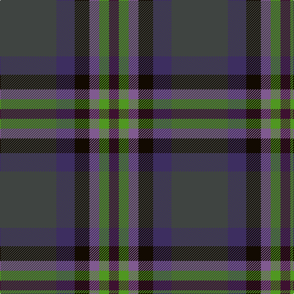

In pattern [BBKBGB](/stripes/bbkbgb/).

This was sourced from register-of-tartans.  It is a [6 stripe tartan](/stripes/stripes6/).

Original link https://www.tartanregister.gov.uk/tartanDetails.aspx?ref=10389

## Register references

External register numbers recorded for this tartan.

- Scottish Register of Tartans: [10389](https://www.tartanregister.gov.uk/tartanDetails.aspx?ref=10389)

## Thread count
N/92 DB30 K24 LP16 G16 DP/16

## Palette
Each colour and the base-6 reference it is a variant of.

| Colour | Shade | Base |
|---|---|---|
| DB | <code style="background-color:#3D2E60;">#3D2E60</code> `oklch(34.4% 0.086 295.4)` <small>#3D2E60</small> | B <code style="background-color:#2A418A;">#2A418A</code> |
| DP | <code style="background-color:#3D1130;">#3D1130</code> `oklch(26.3% 0.081 341.1)` <small>#3D1130</small> | B <code style="background-color:#2A418A;">#2A418A</code> |
| G | <code style="background-color:#509721;">#509721</code> `oklch(60.7% 0.164 136.0)` <small>#509721</small> | G <code style="background-color:#006100;">#006100</code> |
| K | <code style="background-color:#120A01;">#120A01</code> `oklch(15.2% 0.028 78.6)` <small>#120A01</small> | K <code style="background-color:#000000;">#000000</code> |
| LP | <code style="background-color:#805A90;">#805A90</code> `oklch(52.9% 0.093 315.5)` <small>#805A90</small> | B <code style="background-color:#2A418A;">#2A418A</code> |
| N | <code style="background-color:#3F4441;">#3F4441</code> `oklch(38.1% 0.008 159.7)` <small>#3F4441</small> | B <code style="background-color:#2A418A;">#2A418A</code> |

# Sample pattern

## Nearest tartans

The nearest existing variants by ΔTartan distance, with this tartan at the top so the swatches line up against it.

ΔTartan

Tartan

Sett

—

<a href="/ttd/edit/#slug=dt46dp15k12n8g8dp8~x2">Haut Family (by Dundee)</a> <a class="nn-out" href="/setts/s6/dt46dp15k12n8g8dp8~x2/" title="open its dictionary page">↗</a>

1.33

<a href="/ttd/edit/#slug=dg5g2db2db15r2lg2dg5r2~x4">Remember the Somme 1916</a> <a class="nn-out" href="/setts/s8/dg5g2db2db15r2lg2dg5r2~x4/" title="open its dictionary page">↗</a>

1.45

<a href="/ttd/edit/#slug=n15k10dt30dy11w3lg5~x2">McHale, Barry Name Tartan Tartan Number: 10708. Earliest known date: 27 September 2012 Barry McHale commissioned the production of this tartan to be worn at his wedding. It may be worn by any of his McHale relatives. See products available Copyright © Blair Urquhart, Comrie, 2015</a> <a class="nn-out" href="/setts/s6/n15k10dt30dy11w3lg5~x2/" title="open its dictionary page">↗</a>

1.48

<a href="/ttd/edit/#slug=r4k15t4dt15dg24y4~x2">Haughfoot (Commemorative)</a> <a class="nn-out" href="/setts/s6/r4k15t4dt15dg24y4~x2/" title="open its dictionary page">↗</a>

1.49

<a href="/ttd/edit/#slug=dt14k5dp5k5dt14dg32r4~x2">Bennachie (Whisky)</a> <a class="nn-out" href="/setts/s7/dt14k5dp5k5dt14dg32r4~x2/" title="open its dictionary page">↗</a>

1.52

<a href="/ttd/edit/#slug=dg3dt22dr10o5dg21r6dt3~x2">Swankie</a> <a class="nn-out" href="/setts/s7/dg3dt22dr10o5dg21r6dt3~x2/" title="open its dictionary page">↗</a>

1.56

<a href="/ttd/edit/#slug=db17lb2db2r2db2do12dg16lo3~x4">Blairmore House (Corporate)</a> <a class="nn-out" href="/setts/s8/db17lb2db2r2db2do12dg16lo3~x4/" title="open its dictionary page">↗</a>

1.59

<a href="/ttd/edit/#slug=ly4dg17k10dt3k3dt17r3dt3~x2">Royal Highland Society (Corporate)</a> <a class="nn-out" href="/setts/s8/ly4dg17k10dt3k3dt17r3dt3~x2/" title="open its dictionary page">↗</a>

1.62

<a href="/ttd/edit/#slug=n5t4n22k15y22o4y4~x2">Cairngorm #2</a> <a class="nn-out" href="/setts/s7/n5t4n22k15y22o4y4~x2/" title="open its dictionary page">↗</a>

1.67

<a href="/ttd/edit/#slug=dg3lo2o10dg10db20dg12r3db10w2~x2">Patel Name Tartan Tartan Number: 10924. Earliest known date: 2013 Designed for the Patel family using colours associated with the Gujarat, a state in the North-West coast of India known locally as Jewel of the West. See products available Copyright © Blair Urquhart, Comrie, 2015</a> <a class="nn-out" href="/setts/s9/dg3lo2o10dg10db20dg12r3db10w2~x2/" title="open its dictionary page">↗</a>

1.68

<a href="/ttd/edit/#slug=r3db22k11dg32ly3~x2">Cultoquhey Hotel Corporate Tartan Tartan Number: 3393. Earliest known date: circa1990 Designed by Peter MacDonald as a Cook tartan for the former owners (David &amp; Anna) of the Cultoquhey Hotel near Crieff. When they left, if became the house tartan of the hotel See products available Copyright © Blair Urquhart, Comrie, 2015</a> <a class="nn-out" href="/setts/s5/r3db22k11dg32ly3~x2/" title="open its dictionary page">↗</a>

## Neighbour map

Every grey dot is one of 14299 variants placed by the first two principal components of the ΔTartan feature space (44% of its variance). Red is this tartan; blue dots are its nearest — click one to open its page.

<svg viewBox="0 0 640 380" role="img" style="max-width:100%;height:auto;border:1px solid #e0e0e0;border-radius:4px;display:block" xmlns="http://www.w3.org/2000/svg"><image href="/nn/cloud.v1.png" width="640" height="380"/><a href="/setts/s8/dg5g2db2db15r2lg2dg5r2~x4/"><circle cx="222.5" cy="202.0" r="4" fill="#3465a4"><title>Remember the Somme 1916</title></circle></a><a href="/setts/s6/n15k10dt30dy11w3lg5~x2/"><circle cx="192.5" cy="219.8" r="4" fill="#3465a4"><title>McHale, Barry Name Tartan Tartan Number: 10708. Earliest known date: 27 September 2012 Barry McHale commissioned the production of this tartan to be worn at his wedding. It may be worn by any of his McHale relatives. See products available Copyright © Blair Urquhart, Comrie, 2015</title></circle></a><a href="/setts/s6/r4k15t4dt15dg24y4~x2/"><circle cx="157.6" cy="244.8" r="4" fill="#3465a4"><title>Haughfoot (Commemorative)</title></circle></a><a href="/setts/s7/dt14k5dp5k5dt14dg32r4~x2/"><circle cx="252.6" cy="242.9" r="4" fill="#3465a4"><title>Bennachie (Whisky)</title></circle></a><a href="/setts/s7/dg3dt22dr10o5dg21r6dt3~x2/"><circle cx="217.3" cy="248.4" r="4" fill="#3465a4"><title>Swankie</title></circle></a><a href="/setts/s8/db17lb2db2r2db2do12dg16lo3~x4/"><circle cx="193.6" cy="198.5" r="4" fill="#3465a4"><title>Blairmore House (Corporate)</title></circle></a><a href="/setts/s8/ly4dg17k10dt3k3dt17r3dt3~x2/"><circle cx="197.4" cy="245.0" r="4" fill="#3465a4"><title>Royal Highland Society (Corporate)</title></circle></a><a href="/setts/s7/n5t4n22k15y22o4y4~x2/"><circle cx="218.4" cy="268.9" r="4" fill="#3465a4"><title>Cairngorm #2</title></circle></a><a href="/setts/s9/dg3lo2o10dg10db20dg12r3db10w2~x2/"><circle cx="220.0" cy="210.1" r="4" fill="#3465a4"><title>Patel Name Tartan Tartan Number: 10924. Earliest known date: 2013 Designed for the Patel family using colours associated with the Gujarat, a state in the North-West coast of India known locally as Jewel of the West. See products available Copyright © Blair Urquhart, Comrie, 2015</title></circle></a><a href="/setts/s5/r3db22k11dg32ly3~x2/"><circle cx="271.4" cy="243.3" r="4" fill="#3465a4"><title>Cultoquhey Hotel Corporate Tartan Tartan Number: 3393. Earliest known date: circa1990 Designed by Peter MacDonald as a Cook tartan for the former owners (David &amp; Anna) of the Cultoquhey Hotel near Crieff. When they left, if became the house tartan of the hotel See products available Copyright © Blair Urquhart, Comrie, 2015</title></circle></a><circle cx="240.5" cy="238.7" r="5" fill="#c00000"/></svg>

ID: /setts/s6/dt46dp15k12n8g8dp8~x2/
