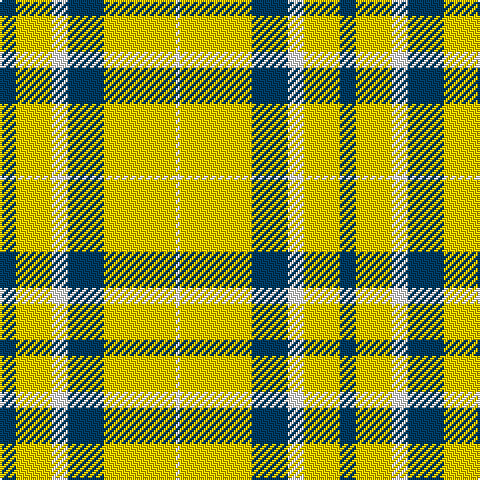

In pattern [BYWBYW](/stripes/bywbyw/).

This was sourced from tartans-authority.  It is a [6 stripe tartan](/stripes/stripes6/).

Original link http://www.tartansauthority.com/tartan-ferret/display/10567/

## Thread count
DB/8 Y18 W8 DB18 Y36 W/2

## Palette
Each colour and the base-6 reference it is a variant of.

| Colour | Shade | Base |
|---|---|---|
| DB | <code style="background-color:#003C64;">#003C64</code> `oklch(34.5% 0.089 246.0)` <small>#003C64</small> | B <code style="background-color:#2A418A;">#2A418A</code> |
| W | <code style="background-color:#FCFCFC;">#FCFCFC</code> `oklch(99.1% 0.000 89.9)` <small>#FCFCFC</small> | W <code style="background-color:#F7F7F7;">#F7F7F7</code> |
| Y | <code style="background-color:#FCCC00;">#FCCC00</code> `oklch(86.2% 0.176 91.5)` <small>#FCCC00</small> | Y <code style="background-color:#F2BF00;">#F2BF00</code> |

# Sample pattern

## Nearest tartans

The nearest existing variants by ΔTartan distance.

1. [WVU Mountaineer Tartan](/setts/s6/db4ly9w4db9ly18w1~x2/) — ΔT 0.73
1. [Burns (Fashion)](/setts/s6/w15do6w1do3o3w1~x4/) — ΔT 1.32
1. [Fraser Yellow #2](/setts/s6/w1ly8dg3ly1db3ly1~x4/) — ΔT 1.74
1. [Porter Drinkers', The](/setts/s6/k2ly6k2ly11k9r1~x2/) — ΔT 1.75
1. [Wallace Green Dress Fashion Tartan Tartan Number: 2212. Earliest known date: pre 2004 A dancers tartan based on the Wallace See products available Copyright © Blair Urquhart, Comrie, 2015](/setts/s6/w12g12w1g12w12lo1~x4/) — ΔT 1.76
1. [Fraser, Yellow](/setts/s6/w1ly8g3ly1db3ly1~x4/) — ΔT 1.81
1. [Lewis, Green (Dance)](/setts/s4/dg4w35g31w4~x2/) — ΔT 1.81
1. [O'Neill Pipe Band 1999/ Oliver dress](/setts/s9/w2r1w2g6w10r6w2g1w2~x4/) — ΔT 1.81
1. [Billy Apple® Yellow](/setts/s4/r1ly13k8g1~x6/) — ΔT 1.86
1. [Jacobite #2](/setts/s6/ly70k30w3dg30k3ly10/) — ΔT 1.91

## Neighbour map

Every grey dot is one of 14299 variants placed by the first two principal components of the ΔTartan feature space (44% of its variance). Red is this tartan; blue dots are its nearest — click one to open its page.

<svg viewBox="0 0 640 380" role="img" style="max-width:100%;height:auto;border:1px solid #e0e0e0;border-radius:4px;display:block" xmlns="http://www.w3.org/2000/svg"><image href="/nn/cloud.v1.png" width="640" height="380"/><a href="/setts/s6/db4ly9w4db9ly18w1~x2/"><circle cx="300.7" cy="179.2" r="4" fill="#3465a4"><title>WVU Mountaineer Tartan</title></circle></a><a href="/setts/s6/w15do6w1do3o3w1~x4/"><circle cx="323.0" cy="166.0" r="4" fill="#3465a4"><title>Burns (Fashion)</title></circle></a><a href="/setts/s6/w1ly8dg3ly1db3ly1~x4/"><circle cx="272.3" cy="191.6" r="4" fill="#3465a4"><title>Fraser Yellow #2</title></circle></a><a href="/setts/s6/k2ly6k2ly11k9r1~x2/"><circle cx="287.7" cy="201.8" r="4" fill="#3465a4"><title>Porter Drinkers', The</title></circle></a><a href="/setts/s6/w12g12w1g12w12lo1~x4/"><circle cx="273.4" cy="223.5" r="4" fill="#3465a4"><title>Wallace Green Dress Fashion Tartan Tartan Number: 2212. Earliest known date: pre 2004 A dancers tartan based on the Wallace See products available Copyright © Blair Urquhart, Comrie, 2015</title></circle></a><a href="/setts/s6/w1ly8g3ly1db3ly1~x4/"><circle cx="279.4" cy="193.8" r="4" fill="#3465a4"><title>Fraser, Yellow</title></circle></a><a href="/setts/s4/dg4w35g31w4~x2/"><circle cx="281.9" cy="230.7" r="4" fill="#3465a4"><title>Lewis, Green (Dance)</title></circle></a><a href="/setts/s9/w2r1w2g6w10r6w2g1w2~x4/"><circle cx="287.2" cy="184.1" r="4" fill="#3465a4"><title>O'Neill Pipe Band 1999/ Oliver dress</title></circle></a><a href="/setts/s4/r1ly13k8g1~x6/"><circle cx="283.4" cy="182.3" r="4" fill="#3465a4"><title>Billy Apple® Yellow</title></circle></a><a href="/setts/s6/ly70k30w3dg30k3ly10/"><circle cx="288.1" cy="145.6" r="4" fill="#3465a4"><title>Jacobite #2</title></circle></a><circle cx="316.0" cy="182.8" r="5" fill="#c00000"/></svg>

ID: /setts/s6/dt4ly9w4dt9ly18w1~x2/
