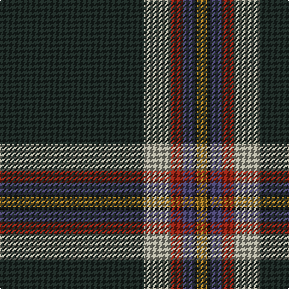

This page is one **sett** — a single exact thread-count. It belongs to the [tartan](/tartans/dt60lr11oi5n5k1o4/)
(the same proportion at any scale), whose colour order is pattern [BYRBKR](/stripes/byrbkr/).

Sourced from register-of-tartans.  It is a [6 stripe tartan](/stripes/stripes6/).

Original link https://www.tartanregister.gov.uk/tartanDetails.aspx?ref=10294

## Register references

External register numbers recorded for this tartan.

- Scottish Register of Tartans: [10294](https://www.tartanregister.gov.uk/tartanDetails.aspx?ref=10294)

## Thread count
K/120 N22 DR10 Na10 Ka2 LT/8

## Palette

Palette: <strong>Logan (The Scottish Gael, 1831)</strong> <small style="color:#888">(1 of 6 colours)</small>
<table><thead><tr><th>Colour</th><th>Threads</th><th>Shade</th><th>Base</th><th>OKLCh</th></tr></thead><tbody><tr><td>K/</td><td style="text-align:right;font-variant-numeric:tabular-nums">120</td><td><code style="background-color:#1E2925;">#1E2925</code> <small style="color:#888">#1E2925</small></td><td>B <code style="background-color:#2A418A;">#2A418A</code></td><td><small style="color:#888">oklch(26.9% 0.017 170.8)</small></td></tr><tr><td>N</td><td style="text-align:right;font-variant-numeric:tabular-nums">22</td><td><code style="background-color:#A2A093;">#A2A093</code> <small style="color:#888">#A2A093</small></td><td>Y <code style="background-color:#F2BF00;">#F2BF00</code></td><td><small style="color:#888">oklch(70.4% 0.019 99.7)</small></td></tr><tr><td>DR</td><td style="text-align:right;font-variant-numeric:tabular-nums">10</td><td><code style="background-color:#8B2316;">#8B2316</code> <small style="color:#888">#8B2316</small></td><td>R <code style="background-color:#CC0000;">#CC0000</code></td><td><small style="color:#888">oklch(42.4% 0.142 30.7)</small></td></tr><tr><td>Na</td><td style="text-align:right;font-variant-numeric:tabular-nums">10</td><td><code style="background-color:#47426A;">#47426A</code> <small style="color:#888">#47426A</small></td><td>B <code style="background-color:#2A418A;">#2A418A</code></td><td><small style="color:#888">oklch(40.2% 0.067 288.8)</small></td></tr><tr><td>Ka</td><td style="text-align:right;font-variant-numeric:tabular-nums">2</td><td><code style="background-color:#101010;">#101010</code> <small style="color:#888">#101010</small></td><td>K <code style="background-color:#000000;">#000000</code></td><td><small style="color:#888">oklch(17.3% 0.000 89.9)</small></td></tr><tr><td>LT/</td><td style="text-align:right;font-variant-numeric:tabular-nums">8</td><td><code style="background-color:#A37A28;">#A37A28</code> <small style="color:#888">#A37A28</small></td><td>R <code style="background-color:#CC0000;">#CC0000</code></td><td><small style="color:#888">oklch(60.5% 0.109 80.9)</small></td></tr></tbody></table>

# Sample pattern

## Nearest tartans

The nearest existing variants by ΔTartan distance, with this tartan at the top so the swatches line up against it.

ΔTartan

Tartan

Sett

—

<a href="/ttd/edit/#slug=dt60lr11oi5n5k1o4~x2">Christie (London) Hunting</a> <a class="nn-out" href="/setts/s6/dt60lr11oi5n5k1o4~x2/" title="open its dictionary page">↗</a>

1.30

<a href="/ttd/edit/#slug=g3db16k3dp2k45r1k2lo3~x2">Cumnock (District)</a> <a class="nn-out" href="/setts/s8/g3db16k3dp2k45r1k2lo3~x2/" title="open its dictionary page">↗</a>

1.34

<a href="/ttd/edit/#slug=k10r5k5dg55db2lo1w1~x2">Moeller, Karsten (Personal)</a> <a class="nn-out" href="/setts/s7/k10r5k5dg55db2lo1w1~x2/" title="open its dictionary page">↗</a>

1.37

<a href="/ttd/edit/#slug=g20r10ly2db100w1y10">Ravetta (Name)</a> <a class="nn-out" href="/setts/s6/g20r10ly2db100w1y10/" title="open its dictionary page">↗</a>

1.40

<a href="/ttd/edit/#slug=dt46w1lo3dg13w1r7g3w1~x2">Victorian Highland Pipe Band Association (Australia)</a> <a class="nn-out" href="/setts/s8/dt46w1lo3dg13w1r7g3w1~x2/" title="open its dictionary page">↗</a>

1.41

<a href="/ttd/edit/#slug=dr5k3dr9dg56t4dg2w3">MTV</a> <a class="nn-out" href="/setts/s7/dr5k3dr9dg56t4dg2w3/" title="open its dictionary page">↗</a>

1.52

<a href="/ttd/edit/#slug=w2db45g9r1n9ri1~x2">Wilton (Name)</a> <a class="nn-out" href="/setts/s6/w2db45g9r1n9ri1~x2/" title="open its dictionary page">↗</a>

1.52

<a href="/ttd/edit/#slug=r5k3r9dg56t4dg2w3">MTV</a> <a class="nn-out" href="/setts/s7/r5k3r9dg56t4dg2w3/" title="open its dictionary page">↗</a>

1.53

<a href="/ttd/edit/#slug=dt18w2k1w4dg13dt40r2~x2">Puxty-Dunne</a> <a class="nn-out" href="/setts/s7/dt18w2k1w4dg13dt40r2~x2/" title="open its dictionary page">↗</a>

1.56

<a href="/ttd/edit/#slug=lo2db4g60dp30w1~x2">McGuinness, Tam (Personal)</a> <a class="nn-out" href="/setts/s5/lo2db4g60dp30w1~x2/" title="open its dictionary page">↗</a>

1.63

<a href="/ttd/edit/#slug=db50dg25lo3o8r1w1r1~x2">Wells (2014)</a> <a class="nn-out" href="/setts/s7/db50dg25lo3o8r1w1r1~x2/" title="open its dictionary page">↗</a>

## Neighbour map

Every grey dot is one of 14359 variants placed by the first two principal components of the ΔTartan feature space (44% of its variance). Red is this tartan; blue dots are its nearest — click one to open its page.

<svg viewBox="0 0 640 380" role="img" style="max-width:100%;height:auto;border:1px solid #e0e0e0;border-radius:4px;display:block" xmlns="http://www.w3.org/2000/svg"><image href="/nn/cloud.v1.png" width="640" height="380"/><a href="/setts/s8/g3db16k3dp2k45r1k2lo3~x2/"><circle cx="438.3" cy="96.3" r="4" fill="#3465a4"><title>Cumnock (District)</title></circle></a><a href="/setts/s7/k10r5k5dg55db2lo1w1~x2/"><circle cx="481.8" cy="107.8" r="4" fill="#3465a4"><title>Moeller, Karsten (Personal)</title></circle></a><a href="/setts/s6/g20r10ly2db100w1y10/"><circle cx="469.7" cy="109.2" r="4" fill="#3465a4"><title>Ravetta (Name)</title></circle></a><a href="/setts/s8/dt46w1lo3dg13w1r7g3w1~x2/"><circle cx="402.1" cy="95.7" r="4" fill="#3465a4"><title>Victorian Highland Pipe Band Association (Australia)</title></circle></a><a href="/setts/s7/dr5k3dr9dg56t4dg2w3/"><circle cx="478.3" cy="138.6" r="4" fill="#3465a4"><title>MTV</title></circle></a><a href="/setts/s6/w2db45g9r1n9ri1~x2/"><circle cx="453.9" cy="121.7" r="4" fill="#3465a4"><title>Wilton (Name)</title></circle></a><a href="/setts/s7/r5k3r9dg56t4dg2w3/"><circle cx="470.0" cy="132.0" r="4" fill="#3465a4"><title>MTV</title></circle></a><a href="/setts/s7/dt18w2k1w4dg13dt40r2~x2/"><circle cx="503.3" cy="152.9" r="4" fill="#3465a4"><title>Puxty-Dunne</title></circle></a><a href="/setts/s5/lo2db4g60dp30w1~x2/"><circle cx="426.0" cy="136.3" r="4" fill="#3465a4"><title>McGuinness, Tam (Personal)</title></circle></a><a href="/setts/s7/db50dg25lo3o8r1w1r1~x2/"><circle cx="371.3" cy="104.0" r="4" fill="#3465a4"><title>Wells (2014)</title></circle></a><circle cx="470.0" cy="109.1" r="5" fill="#c00000"/></svg>

ID: /setts/s6/dt60lr11oi5n5k1o4~x2/
