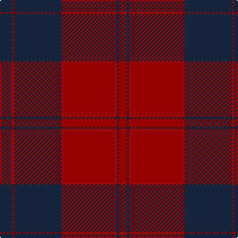

In pattern [BRBRBR](/stripes/brbrbr/).

This was sourced from register-of-tartans.  It is a [6 stripe tartan](/stripes/stripes6/).

Original link https://www.tartanregister.gov.uk/tartanDetails.aspx?ref=2843

## Also known as

This cloth is also recorded under:

- Mary Erskine School, The

## Attestations

This cloth appears in 2 source records; the oldest owns this page.

- 01/01/1993 — Mary Erskine School, The (register-of-tartans, [record](https://www.tartanregister.gov.uk/tartanDetails.aspx?ref=2843))
- pre 2002 — Mary Erskin (School) (tartans-authority, [record](http://www.tartansauthority.com/tartan-ferret/display/2185/))

## Register references

External register numbers recorded for this tartan.

- Scottish Register of Tartans: [2843](https://www.tartanregister.gov.uk/tartanDetails.aspx?ref=2843)
- Scottish Tartans Authority (ITI): 2185
- Scottish Tartans World Register: 2185

## Thread count
DN/12 DR2 DN48 DR56 DN2 DR/8

## Palette
Each colour and its ΔE from the base-6 reference it is a variant of.

| Colour | Shade | Base | ΔE (OKLab) |
|---|---|---|---|
| DN | <code style="background-color:#14283C;">#14283C</code> `#14283C` | B <code style="background-color:#2A418A;">#2A418A</code> | 0.15 |
| DR | <code style="background-color:#880000;">#880000</code> `#880000` | R <code style="background-color:#CC0000;">#CC0000</code> | 0.15 |

# Sample pattern

## Nearest tartans

The nearest existing variants by ΔTartan distance.

1. [Harmony 11](/setts/s6/dy6dp2dy29dp29dy2dp6~x2/) — ΔT 1.73
1. [Scottish Watch](/setts/s4/r104dg39lo4~x2/) — ΔT 1.77
1. [Keepers of the Quaich](/setts/s6/lo3dy33db24dy2db2dy2~x2/) — ΔT 1.88
1. [Keeper of the Quaich](/setts/s6/dy3db3dy3db27dy40y3/) — ΔT 1.92
1. [Crawford](/setts/s7/dr6lr2dr30dg12dr3dg12dr3~x2/) — ΔT 2.01
1. [Crawford](/setts/s7/dr6lr2dr30dg12dr3dg12dr3/) — ΔT 2.01
1. [Donachie of Brockloch (Clan)](/setts/s10/r24dg2r2dg20r25dg2r2dg2r2dg20~x2/) — ΔT 2.04
1. [Keeper of the Quaich Corporate Tartan Tartan Number: 1731. Earliest known date: 1988 Restricted. Sample in STS collection. See products available Copyright © Blair Urquhart, Comrie, 2015](/setts/s6/do3db3do3db27do40ly3/) — ΔT 2.04
1. [Greater Victoria Police PB (Corp)](/setts/s7/r7dt1r26dt31w1dt1w2~x2/) — ΔT 2.07
1. [Bell's (Corporate)](/setts/s11/ly6dt8r24dt54ly4r130ly4dt54r24dt8ly3/) — ΔT 2.10

## Neighbour map

Every grey dot is one of 14299 variants placed by the first two principal components of the ΔTartan feature space (44% of its variance). Red is this tartan; blue dots are its nearest — click one to open its page.

<svg viewBox="0 0 640 380" role="img" style="max-width:100%;height:auto;border:1px solid #e0e0e0;border-radius:4px;display:block" xmlns="http://www.w3.org/2000/svg"><image href="/nn/cloud.v1.png" width="640" height="380"/><a href="/setts/s6/dy6dp2dy29dp29dy2dp6~x2/"><circle cx="452.4" cy="258.7" r="4" fill="#3465a4"><title>Harmony 11</title></circle></a><a href="/setts/s4/r104dg39lo4~x2/"><circle cx="459.3" cy="248.7" r="4" fill="#3465a4"><title>Scottish Watch</title></circle></a><a href="/setts/s6/lo3dy33db24dy2db2dy2~x2/"><circle cx="440.9" cy="220.7" r="4" fill="#3465a4"><title>Keepers of the Quaich</title></circle></a><a href="/setts/s6/dy3db3dy3db27dy40y3/"><circle cx="472.2" cy="247.6" r="4" fill="#3465a4"><title>Keeper of the Quaich</title></circle></a><a href="/setts/s7/dr6lr2dr30dg12dr3dg12dr3~x2/"><circle cx="492.5" cy="253.1" r="4" fill="#3465a4"><title>Crawford</title></circle></a><a href="/setts/s7/dr6lr2dr30dg12dr3dg12dr3/"><circle cx="492.5" cy="253.1" r="4" fill="#3465a4"><title>Crawford</title></circle></a><a href="/setts/s10/r24dg2r2dg20r25dg2r2dg2r2dg20~x2/"><circle cx="449.9" cy="234.9" r="4" fill="#3465a4"><title>Donachie of Brockloch (Clan)</title></circle></a><a href="/setts/s6/do3db3do3db27do40ly3/"><circle cx="457.7" cy="238.6" r="4" fill="#3465a4"><title>Keeper of the Quaich Corporate Tartan Tartan Number: 1731. Earliest known date: 1988 Restricted. Sample in STS collection. See products available Copyright © Blair Urquhart, Comrie, 2015</title></circle></a><a href="/setts/s7/r7dt1r26dt31w1dt1w2~x2/"><circle cx="410.8" cy="168.3" r="4" fill="#3465a4"><title>Greater Victoria Police PB (Corp)</title></circle></a><a href="/setts/s11/ly6dt8r24dt54ly4r130ly4dt54r24dt8ly3/"><circle cx="472.6" cy="143.5" r="4" fill="#3465a4"><title>Bell's (Corporate)</title></circle></a><circle cx="494.9" cy="232.6" r="5" fill="#c00000"/></svg>

ID: /setts/s6/dt6r1dt24r28dt1r4~x2/
