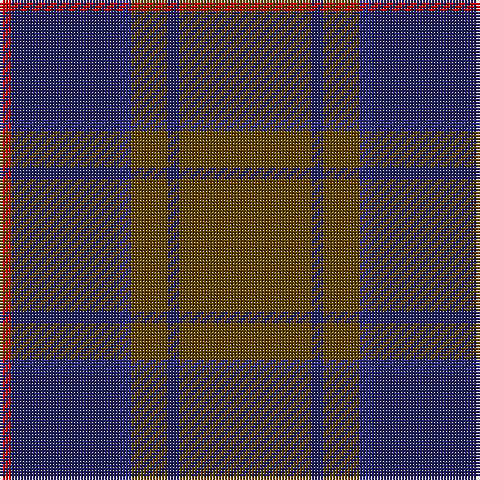

This page is one **sett** — a single exact thread-count. It belongs to the [tartan](/tartans/dy11db1dy3db1db9r1/)
(the same proportion at any scale), whose colour order is pattern [GBGBBR](/stripes/gbgbbr/).

Sourced from register-of-tartans.  It is a [6 stripe tartan](/stripes/stripes6/).

Original link https://www.tartanregister.gov.uk/tartanDetails.aspx?ref=907

3 attestations — the source records this cloth was collapsed from (oldest owns this page)

<ul>
<li>01/01/2002 — Dege of Saville Row (register-of-tartans, <a href="https://www.tartanregister.gov.uk/tartanDetails.aspx?ref=907">record</a>)</li>
<li>pre 2002 — Dege of Saville Row (Corporate) (tartans-authority, <a href="http://www.tartansauthority.com/tartan-ferret/display/2112/">record</a>)</li>
<li>undated — Dege of Saville Row Corporate Tartan Tartan Number: 2112. Earliest known date: 1990 The choice of design and colours reflects the history and tradition of Dege of Saville Row and its relationship to country life and sporting activities since 1865. Dege make high quality ceremonial and military dress. See products available Copyright © Blair Urquhart, Comrie, 2015 (house-of-tartan, <a href="http://www.house-of-tartan.scotland.net/house/TartanViewjs.asp?colr=Def&tnam=2112">record</a>)</li>
</ul>

## Register references

External register numbers recorded for this tartan.

- Scottish Register of Tartans: [907](https://www.tartanregister.gov.uk/tartanDetails.aspx?ref=907)
- Scottish Tartans Authority (ITI): 2112
- Scottish Tartans World Register: 2112

## Thread count
T/44 DBa4 T12 DB4 DBa36 R/4

## Palette

Palette: <strong>Tartan Register</strong>
<table><thead><tr><th>Colour</th><th>Threads</th><th>Shade</th><th>Base</th><th>OKLCh</th></tr></thead><tbody><tr><td>T/</td><td style="text-align:right;font-variant-numeric:tabular-nums">44</td><td><code style="background-color:#604000;">#604000</code> <small style="color:#888">#604000</small></td><td>G <code style="background-color:#006100;">#006100</code></td><td><small style="color:#888">oklch(39.8% 0.083 76.8)</small></td></tr><tr><td>DBa</td><td style="text-align:right;font-variant-numeric:tabular-nums">4</td><td><code style="background-color:#202060;">#202060</code> <small style="color:#888">#202060</small></td><td>B <code style="background-color:#2A418A;">#2A418A</code></td><td><small style="color:#888">oklch(28.9% 0.111 276.9)</small></td></tr><tr><td>T</td><td style="text-align:right;font-variant-numeric:tabular-nums">12</td><td><code style="background-color:#604000;">#604000</code> <small style="color:#888">#604000</small></td><td>G <code style="background-color:#006100;">#006100</code></td><td><small style="color:#888">oklch(39.8% 0.083 76.8)</small></td></tr><tr><td>DB</td><td style="text-align:right;font-variant-numeric:tabular-nums">4</td><td><code style="background-color:#2C2C80;">#2C2C80</code> <small style="color:#888">#2C2C80</small></td><td>B <code style="background-color:#2A418A;">#2A418A</code></td><td><small style="color:#888">oklch(35.0% 0.138 276.6)</small></td></tr><tr><td>DBa</td><td style="text-align:right;font-variant-numeric:tabular-nums">36</td><td><code style="background-color:#202060;">#202060</code> <small style="color:#888">#202060</small></td><td>B <code style="background-color:#2A418A;">#2A418A</code></td><td><small style="color:#888">oklch(28.9% 0.111 276.9)</small></td></tr><tr><td>R/</td><td style="text-align:right;font-variant-numeric:tabular-nums">4</td><td><code style="background-color:#C80000;">#C80000</code> <small style="color:#888">#C80000</small></td><td>R <code style="background-color:#CC0000;">#CC0000</code></td><td><small style="color:#888">oklch(52.3% 0.215 29.2)</small></td></tr></tbody></table>

# Sample pattern

## Nearest tartans

The nearest existing variants by ΔTartan distance, with this tartan at the top so the swatches line up against it.

ΔTartan

Tartan

Sett

—

<a href="/ttd/edit/#slug=dy11db1dy3db1db9r1~x4">Dege of Saville Row</a> <a class="nn-out" href="/setts/s6/dy11db1dy3db1db9r1~x4/" title="open its dictionary page">↗</a>

1.09

<a href="/ttd/edit/#slug=dr26w2dr3dt15dt26dr2dt3~x2">Gavin</a> <a class="nn-out" href="/setts/s7/dr26w2dr3dt15dt26dr2dt3~x2/" title="open its dictionary page">↗</a>

1.18

<a href="/ttd/edit/#slug=o15r5o30db32o4ly3~x2">Cameron, hunting</a> <a class="nn-out" href="/setts/s6/o15r5o30db32o4ly3~x2/" title="open its dictionary page">↗</a>

1.20

<a href="/ttd/edit/#slug=dy3db3dy3db27dy40y3">Keeper of the Quaich</a> <a class="nn-out" href="/setts/s6/dy3db3dy3db27dy40y3/" title="open its dictionary page">↗</a>

1.34

<a href="/ttd/edit/#slug=dy15r5dy30db32dy4ly3~x2">Cameron Hunting Brown Clan Tartan Tartan Number: 1745. Earliest known date: 1916 Nothing See products available Copyright © Blair Urquhart, Comrie, 2015</a> <a class="nn-out" href="/setts/s6/dy15r5dy30db32dy4ly3~x2/" title="open its dictionary page">↗</a>

1.43

<a href="/ttd/edit/#slug=dp32dg16o14k4o6dp7k2~x2">Aisteach</a> <a class="nn-out" href="/setts/s7/dp32dg16o14k4o6dp7k2~x2/" title="open its dictionary page">↗</a>

1.43

<a href="/ttd/edit/#slug=r2db13r3db3r16t2~x4">MacArthur-Fox, dress</a> <a class="nn-out" href="/setts/s6/r2db13r3db3r16t2~x4/" title="open its dictionary page">↗</a>

1.44

<a href="/ttd/edit/#slug=do3db3do3db27do40ly3">Keeper of the Quaich Corporate Tartan Tartan Number: 1731. Earliest known date: 1988 Restricted. Sample in STS collection. See products available Copyright © Blair Urquhart, Comrie, 2015</a> <a class="nn-out" href="/setts/s6/do3db3do3db27do40ly3/" title="open its dictionary page">↗</a>

1.49

<a href="/ttd/edit/#slug=lo3dy33db24dy2db2dy2~x2">Keepers of the Quaich</a> <a class="nn-out" href="/setts/s6/lo3dy33db24dy2db2dy2~x2/" title="open its dictionary page">↗</a>

1.50

<a href="/ttd/edit/#slug=db13n6r51db51n5~x2">Hillsdale (Corporate?)</a> <a class="nn-out" href="/setts/s5/db13n6r51db51n5~x2/" title="open its dictionary page">↗</a>

1.51

<a href="/ttd/edit/#slug=r8lr2o30dg12o3dg12o3~x2">Wasko (Personal)</a> <a class="nn-out" href="/setts/s7/r8lr2o30dg12o3dg12o3~x2/" title="open its dictionary page">↗</a>

## Neighbour map

Every grey dot is one of 14299 variants placed by the first two principal components of the ΔTartan feature space (44% of its variance). Red is this tartan; blue dots are its nearest — click one to open its page.

<svg viewBox="0 0 640 380" role="img" style="max-width:100%;height:auto;border:1px solid #e0e0e0;border-radius:4px;display:block" xmlns="http://www.w3.org/2000/svg"><image href="/nn/cloud.v1.png" width="640" height="380"/><a href="/setts/s7/dr26w2dr3dt15dt26dr2dt3~x2/"><circle cx="412.0" cy="228.9" r="4" fill="#3465a4"><title>Gavin</title></circle></a><a href="/setts/s6/o15r5o30db32o4ly3~x2/"><circle cx="378.9" cy="245.0" r="4" fill="#3465a4"><title>Cameron, hunting</title></circle></a><a href="/setts/s6/dy3db3dy3db27dy40y3/"><circle cx="472.2" cy="247.6" r="4" fill="#3465a4"><title>Keeper of the Quaich</title></circle></a><a href="/setts/s6/dy15r5dy30db32dy4ly3~x2/"><circle cx="355.9" cy="235.1" r="4" fill="#3465a4"><title>Cameron Hunting Brown Clan Tartan Tartan Number: 1745. Earliest known date: 1916 Nothing See products available Copyright © Blair Urquhart, Comrie, 2015</title></circle></a><a href="/setts/s7/dp32dg16o14k4o6dp7k2~x2/"><circle cx="351.8" cy="235.5" r="4" fill="#3465a4"><title>Aisteach</title></circle></a><a href="/setts/s6/r2db13r3db3r16t2~x4/"><circle cx="348.0" cy="244.8" r="4" fill="#3465a4"><title>MacArthur-Fox, dress</title></circle></a><a href="/setts/s6/do3db3do3db27do40ly3/"><circle cx="457.7" cy="238.6" r="4" fill="#3465a4"><title>Keeper of the Quaich Corporate Tartan Tartan Number: 1731. Earliest known date: 1988 Restricted. Sample in STS collection. See products available Copyright © Blair Urquhart, Comrie, 2015</title></circle></a><a href="/setts/s6/lo3dy33db24dy2db2dy2~x2/"><circle cx="440.9" cy="220.7" r="4" fill="#3465a4"><title>Keepers of the Quaich</title></circle></a><a href="/setts/s5/db13n6r51db51n5~x2/"><circle cx="386.9" cy="267.2" r="4" fill="#3465a4"><title>Hillsdale (Corporate?)</title></circle></a><a href="/setts/s7/r8lr2o30dg12o3dg12o3~x2/"><circle cx="385.7" cy="226.2" r="4" fill="#3465a4"><title>Wasko (Personal)</title></circle></a><circle cx="399.7" cy="245.0" r="5" fill="#c00000"/></svg>

ID: /setts/s6/dy11db1dy3db1db9r1~x4/
