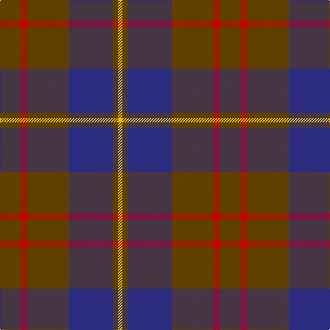

In pattern [GRGBGY](/stripes/grgbgy/).

This was sourced from house-of-tartan.  It is a [6 stripe tartan](/stripes/stripes6/).

Original link http://www.house-of-tartan.scotland.net/house/TartanViewjs.asp?colr=Def&tnam=1745

## Thread count
T/30 R10 T60 DB64 T8 Y/6

## Palette
Each colour and the base-6 reference it is a variant of.

| Colour | Shade | Base |
|---|---|---|
| DB | <code style="background-color:#2C2C80;">#2C2C80</code> `oklch(35.0% 0.138 276.6)` <small>#2C2C80</small> | B <code style="background-color:#2A418A;">#2A418A</code> |
| R | <code style="background-color:#C80000;">#C80000</code> `oklch(52.3% 0.215 29.2)` <small>#C80000</small> | R <code style="background-color:#CC0000;">#CC0000</code> |
| T | <code style="background-color:#604000;">#604000</code> `oklch(39.8% 0.083 76.8)` <small>#604000</small> | G <code style="background-color:#006100;">#006100</code> |
| Y | <code style="background-color:#E8C000;">#E8C000</code> `oklch(81.9% 0.168 93.7)` <small>#E8C000</small> | Y <code style="background-color:#F2BF00;">#F2BF00</code> |

# Sample pattern

## Nearest tartans

The nearest existing variants by ΔTartan distance.

1. [Cameron Hunting](/setts/s6/do15r5do30b32do4lo3~x2/) — ΔT 0.72
1. [London Regiment](/setts/s6/dy34db27r3db27dy34w3~x2/) — ΔT 0.93
1. [Balfour blue & brown](/setts/s6/db18ly2o6ly2o19r3~x2/) — ΔT 1.07
1. [Balfour #2](/setts/s6/db18ly2dy6ly2dy19r3~x2/) — ΔT 1.08
1. [Balfour (Clan)](/setts/s6/db18ly2dy6ly2dy19r3~x4/) — ΔT 1.08
1. [Perthshire Tourist Board (Corporate)](/setts/s6/dp26r6g16dp8g3r2~x2/) — ΔT 1.11
1. [Dama Classic](/setts/s8/y30ly3y3ly3y12do30k3do5~x2/) — ΔT 1.16
1. [Bean Hunting Clan Tartan Tartan Number: 106. Earliest known date: 1987 The weaving and wearing of this tartan is 'Restricted'. This is not a legal definition and is applied by the Scottish Tartans Society irrespective of Design Patent or Copyright, in the spirit of a gentlemans agreement. Interested parties should contact the person listed under 'Source:' in this document. See products available Copyright © Blair Urquhart, Comrie, 2015](/setts/s7/db6dg41db20r15dg41r15db6/) — ΔT 1.22
1. [Connaught Green](/setts/s6/r1db12y5db2y4lb1~x2/) — ΔT 1.23
1. [Cameron, hunting](/setts/s6/o15r5o30db32o4ly3~x2/) — ΔT 1.25

## Neighbour map

Every grey dot is one of 14299 variants placed by the first two principal components of the ΔTartan feature space (44% of its variance). Red is this tartan; blue dots are its nearest — click one to open its page.

<svg viewBox="0 0 640 380" role="img" style="max-width:100%;height:auto;border:1px solid #e0e0e0;border-radius:4px;display:block" xmlns="http://www.w3.org/2000/svg"><image href="/nn/cloud.v1.png" width="640" height="380"/><a href="/setts/s6/do15r5do30b32do4lo3~x2/"><circle cx="349.0" cy="234.3" r="4" fill="#3465a4"><title>Cameron Hunting</title></circle></a><a href="/setts/s6/dy34db27r3db27dy34w3~x2/"><circle cx="343.6" cy="254.3" r="4" fill="#3465a4"><title>London Regiment</title></circle></a><a href="/setts/s6/db18ly2o6ly2o19r3~x2/"><circle cx="317.3" cy="226.5" r="4" fill="#3465a4"><title>Balfour blue &amp; brown</title></circle></a><a href="/setts/s6/db18ly2dy6ly2dy19r3~x2/"><circle cx="297.5" cy="218.4" r="4" fill="#3465a4"><title>Balfour #2</title></circle></a><a href="/setts/s6/db18ly2dy6ly2dy19r3~x4/"><circle cx="297.5" cy="218.4" r="4" fill="#3465a4"><title>Balfour (Clan)</title></circle></a><a href="/setts/s6/dp26r6g16dp8g3r2~x2/"><circle cx="378.9" cy="239.5" r="4" fill="#3465a4"><title>Perthshire Tourist Board (Corporate)</title></circle></a><a href="/setts/s8/y30ly3y3ly3y12do30k3do5~x2/"><circle cx="335.9" cy="212.2" r="4" fill="#3465a4"><title>Dama Classic</title></circle></a><a href="/setts/s7/db6dg41db20r15dg41r15db6/"><circle cx="306.4" cy="258.4" r="4" fill="#3465a4"><title>Bean Hunting Clan Tartan Tartan Number: 106. Earliest known date: 1987 The weaving and wearing of this tartan is 'Restricted'. This is not a legal definition and is applied by the Scottish Tartans Society irrespective of Design Patent or Copyright, in the spirit of a gentlemans agreement. Interested parties should contact the person listed under 'Source:' in this document. See products available Copyright © Blair Urquhart, Comrie, 2015</title></circle></a><a href="/setts/s6/r1db12y5db2y4lb1~x2/"><circle cx="353.7" cy="219.6" r="4" fill="#3465a4"><title>Connaught Green</title></circle></a><a href="/setts/s6/o15r5o30db32o4ly3~x2/"><circle cx="378.9" cy="245.0" r="4" fill="#3465a4"><title>Cameron, hunting</title></circle></a><circle cx="355.9" cy="235.1" r="5" fill="#c00000"/></svg>

ID: /setts/s6/dy15r5dy30db32dy4ly3~x2/
