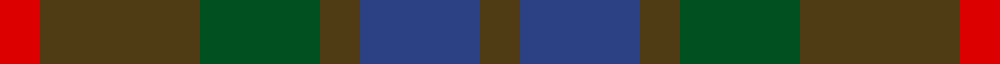
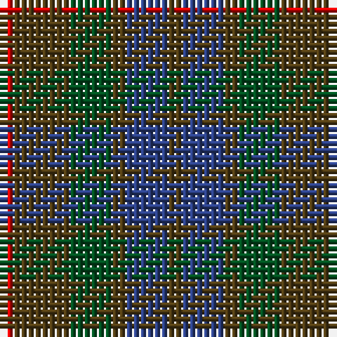

In pattern [GBGGGR](/stripes/gbgggr/).

This was sourced from register-of-tartans.  It is a [6 stripe tartan](/stripes/stripes6/).

Original link https://www.tartanregister.gov.uk/tartanDetails.aspx?ref=1259

## Register references

External register numbers recorded for this tartan.

- Scottish Register of Tartans: [1259](https://www.tartanregister.gov.uk/tartanDetails.aspx?ref=1259)
- Scottish Tartans World Register: 47

## Thread count
R/2 T8 G6 T2 B6 T/2

## Palette
Each colour and the base-6 reference it is a variant of.

| Colour | Shade | Base |
|---|---|---|
| B | <code style="background-color:#2C4084;">#2C4084</code> `oklch(39.4% 0.117 268.3)` <small>#2C4084</small> | B <code style="background-color:#2A418A;">#2A418A</code> |
| G | <code style="background-color:#005020;">#005020</code> `oklch(37.7% 0.105 149.6)` <small>#005020</small> | G <code style="background-color:#006100;">#006100</code> |
| R | <code style="background-color:#DC0000;">#DC0000</code> `oklch(56.2% 0.230 29.2)` <small>#DC0000</small> | R <code style="background-color:#CC0000;">#CC0000</code> |
| T | <code style="background-color:#503C14;">#503C14</code> `oklch(37.0% 0.062 81.8)` <small>#503C14</small> | G <code style="background-color:#006100;">#006100</code> |

# Sample pattern

## Nearest tartans

The nearest existing variants by ΔTartan distance.

1. [Fraser Hunting](/setts/s6/r1o4g3o1db3o1~x2/) — ΔT 1.34
1. [MacNab WI 2](/setts/s4/dg15r3n11b2~x2/) — ΔT 1.60
1. [MacNab WI2](/setts/s4/dg15r3n11b2/) — ΔT 1.60
1. [Bright of Garth (Personal)](/setts/s5/g7dy6dt7dy1dt2~x6/) — ΔT 1.61
1. [Dorward/Dogwood](/setts/s7/dy7r3dy9g15db19dy14r4~x2/) — ΔT 1.63
1. [Harmony 6](/setts/s5/dg2dp10dy15dg10dp2~x4/) — ΔT 1.65
1. [Dewar (WCWM)](/setts/s6/dt1dy1dt7dy5y7lr1~x4/) — ΔT 1.66
1. [Dorward](/setts/s7/o7r3o9g15db19o14r4~x2/) — ΔT 1.67
1. [McCanna NW Htg (Personal)](/setts/s7/k1dy4dg1k1dg1k1dy1~x10/) — ΔT 1.68
1. [Cairngorm #2](/setts/s7/n5t4n22k15y22o4y4~x2/) — ΔT 1.71

## Neighbour map

Every grey dot is one of 14299 variants placed by the first two principal components of the ΔTartan feature space (44% of its variance). Red is this tartan; blue dots are its nearest — click one to open its page.

<svg viewBox="0 0 640 380" role="img" style="max-width:100%;height:auto;border:1px solid #e0e0e0;border-radius:4px;display:block" xmlns="http://www.w3.org/2000/svg"><image href="/nn/cloud.v1.png" width="640" height="380"/><a href="/setts/s6/r1o4g3o1db3o1~x2/"><circle cx="242.6" cy="302.9" r="4" fill="#3465a4"><title>Fraser Hunting</title></circle></a><a href="/setts/s4/dg15r3n11b2~x2/"><circle cx="335.6" cy="299.8" r="4" fill="#3465a4"><title>MacNab WI 2</title></circle></a><a href="/setts/s4/dg15r3n11b2/"><circle cx="335.6" cy="299.8" r="4" fill="#3465a4"><title>MacNab WI2</title></circle></a><a href="/setts/s5/g7dy6dt7dy1dt2~x6/"><circle cx="292.3" cy="332.0" r="4" fill="#3465a4"><title>Bright of Garth (Personal)</title></circle></a><a href="/setts/s7/dy7r3dy9g15db19dy14r4~x2/"><circle cx="229.6" cy="279.8" r="4" fill="#3465a4"><title>Dorward/Dogwood</title></circle></a><a href="/setts/s5/dg2dp10dy15dg10dp2~x4/"><circle cx="304.7" cy="309.3" r="4" fill="#3465a4"><title>Harmony 6</title></circle></a><a href="/setts/s6/dt1dy1dt7dy5y7lr1~x4/"><circle cx="256.2" cy="272.5" r="4" fill="#3465a4"><title>Dewar (WCWM)</title></circle></a><a href="/setts/s7/o7r3o9g15db19o14r4~x2/"><circle cx="230.3" cy="278.2" r="4" fill="#3465a4"><title>Dorward</title></circle></a><a href="/setts/s7/k1dy4dg1k1dg1k1dy1~x10/"><circle cx="328.5" cy="312.8" r="4" fill="#3465a4"><title>McCanna NW Htg (Personal)</title></circle></a><a href="/setts/s7/n5t4n22k15y22o4y4~x2/"><circle cx="218.4" cy="268.9" r="4" fill="#3465a4"><title>Cairngorm #2</title></circle></a><circle cx="270.9" cy="323.6" r="5" fill="#c00000"/></svg>

ID: /setts/s6/dy1db3dy1dg3dy4r1~x2/
