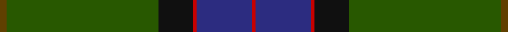

**Bands:** [RBRKGG](/stripes/rbrkgg/) · **Stripes:** [R DB R K DG DY](/stripes/stripes6/) R DB R K DG DY

This was sourced from register-of-tartans.  It is a [6 band tartan](/bands/bands6/).

Original link https://www.tartanregister.gov.uk/tartanDetails.aspx?ref=2777

## Register references

External register numbers recorded for this tartan.

- Scottish Register of Tartans: [2777](https://www.tartanregister.gov.uk/tartanDetails.aspx?ref=2777)
- Scottish Tartans Authority (ITI): 1417
- Scottish Tartans World Register: 1417

## Thread count
T/4 G88 K20 R2 DB32 R/2

## Palette
Each colour and its ΔE from the base-6 reference it is a variant of.

| Colour | Shade | Base | ΔE (OKLab) |
|---|---|---|---|
| DB | <code style="background-color:#2C2C80;">#2C2C80</code> `#2C2C80` | B <code style="background-color:#2A418A;">#2A418A</code> | 0.06 |
| G | <code style="background-color:#285800;">#285800</code> `#285800` | G <code style="background-color:#006100;">#006100</code> | 0.03 |
| K | <code style="background-color:#101010;">#101010</code> `#101010` | K <code style="background-color:#000000;">#000000</code> | 0.17 |
| R | <code style="background-color:#C80000;">#C80000</code> `#C80000` | R <code style="background-color:#CC0000;">#CC0000</code> | 0.01 |
| T | <code style="background-color:#604000;">#604000</code> `#604000` | G <code style="background-color:#006100;">#006100</code> | 0.14 |

# Sample pattern

## Nearest tartans

The nearest existing variants by ΔTartan distance.

1. [Green Swamp Youth Campers](/setts/s6/k8r2k13lo2dg48b6~x2/) — ΔT 1.19
1. [Suttle (Personal)](/setts/s8/n36k18n5dt7n5k7r1g2~x2/) — ΔT 1.33
1. [Nolan Family, John J (Personal)](/setts/s5/do8g19dg42lo3o1~x2/) — ΔT 1.39
1. [Unidentified, Toy Bear](/setts/s8/dg47ly2dg5ly2dg4k15db19r2~x2/) — ΔT 1.40
1. [Green Swamp Youth Campers](/setts/s6/k8r2k13ly2dg48db6~x2/) — ΔT 1.45
1. [Shiach (Personal)](/setts/s8/g45k4r2g4r2k4n21r5~x2/) — ΔT 1.53
1. [St Andrews Old Course Hotel Corporate Tartan Tartan Number: 2332. Earliest known date: 1994 St Andrews Old Course Hotel, Golf Resort, and SPA See products available Copyright © Blair Urquhart, Comrie, 2015](/setts/s6/g50db20k3db2dy2db5~x2/) — ΔT 1.53
1. [Nolan (Personal)](/setts/s5/dr8g19dg42lo3r1~x2/) — ΔT 1.53
1. [Java Saint Andrew Society Hunting](/setts/s7/dt50g26k9g4lb2r2g10~x2/) — ΔT 1.53
1. [Roast Den, The](/setts/s9/y62do12lg1y4dg2y4lg1do12dg12~x2/) — ΔT 1.61

## Neighbour map

Every grey dot is one of 14299 variants placed by the first two principal components of the ΔTartan feature space (44% of its variance). Red is this tartan; blue dots are its nearest — click one to open its page.

<svg viewBox="0 0 640 380" role="img" style="max-width:100%;height:auto;border:1px solid #e0e0e0;border-radius:4px;display:block" xmlns="http://www.w3.org/2000/svg"><image href="/nn/cloud.v1.png" width="640" height="380"/><a href="/setts/s6/k8r2k13lo2dg48b6~x2/"><circle cx="408.3" cy="175.3" r="4" fill="#3465a4"><title>Green Swamp Youth Campers</title></circle></a><a href="/setts/s8/n36k18n5dt7n5k7r1g2~x2/"><circle cx="397.5" cy="152.7" r="4" fill="#3465a4"><title>Suttle (Personal)</title></circle></a><a href="/setts/s5/do8g19dg42lo3o1~x2/"><circle cx="378.3" cy="157.0" r="4" fill="#3465a4"><title>Nolan Family, John J (Personal)</title></circle></a><a href="/setts/s8/dg47ly2dg5ly2dg4k15db19r2~x2/"><circle cx="391.9" cy="172.1" r="4" fill="#3465a4"><title>Unidentified, Toy Bear</title></circle></a><a href="/setts/s6/k8r2k13ly2dg48db6~x2/"><circle cx="438.2" cy="192.6" r="4" fill="#3465a4"><title>Green Swamp Youth Campers</title></circle></a><a href="/setts/s8/g45k4r2g4r2k4n21r5~x2/"><circle cx="369.3" cy="154.6" r="4" fill="#3465a4"><title>Shiach (Personal)</title></circle></a><a href="/setts/s6/g50db20k3db2dy2db5~x2/"><circle cx="447.4" cy="189.0" r="4" fill="#3465a4"><title>St Andrews Old Course Hotel Corporate Tartan Tartan Number: 2332. Earliest known date: 1994 St Andrews Old Course Hotel, Golf Resort, and SPA See products available Copyright © Blair Urquhart, Comrie, 2015</title></circle></a><a href="/setts/s5/dr8g19dg42lo3r1~x2/"><circle cx="439.7" cy="196.7" r="4" fill="#3465a4"><title>Nolan (Personal)</title></circle></a><a href="/setts/s7/dt50g26k9g4lb2r2g10~x2/"><circle cx="354.5" cy="181.0" r="4" fill="#3465a4"><title>Java Saint Andrew Society Hunting</title></circle></a><a href="/setts/s9/y62do12lg1y4dg2y4lg1do12dg12~x2/"><circle cx="414.8" cy="108.5" r="4" fill="#3465a4"><title>Roast Den, The</title></circle></a><circle cx="428.1" cy="155.3" r="5" fill="#c00000"/></svg>

ID: /setts/s6/dy2dg44k10r1db16r1~x2/
