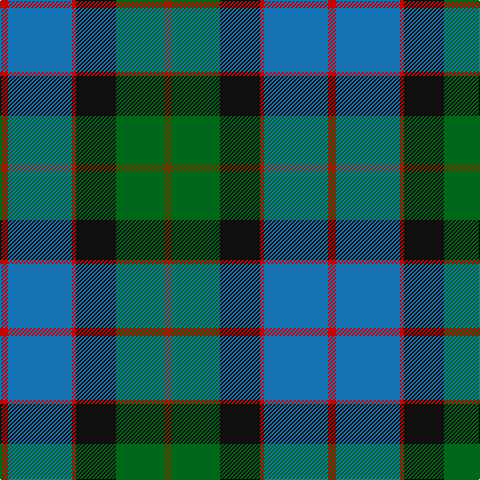

In pattern [GGKRBR](/stripes/ggkrbr/).

This was sourced from tartans-authority.  It is a [6 stripe tartan](/stripes/stripes6/).

Original link http://www.tartansauthority.com/tartan-ferret/display/1418/

## Thread count
R/8 B64 R4 K40 G48 T/8

## Palette
Each colour and the base-6 reference it is a variant of.

| Colour | Shade | Base |
|---|---|---|
| B | <code style="background-color:#1474B4;">#1474B4</code> `oklch(54.0% 0.129 245.1)` <small>#1474B4</small> | B <code style="background-color:#2A418A;">#2A418A</code> |
| G | <code style="background-color:#006818;">#006818</code> `oklch(45.0% 0.142 145.0)` <small>#006818</small> | G <code style="background-color:#006100;">#006100</code> |
| K | <code style="background-color:#101010;">#101010</code> `oklch(17.3% 0.000 89.9)` <small>#101010</small> | K <code style="background-color:#000000;">#000000</code> |
| R | <code style="background-color:#C80000;">#C80000</code> `oklch(52.3% 0.215 29.2)` <small>#C80000</small> | R <code style="background-color:#CC0000;">#CC0000</code> |
| T | <code style="background-color:#604000;">#604000</code> `oklch(39.8% 0.083 76.8)` <small>#604000</small> | G <code style="background-color:#006100;">#006100</code> |

# Sample pattern

## Nearest tartans

The nearest existing variants by ΔTartan distance.

1. [Royal Ashburn Golf Club](/setts/s6/g2b22r2k21g23ly2~x2/) — ΔT 0.75
1. [Paterson (Personal)](/setts/s7/g3db12w1k12g13r2g2~x2/) — ΔT 0.79
1. [Smith, Sir William (?)](/setts/s6/t3db18k20g20k1ly3~x2/) — ΔT 0.81
1. [MacFadzean/MacPhedran](/setts/s7/g3db12w1k12g13r2g2~x4/) — ΔT 0.84
1. [MacLeod of Assynt](/setts/s6/r3k2g20k10b20ly2~x2/) — ΔT 0.86
1. [Landels (Personal)](/setts/s5/db31g2k20ly2g24~x2/) — ΔT 0.86
1. [Canine All Dogs](/setts/s6/r5t3g24db24r4ly2~x2/) — ΔT 0.94
1. [Ednie (Personal)](/setts/s7/b11k4g4m1g4k1r1~x4/) — ΔT 0.95
1. [Russell or Mitchell or Hunter or Galbraith](/setts/s6/k2dg12k12r1db12w2~x2/) — ΔT 0.95
1. [MacWilliam Clan Tartan Tartan Number: 1417. Earliest known date: pre 1880 Mentioned in the pattern book 'Clans Originaux' produced in Paris in 1880 by J. Claude Fres Et Cie. It is similar in style and colour to the MacKay tartan both from Sutherland in the North of Scotland See products available Copyright © Blair Urquhart, Comrie, 2015](/setts/s6/dy2g12k10r1db16r2~x2/) — ΔT 0.98

## Neighbour map

Every grey dot is one of 14299 variants placed by the first two principal components of the ΔTartan feature space (44% of its variance). Red is this tartan; blue dots are its nearest — click one to open its page.

<svg viewBox="0 0 640 380" role="img" style="max-width:100%;height:auto;border:1px solid #e0e0e0;border-radius:4px;display:block" xmlns="http://www.w3.org/2000/svg"><image href="/nn/cloud.v1.png" width="640" height="380"/><a href="/setts/s6/g2b22r2k21g23ly2~x2/"><circle cx="175.6" cy="199.3" r="4" fill="#3465a4"><title>Royal Ashburn Golf Club</title></circle></a><a href="/setts/s7/g3db12w1k12g13r2g2~x2/"><circle cx="200.8" cy="194.5" r="4" fill="#3465a4"><title>Paterson (Personal)</title></circle></a><a href="/setts/s6/t3db18k20g20k1ly3~x2/"><circle cx="179.9" cy="184.1" r="4" fill="#3465a4"><title>Smith, Sir William (?)</title></circle></a><a href="/setts/s7/g3db12w1k12g13r2g2~x4/"><circle cx="193.9" cy="187.3" r="4" fill="#3465a4"><title>MacFadzean/MacPhedran</title></circle></a><a href="/setts/s6/r3k2g20k10b20ly2~x2/"><circle cx="169.5" cy="202.8" r="4" fill="#3465a4"><title>MacLeod of Assynt</title></circle></a><a href="/setts/s5/db31g2k20ly2g24~x2/"><circle cx="218.7" cy="213.6" r="4" fill="#3465a4"><title>Landels (Personal)</title></circle></a><a href="/setts/s6/r5t3g24db24r4ly2~x2/"><circle cx="218.8" cy="188.2" r="4" fill="#3465a4"><title>Canine All Dogs</title></circle></a><a href="/setts/s7/b11k4g4m1g4k1r1~x4/"><circle cx="213.1" cy="194.5" r="4" fill="#3465a4"><title>Ednie (Personal)</title></circle></a><a href="/setts/s6/k2dg12k12r1db12w2~x2/"><circle cx="180.5" cy="211.1" r="4" fill="#3465a4"><title>Russell or Mitchell or Hunter or Galbraith</title></circle></a><a href="/setts/s6/dy2g12k10r1db16r2~x2/"><circle cx="214.2" cy="200.7" r="4" fill="#3465a4"><title>MacWilliam Clan Tartan Tartan Number: 1417. Earliest known date: pre 1880 Mentioned in the pattern book 'Clans Originaux' produced in Paris in 1880 by J. Claude Fres Et Cie. It is similar in style and colour to the MacKay tartan both from Sutherland in the North of Scotland See products available Copyright © Blair Urquhart, Comrie, 2015</title></circle></a><circle cx="193.5" cy="191.5" r="5" fill="#c00000"/></svg>

ID: /setts/s6/dy2g12k10r1b16r2~x4/
