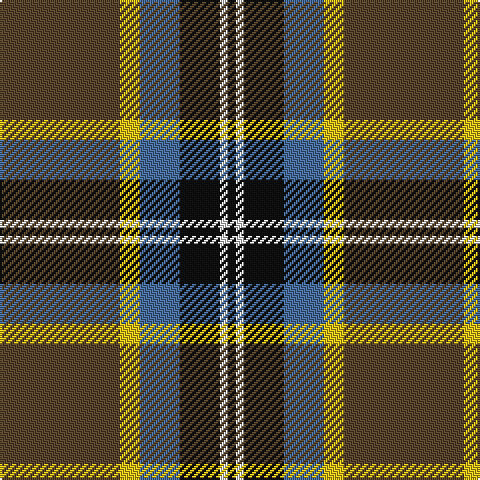

This page is one **sett** — a single exact thread-count. It belongs to the [tartan](/tartans/dy30ly5b10k10w2k2/)
(the same proportion at any scale), whose colour order is pattern [GYBKWK](/stripes/gybkwk/).

Sourced from register-of-tartans.  It is a [6 stripe tartan](/stripes/stripes6/).

Original link https://www.tartanregister.gov.uk/tartanDetails.aspx?ref=10502

## Also known as

This cloth is also recorded under:

- Bryan Wedding Commemorative

2 attestations — the source records this cloth was collapsed from (oldest owns this page)

<ul>
<li>22/02/2011 — Bryan Wedding (Personal) (register-of-tartans, <a href="https://www.tartanregister.gov.uk/tartanDetails.aspx?ref=10502">record</a>)</li>
<li>undated — Bryan Wedding Commemorative Tartan Tartan Number: 10502. Earliest known date: 22/02/2011 Designed for the marriage of Christian Bryan and Mairi Cowieson. The colours are a combination of those contained in the Ramsay and Cornish tartans, reflecting the bride's family connection to the Ramsay tartan and the groom's residence in Cornwall. The autumnal theme of the wedding began with the cognac diamond contained in the brides engagement ring and is further enhanced by the colours chosen for the tartan. See products available Copyright © Blair Urquhart, Comrie, 2015 (house-of-tartan, <a href="http://www.house-of-tartan.scotland.net/house/TartanViewjs.asp?colr=Def&tnam=10502">record</a>)</li>
</ul>

## Register references

External register numbers recorded for this tartan.

- Scottish Register of Tartans: [10502](https://www.tartanregister.gov.uk/tartanDetails.aspx?ref=10502)

## Thread count
T/60 Y10 B20 K20 LN4 K/4

## Palette

Palette: <strong>Logan (The Scottish Gael, 1831)</strong> <small style="color:#888">(1 of 5 colours)</small>
<table><thead><tr><th>Colour</th><th>Threads</th><th>Shade</th><th>Base</th><th>OKLCh</th></tr></thead><tbody><tr><td>T/</td><td style="text-align:right;font-variant-numeric:tabular-nums">60</td><td><code style="background-color:#58442C;">#58442C</code> <small style="color:#888">#58442C</small></td><td>G <code style="background-color:#006100;">#006100</code></td><td><small style="color:#888">oklch(40.2% 0.046 71.0)</small></td></tr><tr><td>Y</td><td style="text-align:right;font-variant-numeric:tabular-nums">10</td><td><code style="background-color:#DCBC1C;">#DCBC1C</code> <small style="color:#888">#DCBC1C</small></td><td>Y <code style="background-color:#F2BF00;">#F2BF00</code></td><td><small style="color:#888">oklch(79.9% 0.159 96.2)</small></td></tr><tr><td>B</td><td style="text-align:right;font-variant-numeric:tabular-nums">20</td><td><code style="background-color:#486C9C;">#486C9C</code> <small style="color:#888">#486C9C</small></td><td>B <code style="background-color:#2A418A;">#2A418A</code></td><td><small style="color:#888">oklch(52.6% 0.087 255.9)</small></td></tr><tr><td>K</td><td style="text-align:right;font-variant-numeric:tabular-nums">20</td><td><code style="background-color:#101010;">#101010</code> <small style="color:#888">#101010</small></td><td>K <code style="background-color:#000000;">#000000</code></td><td><small style="color:#888">oklch(17.3% 0.000 89.9)</small></td></tr><tr><td>LN</td><td style="text-align:right;font-variant-numeric:tabular-nums">4</td><td><code style="background-color:#E8E8E8;">#E8E8E8</code> <small style="color:#888">#E8E8E8</small></td><td>W <code style="background-color:#F7F7F7;">#F7F7F7</code></td><td><small style="color:#888">oklch(93.1% 0.000 89.9)</small></td></tr><tr><td>K/</td><td style="text-align:right;font-variant-numeric:tabular-nums">4</td><td><code style="background-color:#101010;">#101010</code> <small style="color:#888">#101010</small></td><td>K <code style="background-color:#000000;">#000000</code></td><td><small style="color:#888">oklch(17.3% 0.000 89.9)</small></td></tr></tbody></table>

# Sample pattern

## Nearest tartans

The nearest existing variants by ΔTartan distance, with this tartan at the top so the swatches line up against it.

ΔTartan

Tartan

Sett

—

<a href="/ttd/edit/#slug=dy30ly5b10k10w2k2~x2">Bryan Wedding (Personal)</a> <a class="nn-out" href="/setts/s6/dy30ly5b10k10w2k2~x2/" title="open its dictionary page">↗</a>

0.77

<a href="/ttd/edit/#slug=dy30ly5t10k10w2k2~x2">Bryan Wedding (Personal)</a> <a class="nn-out" href="/setts/s6/dy30ly5t10k10w2k2~x2/" title="open its dictionary page">↗</a>

0.88

<a href="/ttd/edit/#slug=b9w2dg30o6r2o2r2o6~x2">Ware/Warr (Name)</a> <a class="nn-out" href="/setts/s8/b9w2dg30o6r2o2r2o6~x2/" title="open its dictionary page">↗</a>

0.91

<a href="/ttd/edit/#slug=k17dg48ly4r10lb12dg4">Asheville Firefighters, The</a> <a class="nn-out" href="/setts/s6/k17dg48ly4r10lb12dg4/" title="open its dictionary page">↗</a>

0.92

<a href="/ttd/edit/#slug=n6dp4n2w2n25k26ly4~x2">New York State Troopers</a> <a class="nn-out" href="/setts/s7/n6dp4n2w2n25k26ly4~x2/" title="open its dictionary page">↗</a>

0.96

<a href="/ttd/edit/#slug=m15dt8y25dt72n98w15">Afternoon Tea / Black Tea</a> <a class="nn-out" href="/setts/s6/m15dt8y25dt72n98w15/" title="open its dictionary page">↗</a>

0.98

<a href="/ttd/edit/#slug=r6dt4w2g27dt37ly2~x2">Highlands of Durham (Corporate)</a> <a class="nn-out" href="/setts/s6/r6dt4w2g27dt37ly2~x2/" title="open its dictionary page">↗</a>

1.04

<a href="/ttd/edit/#slug=w15k8m25k72g98ly15">Afternoon Tea / Afternoon Tea</a> <a class="nn-out" href="/setts/s6/w15k8m25k72g98ly15/" title="open its dictionary page">↗</a>

1.05

<a href="/ttd/edit/#slug=t2dg1t1dg12r2dg1r6ly2~x2">Manitoba Red</a> <a class="nn-out" href="/setts/s8/t2dg1t1dg12r2dg1r6ly2~x2/" title="open its dictionary page">↗</a>

1.10

<a href="/ttd/edit/#slug=w15dg98dt72r25dt8ly15">Afternoon Tea / Darjeeling</a> <a class="nn-out" href="/setts/s6/w15dg98dt72r25dt8ly15/" title="open its dictionary page">↗</a>

1.10

<a href="/ttd/edit/#slug=o6dp4o2w2o24k25lo4~x2">New York State Troopers (Corporate)</a> <a class="nn-out" href="/setts/s7/o6dp4o2w2o24k25lo4~x2/" title="open its dictionary page">↗</a>

## Neighbour map

Every grey dot is one of 14299 variants placed by the first two principal components of the ΔTartan feature space (44% of its variance). Red is this tartan; blue dots are its nearest — click one to open its page.

<svg viewBox="0 0 640 380" role="img" style="max-width:100%;height:auto;border:1px solid #e0e0e0;border-radius:4px;display:block" xmlns="http://www.w3.org/2000/svg"><image href="/nn/cloud.v1.png" width="640" height="380"/><a href="/setts/s6/dy30ly5t10k10w2k2~x2/"><circle cx="252.7" cy="161.5" r="4" fill="#3465a4"><title>Bryan Wedding (Personal)</title></circle></a><a href="/setts/s8/b9w2dg30o6r2o2r2o6~x2/"><circle cx="277.2" cy="144.8" r="4" fill="#3465a4"><title>Ware/Warr (Name)</title></circle></a><a href="/setts/s6/k17dg48ly4r10lb12dg4/"><circle cx="262.0" cy="178.0" r="4" fill="#3465a4"><title>Asheville Firefighters, The</title></circle></a><a href="/setts/s7/n6dp4n2w2n25k26ly4~x2/"><circle cx="258.2" cy="167.0" r="4" fill="#3465a4"><title>New York State Troopers</title></circle></a><a href="/setts/s6/m15dt8y25dt72n98w15/"><circle cx="211.7" cy="182.8" r="4" fill="#3465a4"><title>Afternoon Tea / Black Tea</title></circle></a><a href="/setts/s6/r6dt4w2g27dt37ly2~x2/"><circle cx="301.7" cy="159.2" r="4" fill="#3465a4"><title>Highlands of Durham (Corporate)</title></circle></a><a href="/setts/s6/w15k8m25k72g98ly15/"><circle cx="201.5" cy="180.6" r="4" fill="#3465a4"><title>Afternoon Tea / Afternoon Tea</title></circle></a><a href="/setts/s8/t2dg1t1dg12r2dg1r6ly2~x2/"><circle cx="274.2" cy="164.0" r="4" fill="#3465a4"><title>Manitoba Red</title></circle></a><a href="/setts/s6/w15dg98dt72r25dt8ly15/"><circle cx="206.2" cy="187.6" r="4" fill="#3465a4"><title>Afternoon Tea / Darjeeling</title></circle></a><a href="/setts/s7/o6dp4o2w2o24k25lo4~x2/"><circle cx="242.4" cy="158.3" r="4" fill="#3465a4"><title>New York State Troopers (Corporate)</title></circle></a><circle cx="267.9" cy="171.8" r="5" fill="#c00000"/></svg>

ID: /setts/s6/dy30ly5b10k10w2k2~x2/
