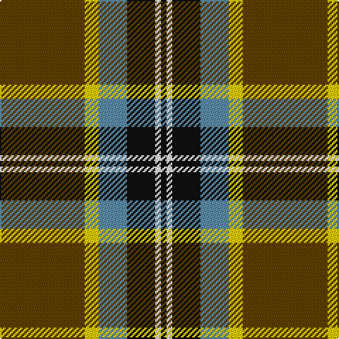

In pattern [GYBKWK](/stripes/gybkwk/).

This was sourced from tartans-authority.  It is a [6 stripe tartan](/stripes/stripes6/).

Original link http://www.tartansauthority.com/tartan-ferret/display/10502/

## Thread count
T/60 Y10 B20 K20 W4 K/4

## Palette
Each colour and the base-6 reference it is a variant of.

| Colour | Shade | Base |
|---|---|---|
| B | <code style="background-color:#5C8CA8;">#5C8CA8</code> `oklch(61.7% 0.067 235.0)` <small>#5C8CA8</small> | B <code style="background-color:#2A418A;">#2A418A</code> |
| K | <code style="background-color:#101010;">#101010</code> `oklch(17.3% 0.000 89.9)` <small>#101010</small> | K <code style="background-color:#000000;">#000000</code> |
| T | <code style="background-color:#604000;">#604000</code> `oklch(39.8% 0.083 76.8)` <small>#604000</small> | G <code style="background-color:#006100;">#006100</code> |
| W | <code style="background-color:#FCFCFC;">#FCFCFC</code> `oklch(99.1% 0.000 89.9)` <small>#FCFCFC</small> | W <code style="background-color:#F7F7F7;">#F7F7F7</code> |
| Y | <code style="background-color:#FCCC00;">#FCCC00</code> `oklch(86.2% 0.176 91.5)` <small>#FCCC00</small> | Y <code style="background-color:#F2BF00;">#F2BF00</code> |

# Sample pattern

## Nearest tartans

The nearest existing variants by ΔTartan distance, with this tartan at the top so the swatches line up against it.

ΔTartan

Tartan

Sett

—

<a href="/ttd/edit/#slug=dy30ly5t10k10w2k2~x2">Bryan Wedding (Personal)</a> <a class="nn-out" href="/setts/s6/dy30ly5t10k10w2k2~x2/" title="open its dictionary page">↗</a>

0.77

<a href="/ttd/edit/#slug=dy30ly5b10k10w2k2~x2">Bryan Wedding (Personal)</a> <a class="nn-out" href="/setts/s6/dy30ly5b10k10w2k2~x2/" title="open its dictionary page">↗</a>

0.95

<a href="/ttd/edit/#slug=k17dg48ly4r10lb12dg4">Asheville Firefighters, The</a> <a class="nn-out" href="/setts/s6/k17dg48ly4r10lb12dg4/" title="open its dictionary page">↗</a>

0.96

<a href="/ttd/edit/#slug=k54lr6k6lr6o20lo40k6ly3">Clyde Valley HOG</a> <a class="nn-out" href="/setts/s8/k54lr6k6lr6o20lo40k6ly3/" title="open its dictionary page">↗</a>

1.01

<a href="/ttd/edit/#slug=lo16k7w1g7k1ly3~x4">Hamilton of Brandon (Fashion)</a> <a class="nn-out" href="/setts/s6/lo16k7w1g7k1ly3~x4/" title="open its dictionary page">↗</a>

1.03

<a href="/ttd/edit/#slug=r4k2lb10k10y28k3~x2">Thomson Camel (Jedburgh Mill)</a> <a class="nn-out" href="/setts/s6/r4k2lb10k10y28k3~x2/" title="open its dictionary page">↗</a>

1.04

<a href="/ttd/edit/#slug=w15k8m25k72g98ly15">Afternoon Tea / Afternoon Tea</a> <a class="nn-out" href="/setts/s6/w15k8m25k72g98ly15/" title="open its dictionary page">↗</a>

1.08

<a href="/ttd/edit/#slug=w6dy36k48r4k5ly6">Drambuie Dress</a> <a class="nn-out" href="/setts/s6/w6dy36k48r4k5ly6/" title="open its dictionary page">↗</a>

1.09

<a href="/ttd/edit/#slug=r6dt4w2g27dt37ly2~x2">Highlands of Durham (Corporate)</a> <a class="nn-out" href="/setts/s6/r6dt4w2g27dt37ly2~x2/" title="open its dictionary page">↗</a>

1.14

<a href="/ttd/edit/#slug=o6dp4o2w2o24k25lo4~x2">New York State Troopers (Corporate)</a> <a class="nn-out" href="/setts/s7/o6dp4o2w2o24k25lo4~x2/" title="open its dictionary page">↗</a>

1.15

<a href="/ttd/edit/#slug=t2dg1t1dg12r2dg1r6ly2~x2">Manitoba Red</a> <a class="nn-out" href="/setts/s8/t2dg1t1dg12r2dg1r6ly2~x2/" title="open its dictionary page">↗</a>

## Neighbour map

Every grey dot is one of 14299 variants placed by the first two principal components of the ΔTartan feature space (44% of its variance). Red is this tartan; blue dots are its nearest — click one to open its page.

<svg viewBox="0 0 640 380" role="img" style="max-width:100%;height:auto;border:1px solid #e0e0e0;border-radius:4px;display:block" xmlns="http://www.w3.org/2000/svg"><image href="/nn/cloud.v1.png" width="640" height="380"/><a href="/setts/s6/dy30ly5b10k10w2k2~x2/"><circle cx="267.9" cy="171.8" r="4" fill="#3465a4"><title>Bryan Wedding (Personal)</title></circle></a><a href="/setts/s6/k17dg48ly4r10lb12dg4/"><circle cx="262.0" cy="178.0" r="4" fill="#3465a4"><title>Asheville Firefighters, The</title></circle></a><a href="/setts/s8/k54lr6k6lr6o20lo40k6ly3/"><circle cx="229.2" cy="131.4" r="4" fill="#3465a4"><title>Clyde Valley HOG</title></circle></a><a href="/setts/s6/lo16k7w1g7k1ly3~x4/"><circle cx="216.0" cy="162.8" r="4" fill="#3465a4"><title>Hamilton of Brandon (Fashion)</title></circle></a><a href="/setts/s6/r4k2lb10k10y28k3~x2/"><circle cx="261.2" cy="176.9" r="4" fill="#3465a4"><title>Thomson Camel (Jedburgh Mill)</title></circle></a><a href="/setts/s6/w15k8m25k72g98ly15/"><circle cx="201.5" cy="180.6" r="4" fill="#3465a4"><title>Afternoon Tea / Afternoon Tea</title></circle></a><a href="/setts/s6/w6dy36k48r4k5ly6/"><circle cx="266.9" cy="173.8" r="4" fill="#3465a4"><title>Drambuie Dress</title></circle></a><a href="/setts/s6/r6dt4w2g27dt37ly2~x2/"><circle cx="301.7" cy="159.2" r="4" fill="#3465a4"><title>Highlands of Durham (Corporate)</title></circle></a><a href="/setts/s7/o6dp4o2w2o24k25lo4~x2/"><circle cx="242.4" cy="158.3" r="4" fill="#3465a4"><title>New York State Troopers (Corporate)</title></circle></a><a href="/setts/s8/t2dg1t1dg12r2dg1r6ly2~x2/"><circle cx="274.2" cy="164.0" r="4" fill="#3465a4"><title>Manitoba Red</title></circle></a><circle cx="252.7" cy="161.5" r="5" fill="#c00000"/></svg>

ID: /setts/s6/dy30ly5t10k10w2k2~x2/
