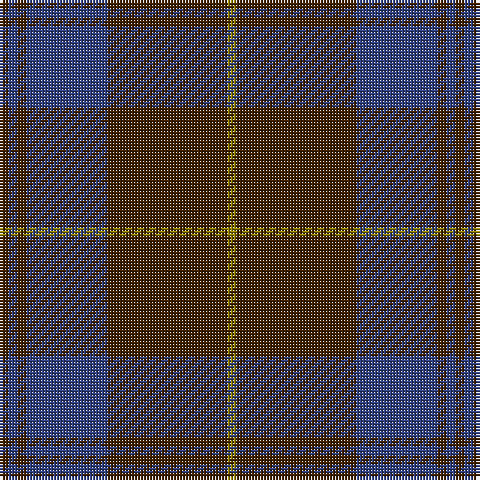

This page is one **sett** — a single exact thread-count. It belongs to the [tartan](/tartans/dy3db3dy3db27dy40y3/)
(the same proportion at any scale), whose colour order is pattern [GBGBGG](/stripes/gbgbgg/).

Sourced from weddslist.  It is a [6 stripe tartan](/stripes/stripes6/).

Original link http://www.weddslist.com/cgi-bin/tartans/pg.pl?source=sts

## Thread count
DR/3 B3 DR3 B27 DR40 LG/3

## Palette

Palette: <strong>custom</strong>
<table><thead><tr><th>Colour</th><th>Threads</th><th>Shade</th><th>Base</th><th>OKLCh</th></tr></thead><tbody><tr><td>DR/</td><td style="text-align:right;font-variant-numeric:tabular-nums">3</td><td><code style="background-color:#402000;">#402000</code> <small style="color:#888">#402000</small></td><td>G <code style="background-color:#006100;">#006100</code></td><td><small style="color:#888">oklch(28.2% 0.066 60.5)</small></td></tr><tr><td>B</td><td style="text-align:right;font-variant-numeric:tabular-nums">3</td><td><code style="background-color:#304080;">#304080</code> <small style="color:#888">#304080</small></td><td>B <code style="background-color:#2A418A;">#2A418A</code></td><td><small style="color:#888">oklch(39.4% 0.109 270.2)</small></td></tr><tr><td>DR</td><td style="text-align:right;font-variant-numeric:tabular-nums">3</td><td><code style="background-color:#402000;">#402000</code> <small style="color:#888">#402000</small></td><td>G <code style="background-color:#006100;">#006100</code></td><td><small style="color:#888">oklch(28.2% 0.066 60.5)</small></td></tr><tr><td>B</td><td style="text-align:right;font-variant-numeric:tabular-nums">27</td><td><code style="background-color:#304080;">#304080</code> <small style="color:#888">#304080</small></td><td>B <code style="background-color:#2A418A;">#2A418A</code></td><td><small style="color:#888">oklch(39.4% 0.109 270.2)</small></td></tr><tr><td>DR</td><td style="text-align:right;font-variant-numeric:tabular-nums">40</td><td><code style="background-color:#402000;">#402000</code> <small style="color:#888">#402000</small></td><td>G <code style="background-color:#006100;">#006100</code></td><td><small style="color:#888">oklch(28.2% 0.066 60.5)</small></td></tr><tr><td>LG/</td><td style="text-align:right;font-variant-numeric:tabular-nums">3</td><td><code style="background-color:#908000;">#908000</code> <small style="color:#888">#908000</small></td><td>G <code style="background-color:#006100;">#006100</code></td><td><small style="color:#888">oklch(59.6% 0.124 100.6)</small></td></tr></tbody></table>

# Sample pattern

## Nearest tartans

The nearest existing variants by ΔTartan distance, with this tartan at the top so the swatches line up against it.

ΔTartan

Tartan

Sett

—

<a href="/ttd/edit/#slug=dy3db3dy3db27dy40y3">Keeper of the Quaich</a> <a class="nn-out" href="/setts/s6/dy3db3dy3db27dy40y3/" title="open its dictionary page">↗</a>

0.97

<a href="/ttd/edit/#slug=do3db3do3db27do40ly3">Keeper of the Quaich Corporate Tartan Tartan Number: 1731. Earliest known date: 1988 Restricted. Sample in STS collection. See products available Copyright © Blair Urquhart, Comrie, 2015</a> <a class="nn-out" href="/setts/s6/do3db3do3db27do40ly3/" title="open its dictionary page">↗</a>

1.12

<a href="/ttd/edit/#slug=lo3dy33db24dy2db2dy2~x2">Keepers of the Quaich</a> <a class="nn-out" href="/setts/s6/lo3dy33db24dy2db2dy2~x2/" title="open its dictionary page">↗</a>

1.19

<a href="/ttd/edit/#slug=dy11db1dy3dbi1db9r1~x4">Dege of Saville Row</a> <a class="nn-out" href="/setts/s6/dy11db1dy3dbi1db9r1~x4/" title="open its dictionary page">↗</a>

1.24

<a href="/ttd/edit/#slug=db50do4db12do23ly4do4~x2">Sligo, County</a> <a class="nn-out" href="/setts/s6/db50do4db12do23ly4do4~x2/" title="open its dictionary page">↗</a>

1.44

<a href="/ttd/edit/#slug=dr6lr2dr30dg12dr3dg12dr3~x2">Crawford</a> <a class="nn-out" href="/setts/s7/dr6lr2dr30dg12dr3dg12dr3~x2/" title="open its dictionary page">↗</a>

1.44

<a href="/ttd/edit/#slug=dr6lr2dr30dg12dr3dg12dr3">Crawford</a> <a class="nn-out" href="/setts/s7/dr6lr2dr30dg12dr3dg12dr3/" title="open its dictionary page">↗</a>

1.50

<a href="/ttd/edit/#slug=dri26w2dri3dt15dt26dr2dt3~x2">Gavin</a> <a class="nn-out" href="/setts/s7/dri26w2dri3dt15dt26dr2dt3~x2/" title="open its dictionary page">↗</a>

1.51

<a href="/ttd/edit/#slug=dg37dy9dg3r9dy3~x2">Glen Trool District Tartan Tartan Number: 914. Earliest known date: pre 1945 Glen Trool is in the Galloway Uplands in the Southwest of Scotland. The tartan began life as a trade sett - a colourful fashion fabric - and was given a name merely to identify it. It proved very popular and is now recognised as a District Tartan. See products available Copyright © Blair Urquhart, Comrie, 2015</a> <a class="nn-out" href="/setts/s5/dg37dy9dg3r9dy3~x2/" title="open its dictionary page">↗</a>

1.51

<a href="/ttd/edit/#slug=db13k3db20dy70db20dy30w3~x2">Unidentified #44</a> <a class="nn-out" href="/setts/s7/db13k3db20dy70db20dy30w3~x2/" title="open its dictionary page">↗</a>

1.56

<a href="/ttd/edit/#slug=k26r6dg16k8dg3r2~x2">Perthshire Tourist Board</a> <a class="nn-out" href="/setts/s6/k26r6dg16k8dg3r2~x2/" title="open its dictionary page">↗</a>

## Neighbour map

Every grey dot is one of 14359 variants placed by the first two principal components of the ΔTartan feature space (44% of its variance). Red is this tartan; blue dots are its nearest — click one to open its page.

<svg viewBox="0 0 640 380" role="img" style="max-width:100%;height:auto;border:1px solid #e0e0e0;border-radius:4px;display:block" xmlns="http://www.w3.org/2000/svg"><image href="/nn/cloud.v1.png" width="640" height="380"/><a href="/setts/s6/do3db3do3db27do40ly3/"><circle cx="457.4" cy="239.3" r="4" fill="#3465a4"><title>Keeper of the Quaich Corporate Tartan Tartan Number: 1731. Earliest known date: 1988 Restricted. Sample in STS collection. See products available Copyright © Blair Urquhart, Comrie, 2015</title></circle></a><a href="/setts/s6/lo3dy33db24dy2db2dy2~x2/"><circle cx="440.4" cy="221.2" r="4" fill="#3465a4"><title>Keepers of the Quaich</title></circle></a><a href="/setts/s6/dy11db1dy3dbi1db9r1~x4/"><circle cx="399.4" cy="245.6" r="4" fill="#3465a4"><title>Dege of Saville Row</title></circle></a><a href="/setts/s6/db50do4db12do23ly4do4~x2/"><circle cx="472.0" cy="248.5" r="4" fill="#3465a4"><title>Sligo, County</title></circle></a><a href="/setts/s7/dr6lr2dr30dg12dr3dg12dr3~x2/"><circle cx="492.2" cy="253.5" r="4" fill="#3465a4"><title>Crawford</title></circle></a><a href="/setts/s7/dr6lr2dr30dg12dr3dg12dr3/"><circle cx="492.2" cy="253.5" r="4" fill="#3465a4"><title>Crawford</title></circle></a><a href="/setts/s7/dri26w2dri3dt15dt26dr2dt3~x2/"><circle cx="411.7" cy="229.5" r="4" fill="#3465a4"><title>Gavin</title></circle></a><a href="/setts/s5/dg37dy9dg3r9dy3~x2/"><circle cx="476.6" cy="258.9" r="4" fill="#3465a4"><title>Glen Trool District Tartan Tartan Number: 914. Earliest known date: pre 1945 Glen Trool is in the Galloway Uplands in the Southwest of Scotland. The tartan began life as a trade sett - a colourful fashion fabric - and was given a name merely to identify it. It proved very popular and is now recognised as a District Tartan. See products available Copyright © Blair Urquhart, Comrie, 2015</title></circle></a><a href="/setts/s7/db13k3db20dy70db20dy30w3~x2/"><circle cx="481.5" cy="221.3" r="4" fill="#3465a4"><title>Unidentified #44</title></circle></a><a href="/setts/s6/k26r6dg16k8dg3r2~x2/"><circle cx="405.1" cy="262.4" r="4" fill="#3465a4"><title>Perthshire Tourist Board</title></circle></a><circle cx="471.9" cy="248.1" r="5" fill="#c00000"/></svg>

ID: /setts/s6/dy3db3dy3db27dy40y3/
