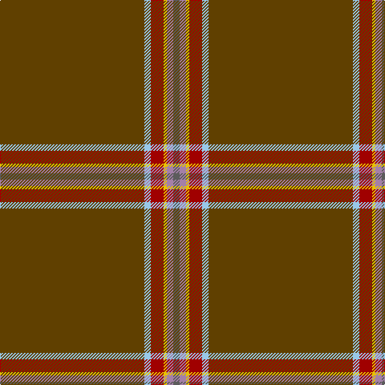

This page is one **sett** — a single exact thread-count. It belongs to the [tartan](/tartans/t45lb2dr4y1lp2n2/)
(the same proportion at any scale), whose colour order is pattern [BRYRWG](/stripes/bryrwg/).

Sourced from tartans-authority.  It is a [6 stripe tartan](/stripes/stripes6/).

Original link http://www.tartansauthority.com/tartan-ferret/display/10299/

## Thread count
T/180 LB8 DR16 Y4 LP8 N/8

## Palette
Each colour and the base-6 reference it is a variant of.

| Colour | Shade | Base |
|---|---|---|
| DR | <code style="background-color:#A00000;">#A00000</code> `oklch(44.3% 0.182 29.2)` <small>#A00000</small> | R <code style="background-color:#CC0000;">#CC0000</code> |
| LB | <code style="background-color:#98C8E8;">#98C8E8</code> `oklch(81.0% 0.068 237.9)` <small>#98C8E8</small> | W <code style="background-color:#F7F7F7;">#F7F7F7</code> |
| LP | <code style="background-color:#A480A8;">#A480A8</code> `oklch(64.8% 0.071 323.0)` <small>#A480A8</small> | R <code style="background-color:#CC0000;">#CC0000</code> |
| N | <code style="background-color:#5C5C5C;">#5C5C5C</code> `oklch(47.5% 0.000 89.9)` <small>#5C5C5C</small> | B <code style="background-color:#2A418A;">#2A418A</code> |
| T | <code style="background-color:#604000;">#604000</code> `oklch(39.8% 0.083 76.8)` <small>#604000</small> | G <code style="background-color:#006100;">#006100</code> |
| Y | <code style="background-color:#E8C000;">#E8C000</code> `oklch(81.9% 0.168 93.7)` <small>#E8C000</small> | Y <code style="background-color:#F2BF00;">#F2BF00</code> |

# Sample pattern

## Nearest tartans

The nearest existing variants by ΔTartan distance, with this tartan at the top so the swatches line up against it.

ΔTartan

Tartan

Sett

—

<a href="/ttd/edit/#slug=dy45lb2r4ly1o2n2~x4">Windy Meadows (Fashion)</a> <a class="nn-out" href="/setts/s6/dy45lb2r4ly1o2n2~x4/" title="open its dictionary page">↗</a>

1.81

<a href="/ttd/edit/#slug=y80lg1y2lo8y2lg1y2r15k1r3lb2~x2">Drovers' Tryst (Corporate)</a> <a class="nn-out" href="/setts/s11/y80lg1y2lo8y2lg1y2r15k1r3lb2~x2/" title="open its dictionary page">↗</a>

1.87

<a href="/ttd/edit/#slug=dy96db8dy8w3dy8g3dy8r3~x2">Burnett of Leys Hunting Family Tartan Tartan Number: 1657. Earliest known date: 1988 Nothing See products available Copyright © Blair Urquhart, Comrie, 2015</a> <a class="nn-out" href="/setts/s8/dy96db8dy8w3dy8g3dy8r3~x2/" title="open its dictionary page">↗</a>

1.93

<a href="/ttd/edit/#slug=ly6dy14db10dy58g3dy8w2">Kozmyk (Corporate)</a> <a class="nn-out" href="/setts/s7/ly6dy14db10dy58g3dy8w2/" title="open its dictionary page">↗</a>

2.04

<a href="/ttd/edit/#slug=dy45k5dy28k5r5w2do6~x2">Leiato of American Samoa (Personal)</a> <a class="nn-out" href="/setts/s7/dy45k5dy28k5r5w2do6~x2/" title="open its dictionary page">↗</a>

2.10

<a href="/ttd/edit/#slug=dy44ly2k4dp2dy15m6k3t3ly2~x2">Inches of Perth (District or Clan)</a> <a class="nn-out" href="/setts/s9/dy44ly2k4dp2dy15m6k3t3ly2~x2/" title="open its dictionary page">↗</a>

2.29

<a href="/ttd/edit/#slug=n44do4n1k1n4y4k1db4do4~x2">Fermanagh (1990)</a> <a class="nn-out" href="/setts/s9/n44do4n1k1n4y4k1db4do4~x2/" title="open its dictionary page">↗</a>

2.30

<a href="/ttd/edit/#slug=b6r7dy49lo2dy22b10dy5k5dy8g4~x2">State Seal of Missouri (Fashion)</a> <a class="nn-out" href="/setts/s10/b6r7dy49lo2dy22b10dy5k5dy8g4~x2/" title="open its dictionary page">↗</a>

2.31

<a href="/ttd/edit/#slug=o45k5o28k5r5w2do6~x2">Leiato of American Samoa (Personal)</a> <a class="nn-out" href="/setts/s7/o45k5o28k5r5w2do6~x2/" title="open its dictionary page">↗</a>

2.33

<a href="/ttd/edit/#slug=dr90k1k2t10k5r2k2t2~x2">Lock in Northumberland</a> <a class="nn-out" href="/setts/s8/dr90k1k2t10k5r2k2t2~x2/" title="open its dictionary page">↗</a>

2.34

<a href="/ttd/edit/#slug=w2o44dt8o2dt2o3r1~x2">Reece, Mathew</a> <a class="nn-out" href="/setts/s7/w2o44dt8o2dt2o3r1~x2/" title="open its dictionary page">↗</a>

## Neighbour map

Every grey dot is one of 14299 variants placed by the first two principal components of the ΔTartan feature space (44% of its variance). Red is this tartan; blue dots are its nearest — click one to open its page.

<svg viewBox="0 0 640 380" role="img" style="max-width:100%;height:auto;border:1px solid #e0e0e0;border-radius:4px;display:block" xmlns="http://www.w3.org/2000/svg"><image href="/nn/cloud.v1.png" width="640" height="380"/><a href="/setts/s11/y80lg1y2lo8y2lg1y2r15k1r3lb2~x2/"><circle cx="566.9" cy="68.7" r="4" fill="#3465a4"><title>Drovers' Tryst (Corporate)</title></circle></a><a href="/setts/s8/dy96db8dy8w3dy8g3dy8r3~x2/"><circle cx="626.0" cy="146.4" r="4" fill="#3465a4"><title>Burnett of Leys Hunting Family Tartan Tartan Number: 1657. Earliest known date: 1988 Nothing See products available Copyright © Blair Urquhart, Comrie, 2015</title></circle></a><a href="/setts/s7/ly6dy14db10dy58g3dy8w2/"><circle cx="548.9" cy="148.0" r="4" fill="#3465a4"><title>Kozmyk (Corporate)</title></circle></a><a href="/setts/s7/dy45k5dy28k5r5w2do6~x2/"><circle cx="546.9" cy="188.3" r="4" fill="#3465a4"><title>Leiato of American Samoa (Personal)</title></circle></a><a href="/setts/s9/dy44ly2k4dp2dy15m6k3t3ly2~x2/"><circle cx="479.4" cy="122.8" r="4" fill="#3465a4"><title>Inches of Perth (District or Clan)</title></circle></a><a href="/setts/s9/n44do4n1k1n4y4k1db4do4~x2/"><circle cx="578.5" cy="128.9" r="4" fill="#3465a4"><title>Fermanagh (1990)</title></circle></a><a href="/setts/s10/b6r7dy49lo2dy22b10dy5k5dy8g4~x2/"><circle cx="476.5" cy="145.3" r="4" fill="#3465a4"><title>State Seal of Missouri (Fashion)</title></circle></a><a href="/setts/s7/o45k5o28k5r5w2do6~x2/"><circle cx="525.4" cy="163.4" r="4" fill="#3465a4"><title>Leiato of American Samoa (Personal)</title></circle></a><a href="/setts/s8/dr90k1k2t10k5r2k2t2~x2/"><circle cx="626.0" cy="104.7" r="4" fill="#3465a4"><title>Lock in Northumberland</title></circle></a><a href="/setts/s7/w2o44dt8o2dt2o3r1~x2/"><circle cx="626.0" cy="136.1" r="4" fill="#3465a4"><title>Reece, Mathew</title></circle></a><circle cx="617.7" cy="120.4" r="5" fill="#c00000"/></svg>

ID: /setts/s6/dy45lb2r4ly1o2n2~x4/
