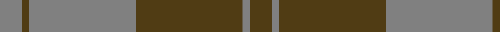

**Bands:** [GGGGGG](/stripes/gggggg/) · **Stripes:** [DY Y DY Y DY Y](/stripes/stripes6/) DY Y DY Y DY Y

This was sourced from register-of-tartans.  It is a [6 band tartan](/bands/bands6/).

Original link https://www.tartanregister.gov.uk/tartanDetails.aspx?ref=1606

## Register references

External register numbers recorded for this tartan.

- Scottish Register of Tartans: [1606](https://www.tartanregister.gov.uk/tartanDetails.aspx?ref=1606)
- Scottish Tartans World Register: 1305

## Thread count
N/12 T4 N58 T58 N4 T/12

## Palette
Each colour and its ΔE from the base-6 reference it is a variant of.

| Colour | Shade | Base | ΔE (OKLab) |
|---|---|---|---|
| N | <code style="background-color:#808080;">#808080</code> `#808080` | G <code style="background-color:#006100;">#006100</code> | 0.23 |
| T | <code style="background-color:#503C14;">#503C14</code> `#503C14` | G <code style="background-color:#006100;">#006100</code> | 0.14 |

# Sample pattern

## Nearest tartans

The nearest existing variants by ΔTartan distance.

1. [Grey Spirit Fashion Tartan Tartan Number: 6594. Earliest known date: 01/03/2005 A fashion tartan from ACS Clothing of Glasgow for use in their kilt hire business. Woven by Lochcarron. The grey is actually a grey/black marl (mixture) which can't be shown graphically. See products available Copyright © Blair Urquhart, Comrie, 2015](/setts/s6/n6k16n6k16n45k4~x2/) — ΔT 1.55
1. [Keepers of the Quaich](/setts/s6/lo3dy33db24dy2db2dy2~x2/) — ΔT 1.63
1. [Donachie of Brockloch (Clan)](/setts/s10/r24dg2r2dg20r25dg2r2dg2r2dg20~x2/) — ΔT 1.64
1. [Rob Roy (Film) (Corporate)](/setts/s6/t3dg1t10dg4dy10t2~x4/) — ΔT 1.79
1. [Lister (Name)](/setts/s7/dy8o29dy8ly3dy8o8ly3~x2/) — ΔT 1.79
1. [Scottish Piping Soc. of London (Corp](/setts/s7/r30y3db5y21r3y21db2~x2/) — ΔT 1.87
1. [Keeper of the Quaich](/setts/s6/dy3db3dy3db27dy40y3/) — ΔT 1.94
1. [Granite City (Silver Granite) Fashion Tartan Tartan Number: 7459. Earliest known date: pre 2007 Produced for Mike King of Philip King Tailoring Ltd, Aberdeen. Previously recorded by the STA as 'Granite City'. Thought to have been produced for Mike King of Aberdeen. . It is believed that Lochcarron of Scotland have now (Jan 2008) trademarked the word ‘Granite’ when used in connection with tartans. See products available Copyright © Blair Urquhart, Comrie, 2015](/setts/s7/k3y3k3y21dy21k3y1~x2/) — ΔT 1.95
1. [Glen Trool (Fashion)](/setts/s5/dg42o10dg3r10o3~x2/) — ΔT 1.96
1. [Glen Trool District Tartan Tartan Number: 914. Earliest known date: pre 1945 Glen Trool is in the Galloway Uplands in the Southwest of Scotland. The tartan began life as a trade sett - a colourful fashion fabric - and was given a name merely to identify it. It proved very popular and is now recognised as a District Tartan. See products available Copyright © Blair Urquhart, Comrie, 2015](/setts/s5/dg37dy9dg3r9dy3~x2/) — ΔT 2.01

## Neighbour map

Every grey dot is one of 14313 variants placed by the first two principal components of the ΔTartan feature space (44% of its variance). Red is this tartan; blue dots are its nearest — click one to open its page.

<svg viewBox="0 0 640 380" role="img" style="max-width:100%;height:auto;border:1px solid #e0e0e0;border-radius:4px;display:block" xmlns="http://www.w3.org/2000/svg"><image href="/nn/cloud.v1.png" width="640" height="380"/><a href="/setts/s6/n6k16n6k16n45k4~x2/"><circle cx="460.6" cy="268.5" r="4" fill="#3465a4"><title>Grey Spirit Fashion Tartan Tartan Number: 6594. Earliest known date: 01/03/2005 A fashion tartan from ACS Clothing of Glasgow for use in their kilt hire business. Woven by Lochcarron. The grey is actually a grey/black marl (mixture) which can't be shown graphically. See products available Copyright © Blair Urquhart, Comrie, 2015</title></circle></a><a href="/setts/s6/lo3dy33db24dy2db2dy2~x2/"><circle cx="441.1" cy="220.8" r="4" fill="#3465a4"><title>Keepers of the Quaich</title></circle></a><a href="/setts/s10/r24dg2r2dg20r25dg2r2dg2r2dg20~x2/"><circle cx="450.3" cy="235.0" r="4" fill="#3465a4"><title>Donachie of Brockloch (Clan)</title></circle></a><a href="/setts/s6/t3dg1t10dg4dy10t2~x4/"><circle cx="334.6" cy="265.6" r="4" fill="#3465a4"><title>Rob Roy (Film) (Corporate)</title></circle></a><a href="/setts/s7/dy8o29dy8ly3dy8o8ly3~x2/"><circle cx="362.4" cy="233.8" r="4" fill="#3465a4"><title>Lister (Name)</title></circle></a><a href="/setts/s7/r30y3db5y21r3y21db2~x2/"><circle cx="390.6" cy="219.1" r="4" fill="#3465a4"><title>Scottish Piping Soc. of London (Corp</title></circle></a><a href="/setts/s6/dy3db3dy3db27dy40y3/"><circle cx="472.3" cy="247.7" r="4" fill="#3465a4"><title>Keeper of the Quaich</title></circle></a><a href="/setts/s7/k3y3k3y21dy21k3y1~x2/"><circle cx="396.3" cy="224.2" r="4" fill="#3465a4"><title>Granite City (Silver Granite) Fashion Tartan Tartan Number: 7459. Earliest known date: pre 2007 Produced for Mike King of Philip King Tailoring Ltd, Aberdeen. Previously recorded by the STA as 'Granite City'. Thought to have been produced for Mike King of Aberdeen. . It is believed that Lochcarron of Scotland have now (Jan 2008) trademarked the word ‘Granite’ when used in connection with tartans. See products available Copyright © Blair Urquhart, Comrie, 2015</title></circle></a><a href="/setts/s5/dg42o10dg3r10o3~x2/"><circle cx="467.5" cy="240.7" r="4" fill="#3465a4"><title>Glen Trool (Fashion)</title></circle></a><a href="/setts/s5/dg37dy9dg3r9dy3~x2/"><circle cx="477.1" cy="258.5" r="4" fill="#3465a4"><title>Glen Trool District Tartan Tartan Number: 914. Earliest known date: pre 1945 Glen Trool is in the Galloway Uplands in the Southwest of Scotland. The tartan began life as a trade sett - a colourful fashion fabric - and was given a name merely to identify it. It proved very popular and is now recognised as a District Tartan. See products available Copyright © Blair Urquhart, Comrie, 2015</title></circle></a><circle cx="442.6" cy="255.8" r="5" fill="#c00000"/></svg>

ID: /setts/s6/dy6y2dy29y29dy2y6~x2/
