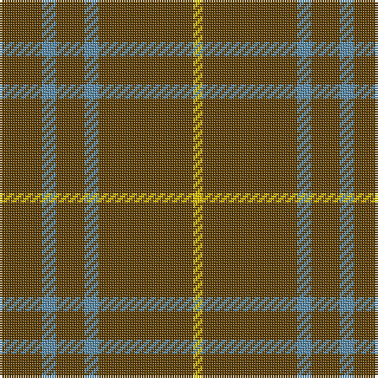

This page is one **sett** — a single exact thread-count. It belongs to the [tartan](/tartans/t9b3t6b3t20y2/)
(the same proportion at any scale), whose colour order is pattern [GBGBGY](/stripes/gbgbgy/).

Sourced from tartans-authority.  It is a [6 stripe tartan](/stripes/stripes6/).

Original link http://www.tartansauthority.com/tartan-ferret/display/717/

## Also known as

This cloth is also recorded under:

- Oman RAF, Sultanate of
- Oman, Sultanate of / Oliver dress
- Oman, Sultanate of..

3 attestations — the source records this cloth was collapsed from (oldest owns this page)

<ul>
<li>1960s — Oman RAF, Sultanate of (Military) (tartans-authority, <a href="http://www.tartansauthority.com/tartan-ferret/display/717/">record</a>)</li>
<li>undated — Oman, Sultanate of.. (weddslist, <a href="http://www.weddslist.com/cgi-bin/tartans/pg.pl?source=sts">record</a>)</li>
<li>undated — Oman Sultanate of.. Regimental Tartan Tartan Number: 717. Earliest known date: pre 2003 Air Force (Juniors) Pipe Band regimental tartan. See products available Copyright © Blair Urquhart, Comrie, 2015 (house-of-tartan, <a href="http://www.house-of-tartan.scotland.net/house/TartanViewjs.asp?colr=Def&tnam=717">record</a>)</li>
</ul>

## Thread count
T/18 B6 T12 B6 T40 Y/4

## Palette
Each colour and the base-6 reference it is a variant of.

| Colour | Shade | Base |
|---|---|---|
| B | <code style="background-color:#5C8CA8;">#5C8CA8</code> `oklch(61.7% 0.067 235.0)` <small>#5C8CA8</small> | B <code style="background-color:#2A418A;">#2A418A</code> |
| T | <code style="background-color:#604000;">#604000</code> `oklch(39.8% 0.083 76.8)` <small>#604000</small> | G <code style="background-color:#006100;">#006100</code> |
| Y | <code style="background-color:#E8C000;">#E8C000</code> `oklch(81.9% 0.168 93.7)` <small>#E8C000</small> | Y <code style="background-color:#F2BF00;">#F2BF00</code> |

# Sample pattern

## Nearest tartans

The nearest existing variants by ΔTartan distance, with this tartan at the top so the swatches line up against it.

ΔTartan

Tartan

Sett

—

<a href="/ttd/edit/#slug=dy9t3dy6t3dy20ly2~x2">Oman RAF, Sultanate of (Military)</a> <a class="nn-out" href="/setts/s6/dy9t3dy6t3dy20ly2~x2/" title="open its dictionary page">↗</a>

1.11

<a href="/setts/s10/dy9t3dy6t3dy20ly2~x2/">Oman, Sultanate of / Oliver dress</a>

1.46

<a href="/ttd/edit/#slug=db1lo9db2lo9r1~x4">Brooks Brothers Tattersall Camel</a> <a class="nn-out" href="/setts/s5/db1lo9db2lo9r1~x4/" title="open its dictionary page">↗</a>

1.71

<a href="/ttd/edit/#slug=g23r3g7r3g23dp7~x2">Highland Spring (1997)</a> <a class="nn-out" href="/setts/s6/g23r3g7r3g23dp7~x2/" title="open its dictionary page">↗</a>

1.72

<a href="/ttd/edit/#slug=r3dy16dy10r3dy3lb2dy3r3~x2">Scott Htg (Error 2)</a> <a class="nn-out" href="/setts/s8/r3dy16dy10r3dy3lb2dy3r3~x2/" title="open its dictionary page">↗</a>

1.76

<a href="/ttd/edit/#slug=y30w2r5~x4">S3</a> <a class="nn-out" href="/setts/s3/y30w2r5~x4/" title="open its dictionary page">↗</a>

1.92

<a href="/ttd/edit/#slug=o5k2o28k10o26k4o4~x2">Dunbar, John Telfer (Personal)</a> <a class="nn-out" href="/setts/s7/o5k2o28k10o26k4o4~x2/" title="open its dictionary page">↗</a>

1.98

<a href="/setts/s8/r8g3r4g44w4~x2/">Welsh National</a>

2.04

<a href="/ttd/edit/#slug=dp7g23r3g7~x2">Highland Spring (1997) (Corporate)</a> <a class="nn-out" href="/setts/s4/dp7g23r3g7~x2/" title="open its dictionary page">↗</a>

2.08

<a href="/ttd/edit/#slug=db3n44k9n10k9n10k9n44r3~x2">VersaCold/Atlas (Corporate)</a> <a class="nn-out" href="/setts/s9/db3n44k9n10k9n10k9n44r3~x2/" title="open its dictionary page">↗</a>

2.11

<a href="/ttd/edit/#slug=r3g12r1g2r2g2r1g12r3k1~x4">Connell (Dalgliesh) (Personal)</a> <a class="nn-out" href="/setts/s10/r3g12r1g2r2g2r1g12r3k1~x4/" title="open its dictionary page">↗</a>

## Neighbour map

Every grey dot is one of 14299 variants placed by the first two principal components of the ΔTartan feature space (44% of its variance). Red is this tartan; blue dots are its nearest — click one to open its page.

<svg viewBox="0 0 640 380" role="img" style="max-width:100%;height:auto;border:1px solid #e0e0e0;border-radius:4px;display:block" xmlns="http://www.w3.org/2000/svg"><image href="/nn/cloud.v1.png" width="640" height="380"/><a href="/setts/s10/dy9t3dy6t3dy20ly2~x2/"><circle cx="561.4" cy="240.3" r="4" fill="#3465a4"><title>Oman, Sultanate of / Oliver dress</title></circle></a><a href="/setts/s5/db1lo9db2lo9r1~x4/"><circle cx="534.7" cy="248.8" r="4" fill="#3465a4"><title>Brooks Brothers Tattersall Camel</title></circle></a><a href="/setts/s6/g23r3g7r3g23dp7~x2/"><circle cx="515.8" cy="278.0" r="4" fill="#3465a4"><title>Highland Spring (1997)</title></circle></a><a href="/setts/s8/r3dy16dy10r3dy3lb2dy3r3~x2/"><circle cx="511.7" cy="252.2" r="4" fill="#3465a4"><title>Scott Htg (Error 2)</title></circle></a><a href="/setts/s3/y30w2r5~x4/"><circle cx="582.7" cy="254.9" r="4" fill="#3465a4"><title>S3</title></circle></a><a href="/setts/s7/o5k2o28k10o26k4o4~x2/"><circle cx="602.2" cy="250.8" r="4" fill="#3465a4"><title>Dunbar, John Telfer (Personal)</title></circle></a><a href="/setts/s8/r8g3r4g44w4~x2/"><circle cx="576.1" cy="207.4" r="4" fill="#3465a4"><title>Welsh National</title></circle></a><a href="/setts/s4/dp7g23r3g7~x2/"><circle cx="471.7" cy="289.2" r="4" fill="#3465a4"><title>Highland Spring (1997) (Corporate)</title></circle></a><a href="/setts/s9/db3n44k9n10k9n10k9n44r3~x2/"><circle cx="519.9" cy="207.0" r="4" fill="#3465a4"><title>VersaCold/Atlas (Corporate)</title></circle></a><a href="/setts/s10/r3g12r1g2r2g2r1g12r3k1~x4/"><circle cx="475.1" cy="206.4" r="4" fill="#3465a4"><title>Connell (Dalgliesh) (Personal)</title></circle></a><circle cx="559.0" cy="256.1" r="5" fill="#c00000"/></svg>

ID: /setts/s6/dy9t3dy6t3dy20ly2~x2/
