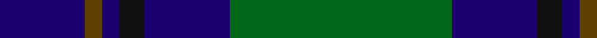

In pattern [BGBKBG](/patterns/bgbkbg/).

This was sourced from tartans-authority.  It is a [6 stripes tartan](/stripes/stripes6/).

Original link http://www.tartansauthority.com/tartan-ferret/display/2332/

## Thread count
DB/40 T8 DB8 K12 DB40 G/104

## Palette
Each colour and its ΔE from the base-6 reference it is a variant of.

| Colour | Shade | Base | ΔE (OKLab) |
|---|---|---|---|
| DB | <code style="background-color:#1C0070;">#1C0070</code> `#1C0070` | B <code style="background-color:#2A418A;">#2A418A</code> | 0.14 |
| G | <code style="background-color:#006818;">#006818</code> `#006818` | G <code style="background-color:#006100;">#006100</code> | 0.02 |
| K | <code style="background-color:#101010;">#101010</code> `#101010` | K <code style="background-color:#000000;">#000000</code> | 0.17 |
| T | <code style="background-color:#604000;">#604000</code> `#604000` | G <code style="background-color:#006100;">#006100</code> | 0.14 |

# Sample pattern

## Nearest tartans

The nearest existing variants by ΔTartan distance.

1. [MacIntyre LC](/setts/s6/g8b24r6b24g64y8-b000052-g11450d-raa0000-yaaaaaa/) — ΔT 0.65
1. [MacIntyre LC](/setts/s6/g4b12r3b12g32y4-b000052-g11450d-raa0000-yaaaaaa/) — ΔT 0.65
1. [Greenways Marketing Intl (Corporate)](/setts/s7/b48g6b6g6y4g36r4-b1c0070-g006818-r880000-yd09800/) — ΔT 0.79
1. [MacIntyre](/setts/s6/g8b24r6b24g64w8-b304080-g004010-rc00000-we0e0e0/) — ΔT 0.79
1. [Rowan (Personal)](/setts/s5/g48y4b32k4b4-b2c2c80-g006818-k101010-yd09800/) — ΔT 0.85
1. [MacIntyre L](/setts/s6/g4b12r3b12g32w4-b000064-g004c00-rc80000-wd0d0d0/) — ΔT 0.89
1. [Gracie](/setts/s8/g94r6g12b70y6b70g12r6-b1c0070-g006818-r880000-yd09800/) — ΔT 0.93
1. [St. Andrew Society, Sao Paulo (Corp)](/setts/s6/b10w6b72g76y10g10-b2c2c80-g006818-we0e0e0-ye8c000/) — ΔT 0.93
1. [Connacht Irish District Tartan Tartan Number: 4485. Earliest known date: 1994 Phil Smith obtained in Perthshire from a swatch dated 1994 shown to him by Keith Lumsden of the Scottish Tartans Society. However www.uniq-orn.com shows this as Connaught Green. See products available Copyright © Blair Urquhart, Comrie, 2015](/setts/s6/r4b64g28b10g32w4-b202060-g288028-ra00000-we0e0e0/) — ΔT 0.97
1. [Heritage Tartan, The](/setts/s6/b8r4b24g35w4g8-b1c0070-g006818-r880000-wc0c0c0/) — ΔT 0.99

## Neighbour map

Every grey dot is one of 15726 variants placed by the first two principal components of the ΔTartan feature space (44% of its variance). Red is this tartan; blue dots are its nearest — click one to open its page.

<svg viewBox="0 0 640 380" role="img" style="max-width:100%;height:auto;border:1px solid #e0e0e0;border-radius:4px;display:block" xmlns="http://www.w3.org/2000/svg"><image href="/nn/cloud.v1.png" width="640" height="380"/><a href="/setts/s6/g8b24r6b24g64y8-b000052-g11450d-raa0000-yaaaaaa/"><circle cx="319.1" cy="224.4" r="4" fill="#3465a4"><title>MacIntyre LC</title></circle></a><a href="/setts/s6/g4b12r3b12g32y4-b000052-g11450d-raa0000-yaaaaaa/"><circle cx="319.1" cy="224.4" r="4" fill="#3465a4"><title>MacIntyre LC</title></circle></a><a href="/setts/s7/b48g6b6g6y4g36r4-b1c0070-g006818-r880000-yd09800/"><circle cx="308.6" cy="193.5" r="4" fill="#3465a4"><title>Greenways Marketing Intl (Corporate)</title></circle></a><a href="/setts/s6/g8b24r6b24g64w8-b304080-g004010-rc00000-we0e0e0/"><circle cx="320.6" cy="221.8" r="4" fill="#3465a4"><title>MacIntyre</title></circle></a><a href="/setts/s5/g48y4b32k4b4-b2c2c80-g006818-k101010-yd09800/"><circle cx="337.2" cy="221.4" r="4" fill="#3465a4"><title>Rowan (Personal)</title></circle></a><a href="/setts/s6/g4b12r3b12g32w4-b000064-g004c00-rc80000-wd0d0d0/"><circle cx="298.2" cy="215.7" r="4" fill="#3465a4"><title>MacIntyre L</title></circle></a><a href="/setts/s8/g94r6g12b70y6b70g12r6-b1c0070-g006818-r880000-yd09800/"><circle cx="322.4" cy="185.9" r="4" fill="#3465a4"><title>Gracie</title></circle></a><a href="/setts/s6/b10w6b72g76y10g10-b2c2c80-g006818-we0e0e0-ye8c000/"><circle cx="290.6" cy="198.9" r="4" fill="#3465a4"><title>St. Andrew Society, Sao Paulo (Corp)</title></circle></a><a href="/setts/s6/r4b64g28b10g32w4-b202060-g288028-ra00000-we0e0e0/"><circle cx="320.7" cy="199.6" r="4" fill="#3465a4"><title>Connacht Irish District Tartan Tartan Number: 4485. Earliest known date: 1994 Phil Smith obtained in Perthshire from a swatch dated 1994 shown to him by Keith Lumsden of the Scottish Tartans Society. However www.uniq-orn.com shows this as Connaught Green. See products available Copyright © Blair Urquhart, Comrie, 2015</title></circle></a><a href="/setts/s6/b8r4b24g35w4g8-b1c0070-g006818-r880000-wc0c0c0/"><circle cx="282.1" cy="225.7" r="4" fill="#3465a4"><title>Heritage Tartan, The</title></circle></a><circle cx="311.9" cy="212.9" r="5" fill="#c00000"/></svg>

ID: /setts/s6/g104b40k12b8ga8b40-b1c0070-g006818-ga604000-k101010/
