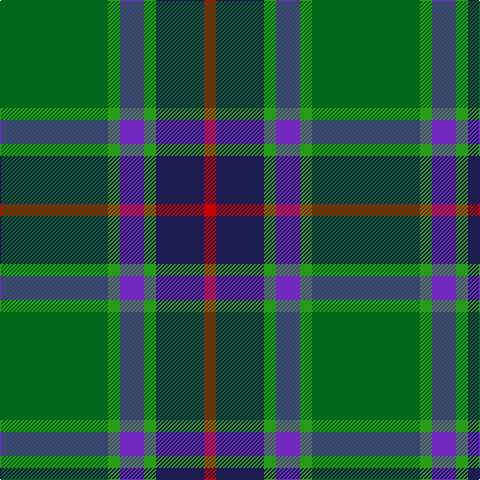

In pattern [GGBGBR](/patterns/ggbgbr/).

This was sourced from tartans-authority.  It is a [6 stripes tartan](/stripes/stripes6/).

Original link http://www.tartansauthority.com/tartan-ferret/display/10029/

## Thread count
Ga/108 G12 P24 G12 DB48 R/12

## Palette
Each colour and its ΔE from the base-6 reference it is a variant of.

| Colour | Shade | Base | ΔE (OKLab) |
|---|---|---|---|
| DB | <code style="background-color:#1C1C50;">#1C1C50</code> `#1C1C50` | B <code style="background-color:#2C4084;">#2C4084</code> | 0.14 |
| G | <code style="background-color:#289C18;">#289C18</code> `#289C18` | G <code style="background-color:#006400;">#006400</code> | 0.18 |
| Ga | <code style="background-color:#006818;">#006818</code> `#006818` | G <code style="background-color:#006400;">#006400</code> | 0.02 |
| P | <code style="background-color:#7028C0;">#7028C0</code> `#7028C0` | B <code style="background-color:#2C4084;">#2C4084</code> | 0.15 |
| R | <code style="background-color:#C80000;">#C80000</code> `#C80000` | R <code style="background-color:#C80000;">#C80000</code> | 0.00 |

# Sample pattern

## Nearest tartans

The nearest existing variants by ΔTartan distance.

1. [Gloucester County Pipe Band (Corp)](/setts/s7/g108b28y14r28k14b28r12-b003c64-g007460-k101010-r901c38-ye8c000/) — ΔT 0.90
1. [Irving of Bonshaw Tower](/setts/s6/r6g6k6g54b54w6-b304080-g008000-k000000-rc00000-we0e0e0/) — ΔT 0.95
1. [Sinclair Green (Personal)](/setts/s7/g8r4g60b30w4ba30r8-b5c5c5c-ba1c0070-g006818-r880000-wfcfcfc/) — ΔT 0.95
1. [Simple Technology (Corporate)](/setts/s5/r6g56b18ga36w6-b2c2c80-g006818-ga003820-rc80000-we0e0e0/) — ΔT 0.96
1. [Cultoquhey (Corporate)](/setts/s5/r6b44k22g64y6-b202060-g006818-k101010-rc80000-yd8b000/) — ΔT 0.97
1. [Cultoquhey Hotel](/setts/s5/r6b44k22g64y6-b202060-g006818-k101010-rc80000-ye8c000/) — ΔT 0.97
1. [Irving of Glentulchan](/setts/s6/r6g54b54k6b6w6-b304080-g008000-k000000-rc00000-we0e0e0/) — ΔT 0.99
1. [MPS Emerald Society](/setts/s6/y8g60ga30b10ba20y8-b2c2c80-ba1474b4-g003820-ga006818-yfccc00/) — ΔT 0.99
1. [Womens Rural Institute](/setts/s8/g8ga48b8k12g8r6g8b6-b440044-g003820-ga408060-k101010-r880000/) — ΔT 1.00
1. [Asheville Firefighters, The](/setts/s6/k17g48y4r10b12g4-b202060-g006818-k101010-rc80000-ye8c000/) — ΔT 1.01

## Neighbour map

Every grey dot is one of 15726 variants placed by the first two principal components of the ΔTartan feature space (44% of its variance). Red is this tartan; blue dots are its nearest — click one to open its page.

<svg viewBox="0 0 640 380" role="img" style="max-width:100%;height:auto;border:1px solid #e0e0e0;border-radius:4px;display:block" xmlns="http://www.w3.org/2000/svg"><image href="/nn/cloud.v1.png" width="640" height="380"/><a href="/setts/s7/g108b28y14r28k14b28r12-b003c64-g007460-k101010-r901c38-ye8c000/"><circle cx="236.2" cy="196.4" r="4" fill="#3465a4"><title>Gloucester County Pipe Band (Corp)</title></circle></a><a href="/setts/s6/r6g6k6g54b54w6-b304080-g008000-k000000-rc00000-we0e0e0/"><circle cx="234.7" cy="188.0" r="4" fill="#3465a4"><title>Irving of Bonshaw Tower</title></circle></a><a href="/setts/s7/g8r4g60b30w4ba30r8-b5c5c5c-ba1c0070-g006818-r880000-wfcfcfc/"><circle cx="250.9" cy="178.5" r="4" fill="#3465a4"><title>Sinclair Green (Personal)</title></circle></a><a href="/setts/s5/r6g56b18ga36w6-b2c2c80-g006818-ga003820-rc80000-we0e0e0/"><circle cx="231.4" cy="226.9" r="4" fill="#3465a4"><title>Simple Technology (Corporate)</title></circle></a><a href="/setts/s5/r6b44k22g64y6-b202060-g006818-k101010-rc80000-yd8b000/"><circle cx="226.5" cy="215.9" r="4" fill="#3465a4"><title>Cultoquhey (Corporate)</title></circle></a><a href="/setts/s5/r6b44k22g64y6-b202060-g006818-k101010-rc80000-ye8c000/"><circle cx="223.1" cy="214.4" r="4" fill="#3465a4"><title>Cultoquhey Hotel</title></circle></a><a href="/setts/s6/r6g54b54k6b6w6-b304080-g008000-k000000-rc00000-we0e0e0/"><circle cx="235.7" cy="188.0" r="4" fill="#3465a4"><title>Irving of Glentulchan</title></circle></a><a href="/setts/s6/y8g60ga30b10ba20y8-b2c2c80-ba1474b4-g003820-ga006818-yfccc00/"><circle cx="174.7" cy="210.9" r="4" fill="#3465a4"><title>MPS Emerald Society</title></circle></a><a href="/setts/s8/g8ga48b8k12g8r6g8b6-b440044-g003820-ga408060-k101010-r880000/"><circle cx="230.5" cy="190.5" r="4" fill="#3465a4"><title>Womens Rural Institute</title></circle></a><a href="/setts/s6/k17g48y4r10b12g4-b202060-g006818-k101010-rc80000-ye8c000/"><circle cx="275.8" cy="187.0" r="4" fill="#3465a4"><title>Asheville Firefighters, The</title></circle></a><circle cx="243.5" cy="199.1" r="5" fill="#c00000"/></svg>

ID: /setts/s6/g108ga12b24ga12ba48r12-b7028c0-ba1c1c50-g006818-ga289c18-rc80000/
