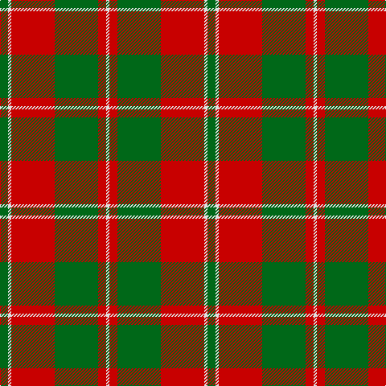

In pattern [GWRGRW](/patterns/gwrgrw/).

This was sourced from register-of-tartans.  It is a [6 stripes tartan](/stripes/stripes6/).

Original link https://www.tartanregister.gov.uk/tartanDetails.aspx?ref=2360

## Thread count
G/10 LN4 R54 G54 R10 LN/4

## Palette
Each colour and its ΔE from the base-6 reference it is a variant of.

| Colour | Shade | Base | ΔE (OKLab) |
|---|---|---|---|
| G | <code style="background-color:#006818;">#006818</code> `#006818` | G <code style="background-color:#006400;">#006400</code> | 0.02 |
| LN | <code style="background-color:#E0E0E0;">#E0E0E0</code> `#E0E0E0` | W <code style="background-color:#F4F4F0;">#F4F4F0</code> | 0.06 |
| R | <code style="background-color:#C80000;">#C80000</code> `#C80000` | R <code style="background-color:#C80000;">#C80000</code> | 0.00 |

# Sample pattern

## Nearest tartans

The nearest existing variants by ΔTartan distance.

1. [Livingston](/setts/s9/g40k4r6k4r12g40r58g6r20-g008000-k000000-rc00000/) — ΔT 1.00
1. [Cetoloni (Personal)](/setts/s6/b4r48g24y4g24b4-b2c2c80-g006818-rc80000-ye8c000/) — ΔT 1.06
1. [Murray, Lord George (Hose)](/setts/s5/g4r20g40r20k4-g006818-k000000-rc80000/) — ΔT 1.07
1. [Denny, hunting](/setts/s6/b2r32g12k2g12k2-b304080-g008000-k000000-rc00000/) — ΔT 1.11
1. [MacDonald, Lord of the Isles](/setts/s5/g32r10g4r36k4-g008000-k000000-rc00000/) — ΔT 1.11
1. [MacGregor of Balquidder (Logan)](/setts/s6/g18r4g18r28k2w4-g006818-k101010-rc80000-we0e0e0/) — ΔT 1.12
1. [MacGregor of Balquhidder](/setts/s5/g16r4g18r32w2-g005020-rdc0000-we0e0e0/) — ΔT 1.12
1. [MacKintosh, Fragment](/setts/s7/r2g28r2g2r28g2w2-g30a010-rc00000-we0e0e0/) — ΔT 1.13
1. [Spice Apple](/setts/s7/g16y4r88g48y16g16r16-g006818-rc80000-yd09800/) — ΔT 1.15
1. [Denny Hunting Clan Tartan Tartan Number: 518. Earliest known date: pre 2003 This tartan is remarkably similar to the Durham sett designed by Wilson's of Bannockburn around 1819. The variation in proportions may point to a deliberate modification suggested by the links between the names. See products available Copyright © Blair Urquhart, Comrie, 2015](/setts/s6/b2r32g12k2g12k2-b2c2c80-g006818-k101010-rc80000/) — ΔT 1.16

## Neighbour map

Every grey dot is one of 15726 variants placed by the first two principal components of the ΔTartan feature space (44% of its variance). Red is this tartan; blue dots are its nearest — click one to open its page.

<svg viewBox="0 0 640 380" role="img" style="max-width:100%;height:auto;border:1px solid #e0e0e0;border-radius:4px;display:block" xmlns="http://www.w3.org/2000/svg"><image href="/nn/cloud.v1.png" width="640" height="380"/><a href="/setts/s9/g40k4r6k4r12g40r58g6r20-g008000-k000000-rc00000/"><circle cx="335.7" cy="186.6" r="4" fill="#3465a4"><title>Livingston</title></circle></a><a href="/setts/s6/b4r48g24y4g24b4-b2c2c80-g006818-rc80000-ye8c000/"><circle cx="287.6" cy="197.2" r="4" fill="#3465a4"><title>Cetoloni (Personal)</title></circle></a><a href="/setts/s5/g4r20g40r20k4-g006818-k000000-rc80000/"><circle cx="324.9" cy="239.8" r="4" fill="#3465a4"><title>Murray, Lord George (Hose)</title></circle></a><a href="/setts/s6/b2r32g12k2g12k2-b304080-g008000-k000000-rc00000/"><circle cx="323.2" cy="170.1" r="4" fill="#3465a4"><title>Denny, hunting</title></circle></a><a href="/setts/s5/g32r10g4r36k4-g008000-k000000-rc00000/"><circle cx="335.1" cy="233.6" r="4" fill="#3465a4"><title>MacDonald, Lord of the Isles</title></circle></a><a href="/setts/s6/g18r4g18r28k2w4-g006818-k101010-rc80000-we0e0e0/"><circle cx="297.9" cy="199.1" r="4" fill="#3465a4"><title>MacGregor of Balquidder (Logan)</title></circle></a><a href="/setts/s5/g16r4g18r32w2-g005020-rdc0000-we0e0e0/"><circle cx="347.8" cy="218.3" r="4" fill="#3465a4"><title>MacGregor of Balquhidder</title></circle></a><a href="/setts/s7/r2g28r2g2r28g2w2-g30a010-rc00000-we0e0e0/"><circle cx="356.9" cy="172.7" r="4" fill="#3465a4"><title>MacKintosh, Fragment</title></circle></a><a href="/setts/s7/g16y4r88g48y16g16r16-g006818-rc80000-yd09800/"><circle cx="368.8" cy="183.5" r="4" fill="#3465a4"><title>Spice Apple</title></circle></a><a href="/setts/s6/b2r32g12k2g12k2-b2c2c80-g006818-k101010-rc80000/"><circle cx="342.8" cy="177.1" r="4" fill="#3465a4"><title>Denny Hunting Clan Tartan Tartan Number: 518. Earliest known date: pre 2003 This tartan is remarkably similar to the Durham sett designed by Wilson's of Bannockburn around 1819. The variation in proportions may point to a deliberate modification suggested by the links between the names. See products available Copyright © Blair Urquhart, Comrie, 2015</title></circle></a><circle cx="335.3" cy="199.4" r="5" fill="#c00000"/></svg>

ID: /setts/s6/g10w4r54g54r10w4-g006818-rc80000-we0e0e0/
