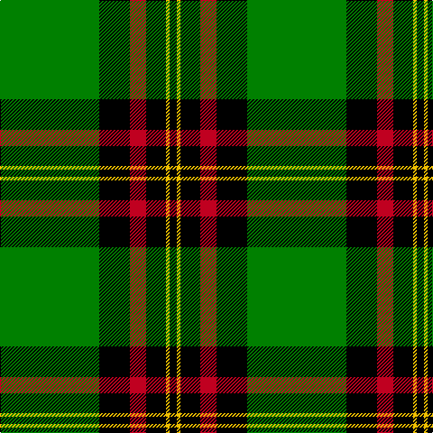

In pattern [GKRKYK](/patterns/gkrkyk/).

This was sourced from weddslist.  It is a [6 stripes tartan](/stripes/stripes6/).

Original link http://www.weddslist.com/cgi-bin/tartans/pg.pl?source=sts

## Thread count
G/110 K34 R18 K22 Y4 K/8

## Palette
Each colour and its ΔE from the base-6 reference it is a variant of.

| Colour | Shade | Base | ΔE (OKLab) |
|---|---|---|---|
| G | <code style="background-color:#008000;">#008000</code> `#008000` | G <code style="background-color:#006400;">#006400</code> | 0.09 |
| K | <code style="background-color:#000000;">#000000</code> `#000000` | K <code style="background-color:#000000;">#000000</code> | 0.00 |
| R | <code style="background-color:#C00020;">#C00020</code> `#C00020` | R <code style="background-color:#C80000;">#C80000</code> | 0.02 |
| Y | <code style="background-color:#F0C000;">#F0C000</code> `#F0C000` | Y <code style="background-color:#E8C000;">#E8C000</code> | 0.01 |

# Sample pattern

## Nearest tartans

The nearest existing variants by ΔTartan distance.

1. [MacHardy](/setts/s8/g6r2k24w2k24g64r2k6-g008000-k000000-rc00000-we0e0e0/) — ΔT 0.93
1. [Forbes](/setts/s6/r2g32k16g8k8y2-g008000-k000000-rc00000-yf0c000/) — ΔT 1.12
1. [MacArthur, ?](/setts/s6/r6g60k24g12k32y4-g008000-k000000-rc00000-yf0c000/) — ΔT 1.29
1. [O'Donoghue](/setts/s5/g124k80y6k6w6-g006818-k101010-wf8f8f8-ye8c000/) — ΔT 1.29
1. [Herbage](/setts/s5/g100k32ga40r4ga12-g008000-ga808080-k000000-rc00000/) — ΔT 1.36
1. [Duchess of Fife](/setts/s6/g140k52g24k28b6k32-b1474b4-g007800-k000000/) — ΔT 1.37
1. [Keirnan](/setts/s10/w4g8k12r4k4r4k6r4g40w2-g008000-k000000-rc00000-we0e0e0/) — ΔT 1.38
1. [Birmingham Irish Pipes & Drums](/setts/s8/g96y6k12w8g6k30y6g8-g285800-k000000-wf8f8f8-yc88c00/) — ΔT 1.42
1. [Moran (Name)](/setts/s6/g110k34r18k22y4k8-g006818-k101010-rc8002c-ye8c000/) — ΔT 1.44
1. [Vipont](/setts/s7/r6g28k4w4g28k72y6-g008000-k000000-rc00000-wc0a0e0-yf0c000/) — ΔT 1.51

## Neighbour map

Every grey dot is one of 15726 variants placed by the first two principal components of the ΔTartan feature space (44% of its variance). Red is this tartan; blue dots are its nearest — click one to open its page.

<svg viewBox="0 0 640 380" role="img" style="max-width:100%;height:auto;border:1px solid #e0e0e0;border-radius:4px;display:block" xmlns="http://www.w3.org/2000/svg"><image href="/nn/cloud.v1.png" width="640" height="380"/><a href="/setts/s8/g6r2k24w2k24g64r2k6-g008000-k000000-rc00000-we0e0e0/"><circle cx="337.1" cy="132.4" r="4" fill="#3465a4"><title>MacHardy</title></circle></a><a href="/setts/s6/r2g32k16g8k8y2-g008000-k000000-rc00000-yf0c000/"><circle cx="316.4" cy="189.3" r="4" fill="#3465a4"><title>Forbes</title></circle></a><a href="/setts/s6/r6g60k24g12k32y4-g008000-k000000-rc00000-yf0c000/"><circle cx="275.2" cy="196.4" r="4" fill="#3465a4"><title>MacArthur, ?</title></circle></a><a href="/setts/s5/g124k80y6k6w6-g006818-k101010-wf8f8f8-ye8c000/"><circle cx="360.0" cy="185.2" r="4" fill="#3465a4"><title>O'Donoghue</title></circle></a><a href="/setts/s5/g100k32ga40r4ga12-g008000-ga808080-k000000-rc00000/"><circle cx="299.2" cy="180.4" r="4" fill="#3465a4"><title>Herbage</title></circle></a><a href="/setts/s6/g140k52g24k28b6k32-b1474b4-g007800-k000000/"><circle cx="361.2" cy="196.1" r="4" fill="#3465a4"><title>Duchess of Fife</title></circle></a><a href="/setts/s10/w4g8k12r4k4r4k6r4g40w2-g008000-k000000-rc00000-we0e0e0/"><circle cx="284.6" cy="128.6" r="4" fill="#3465a4"><title>Keirnan</title></circle></a><a href="/setts/s8/g96y6k12w8g6k30y6g8-g285800-k000000-wf8f8f8-yc88c00/"><circle cx="364.9" cy="149.9" r="4" fill="#3465a4"><title>Birmingham Irish Pipes &amp; Drums</title></circle></a><a href="/setts/s6/g110k34r18k22y4k8-g006818-k101010-rc8002c-ye8c000/"><circle cx="367.0" cy="168.2" r="4" fill="#3465a4"><title>Moran (Name)</title></circle></a><a href="/setts/s7/r6g28k4w4g28k72y6-g008000-k000000-rc00000-wc0a0e0-yf0c000/"><circle cx="266.1" cy="147.7" r="4" fill="#3465a4"><title>Vipont</title></circle></a><circle cx="326.0" cy="153.4" r="5" fill="#c00000"/></svg>

ID: /setts/s6/g110k34r18k22y4k8-g008000-k000000-rc00020-yf0c000/
