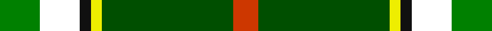

In pattern [GWKYGR](/stripes/gwkygr/).

This was sourced from register-of-tartans.  It is a [6 stripe tartan](/stripes/stripes6/).

Original link https://www.tartanregister.gov.uk/tartanDetails.aspx?ref=10161

## Register references

External register numbers recorded for this tartan.

- Scottish Register of Tartans: [10161](https://www.tartanregister.gov.uk/tartanDetails.aspx?ref=10161)

## Thread count
Ga/22 W22 K6 Y6 G72 DO/14

## Palette
Each colour and the base-6 reference it is a variant of.

| Colour | Shade | Base |
|---|---|---|
| DO | <code style="background-color:#CD3700;">#CD3700</code> `oklch(56.1% 0.194 35.7)` <small>#CD3700</small> | R <code style="background-color:#CC0000;">#CC0000</code> |
| G | <code style="background-color:#004F00;">#004F00</code> `oklch(37.0% 0.126 142.5)` <small>#004F00</small> | G <code style="background-color:#006100;">#006100</code> |
| Ga | <code style="background-color:#008000;">#008000</code> `oklch(52.0% 0.177 142.5)` <small>#008000</small> | G <code style="background-color:#006100;">#006100</code> |
| K | <code style="background-color:#101010;">#101010</code> `oklch(17.3% 0.000 89.9)` <small>#101010</small> | K <code style="background-color:#000000;">#000000</code> |
| W | <code style="background-color:#FFFFFF;">#FFFFFF</code> `oklch(100.0% 0.000 89.9)` <small>#FFFFFF</small> | W <code style="background-color:#F7F7F7;">#F7F7F7</code> |
| Y | <code style="background-color:#EEEE00;">#EEEE00</code> `oklch(91.9% 0.200 109.8)` <small>#EEEE00</small> | Y <code style="background-color:#F2BF00;">#F2BF00</code> |

# Sample pattern

## Nearest tartans

The nearest existing variants by ΔTartan distance.

1. [Driver (Name)](/setts/s6/g11w11k3ly3dg36lo7~x2/) — ΔT 0.83
1. [Lethcoe (Thousand Oaks) (Personal)](/setts/s6/k16w4ly2g31t4dp4~x4/) — ΔT 1.12
1. [Alberta](/setts/s7/g18k2lr2k2t3k2ly6~x4/) — ΔT 1.14
1. [Mellor (Name)](/setts/s6/w8k16g32dt3lo5w5~x2/) — ΔT 1.21
1. [Alberta District Tartan Tartan Number: 2055. Earliest known date: 1961 Designed for the Edmonton Rehabilitation Society as a project for handloom weaving by disabled students. The Provincial Legislative of Alberta gave formal approval for the Alberta tartan in 1961. See products available Copyright © Blair Urquhart, Comrie, 2015](/setts/s7/g12k1r1k1t2k1ly4~x2/) — ΔT 1.38
1. [Mayo](/setts/s7/k4g16db11r16g25ly2t3~x2/) — ΔT 1.39
1. [Kilkenny](/setts/s7/m5dg27o2g25ly7dg3m3~x2/) — ΔT 1.40
1. [Alberta (District)](/setts/s7/g12k1r1k1b2k1ly4~x8/) — ΔT 1.44
1. [Hamilton of Brandon (Fashion)](/setts/s6/lo16k7w1g7k1ly3~x4/) — ΔT 1.44
1. [Drummond of Perth Dress (Dance)](/setts/s9/dg41lo3g7n3w24dg10g7n7w3~x2/) — ΔT 1.47

## Neighbour map

Every grey dot is one of 14299 variants placed by the first two principal components of the ΔTartan feature space (44% of its variance). Red is this tartan; blue dots are its nearest — click one to open its page.

<svg viewBox="0 0 640 380" role="img" style="max-width:100%;height:auto;border:1px solid #e0e0e0;border-radius:4px;display:block" xmlns="http://www.w3.org/2000/svg"><image href="/nn/cloud.v1.png" width="640" height="380"/><a href="/setts/s6/g11w11k3ly3dg36lo7~x2/"><circle cx="202.0" cy="154.8" r="4" fill="#3465a4"><title>Driver (Name)</title></circle></a><a href="/setts/s6/k16w4ly2g31t4dp4~x4/"><circle cx="208.0" cy="133.3" r="4" fill="#3465a4"><title>Lethcoe (Thousand Oaks) (Personal)</title></circle></a><a href="/setts/s7/g18k2lr2k2t3k2ly6~x4/"><circle cx="209.6" cy="159.6" r="4" fill="#3465a4"><title>Alberta</title></circle></a><a href="/setts/s6/w8k16g32dt3lo5w5~x2/"><circle cx="187.3" cy="178.6" r="4" fill="#3465a4"><title>Mellor (Name)</title></circle></a><a href="/setts/s7/g12k1r1k1t2k1ly4~x2/"><circle cx="270.5" cy="155.3" r="4" fill="#3465a4"><title>Alberta District Tartan Tartan Number: 2055. Earliest known date: 1961 Designed for the Edmonton Rehabilitation Society as a project for handloom weaving by disabled students. The Provincial Legislative of Alberta gave formal approval for the Alberta tartan in 1961. See products available Copyright © Blair Urquhart, Comrie, 2015</title></circle></a><a href="/setts/s7/k4g16db11r16g25ly2t3~x2/"><circle cx="223.0" cy="175.4" r="4" fill="#3465a4"><title>Mayo</title></circle></a><a href="/setts/s7/m5dg27o2g25ly7dg3m3~x2/"><circle cx="202.7" cy="165.0" r="4" fill="#3465a4"><title>Kilkenny</title></circle></a><a href="/setts/s7/g12k1r1k1b2k1ly4~x8/"><circle cx="270.8" cy="156.5" r="4" fill="#3465a4"><title>Alberta (District)</title></circle></a><a href="/setts/s6/lo16k7w1g7k1ly3~x4/"><circle cx="216.0" cy="162.8" r="4" fill="#3465a4"><title>Hamilton of Brandon (Fashion)</title></circle></a><a href="/setts/s9/dg41lo3g7n3w24dg10g7n7w3~x2/"><circle cx="212.6" cy="136.9" r="4" fill="#3465a4"><title>Drummond of Perth Dress (Dance)</title></circle></a><circle cx="194.5" cy="150.2" r="5" fill="#c00000"/></svg>

ID: /setts/s6/g11w11k3ly3dg36r7~x2/
