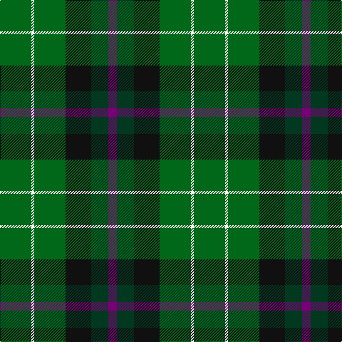

In pattern [BGKGWG](/patterns/bgkgwg/).

This was sourced from tartans-authority.  It is a [6 stripes tartan](/stripes/stripes6/).

Original link http://www.tartansauthority.com/tartan-ferret/display/2559/

## Thread count
G/44 W4 G44 K36 DG24 P/12

## Palette
Each colour and its ΔE from the base-6 reference it is a variant of.

| Colour | Shade | Base | ΔE (OKLab) |
|---|---|---|---|
| DG | <code style="background-color:#003820;">#003820</code> `#003820` | G <code style="background-color:#006100;">#006100</code> | 0.15 |
| G | <code style="background-color:#006818;">#006818</code> `#006818` | G <code style="background-color:#006100;">#006100</code> | 0.02 |
| K | <code style="background-color:#101010;">#101010</code> `#101010` | K <code style="background-color:#000000;">#000000</code> | 0.17 |
| P | <code style="background-color:#780078;">#780078</code> `#780078` | B <code style="background-color:#2A418A;">#2A418A</code> | 0.17 |
| W | <code style="background-color:#FCFCFC;">#FCFCFC</code> `#FCFCFC` | W <code style="background-color:#F7F7F7;">#F7F7F7</code> | 0.01 |

# Sample pattern

## Nearest tartans

The nearest existing variants by ΔTartan distance.

1. [Lossiemouth/Hersbruck](/setts/s6/g26b3g12k10ba15w2~b2c2c80-ba780078-g006818-k101010-we0e0e0~x2/) — ΔT 1.23
1. [Duncan](/setts/s6/k4g21w3g21b21r4~b202060-g006818-k101010-rc80000-we0e0e0~x2/) — ΔT 1.24
1. [Menteith District Tartan Tartan Number: 929. Earliest known date: Mid 19th century Menteith lies in the upper reaches of the River Forth. The tartan is similar to the Graham of Mentieth sett recorded by Logan in 1831. The proportions of colours are quite distinct, however, and the azure stipe in the family tartan is replaced by white in the district. The Menteith district tartan was rescued from oblivion in 1941 by Graeme Menteith who wrote to MacGregor-Hastie about it. (STS archives) See products available Copyright © Blair Urquhart, Comrie, 2015](/setts/s6/g9w1g6k7b7k1~b2c2c80-g006818-k101010-we0e0e0~x2/) — ΔT 1.25
1. [Wilson's No.122](/setts/s8/g14b11ga3k5ga3b11g14y2~b14283c-g006818-ga789484-k101010-yd8b000~x2/) — ΔT 1.28
1. [Aztec, New Mexico](/setts/s8/r3k8g17y2g17k8b8k2~b3850c8-g146400-k101010-rff0000-yffe600~x2/) — ΔT 1.30
1. [Salvation Army Htg (Corporate)](/setts/s7/b5g8k1y2k1g8b4~b1c1c50-g285800-k101010-ycca800~x4/) — ΔT 1.32
1. [Rotary](/setts/s7/g25r4b25r13g25y2ba6~b304080-ba5480b0-g008000-rc00000-yf0c000~x2/) — ΔT 1.32
1. [Duncan Clan Tartan Tartan Number: 1112. Earliest known date: 1906 Duncans and Robertsons share a common ancester, one of the ancient Earls of Atholl, 'Fat Duncan', who led the clan at the Battle of Bannockburn. This sett is also known as Leslie of Wardis or Leslie Hunting, (No. 1113) but Duncan lacks the broad black present in the Leslie Hunting. See products available Copyright © Blair Urquhart, Comrie, 2015](/setts/s6/k4g21w3g21b21r4~b2c2c80-g006818-k101010-rc80000-we0e0e0~x2/) — ΔT 1.33
1. [Simple Technology (Corporate)](/setts/s5/r3g28b9ga18w3~b2c2c80-g006818-ga003820-rc80000-we0e0e0~x2/) — ΔT 1.35
1. [Menteith](/setts/s6/g9w1g6k7b7k1~b1c0070-g006818-k101010-wc0c0c0~x4/) — ΔT 1.36

## Neighbour map

Every grey dot is one of 15726 variants placed by the first two principal components of the ΔTartan feature space (44% of its variance). Red is this tartan; blue dots are its nearest — click one to open its page.

<svg viewBox="0 0 640 380" role="img" style="max-width:100%;height:auto;border:1px solid #e0e0e0;border-radius:4px;display:block" xmlns="http://www.w3.org/2000/svg"><image href="/nn/cloud.v1.png" width="640" height="380"/><a href="/setts/s6/g26b3g12k10ba15w2~b2c2c80-ba780078-g006818-k101010-we0e0e0~x2/"><circle cx="273.2" cy="206.3" r="4" fill="#3465a4"><title>Lossiemouth/Hersbruck</title></circle></a><a href="/setts/s6/k4g21w3g21b21r4~b202060-g006818-k101010-rc80000-we0e0e0~x2/"><circle cx="262.2" cy="233.1" r="4" fill="#3465a4"><title>Duncan</title></circle></a><a href="/setts/s6/g9w1g6k7b7k1~b2c2c80-g006818-k101010-we0e0e0~x2/"><circle cx="230.7" cy="251.5" r="4" fill="#3465a4"><title>Menteith District Tartan Tartan Number: 929. Earliest known date: Mid 19th century Menteith lies in the upper reaches of the River Forth. The tartan is similar to the Graham of Mentieth sett recorded by Logan in 1831. The proportions of colours are quite distinct, however, and the azure stipe in the family tartan is replaced by white in the district. The Menteith district tartan was rescued from oblivion in 1941 by Graeme Menteith who wrote to MacGregor-Hastie about it. (STS archives) See products available Copyright © Blair Urquhart, Comrie, 2015</title></circle></a><a href="/setts/s8/g14b11ga3k5ga3b11g14y2~b14283c-g006818-ga789484-k101010-yd8b000~x2/"><circle cx="197.2" cy="235.8" r="4" fill="#3465a4"><title>Wilson's No.122</title></circle></a><a href="/setts/s8/r3k8g17y2g17k8b8k2~b3850c8-g146400-k101010-rff0000-yffe600~x2/"><circle cx="220.0" cy="206.6" r="4" fill="#3465a4"><title>Aztec, New Mexico</title></circle></a><a href="/setts/s7/b5g8k1y2k1g8b4~b1c1c50-g285800-k101010-ycca800~x4/"><circle cx="293.1" cy="248.7" r="4" fill="#3465a4"><title>Salvation Army Htg (Corporate)</title></circle></a><a href="/setts/s7/g25r4b25r13g25y2ba6~b304080-ba5480b0-g008000-rc00000-yf0c000~x2/"><circle cx="240.8" cy="201.6" r="4" fill="#3465a4"><title>Rotary</title></circle></a><a href="/setts/s6/k4g21w3g21b21r4~b2c2c80-g006818-k101010-rc80000-we0e0e0~x2/"><circle cx="263.8" cy="233.1" r="4" fill="#3465a4"><title>Duncan Clan Tartan Tartan Number: 1112. Earliest known date: 1906 Duncans and Robertsons share a common ancester, one of the ancient Earls of Atholl, 'Fat Duncan', who led the clan at the Battle of Bannockburn. This sett is also known as Leslie of Wardis or Leslie Hunting, (No. 1113) but Duncan lacks the broad black present in the Leslie Hunting. See products available Copyright © Blair Urquhart, Comrie, 2015</title></circle></a><a href="/setts/s5/r3g28b9ga18w3~b2c2c80-g006818-ga003820-rc80000-we0e0e0~x2/"><circle cx="232.0" cy="226.3" r="4" fill="#3465a4"><title>Simple Technology (Corporate)</title></circle></a><a href="/setts/s6/g9w1g6k7b7k1~b1c0070-g006818-k101010-wc0c0c0~x4/"><circle cx="229.7" cy="252.1" r="4" fill="#3465a4"><title>Menteith</title></circle></a><circle cx="246.3" cy="236.3" r="5" fill="#c00000"/></svg>

ID: /setts/s6/g11w1g11k9ga6b3~b780078-g006818-ga003820-k101010-wfcfcfc~x4/
