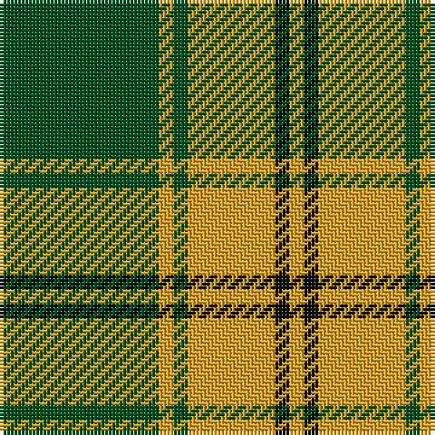

In pattern [GYGYKY](/patterns/gygyky/).

This was sourced from register-of-tartans.  It is a [6 stripes tartan](/stripes/stripes6/).

Original link https://www.tartanregister.gov.uk/tartanDetails.aspx?ref=11025

## Thread count
G/44 Y4 G4 Y24 K4 Y/4

## Palette
Each colour and its ΔE from the base-6 reference it is a variant of.

| Colour | Shade | Base | ΔE (OKLab) |
|---|---|---|---|
| G | <code style="background-color:#005020;">#005020</code> `#005020` | G <code style="background-color:#006100;">#006100</code> | 0.07 |
| K | <code style="background-color:#101010;">#101010</code> `#101010` | K <code style="background-color:#000000;">#000000</code> | 0.17 |
| Y | <code style="background-color:#E0A126;">#E0A126</code> `#E0A126` | Y <code style="background-color:#F2BF00;">#F2BF00</code> | 0.08 |

# Sample pattern

## Nearest tartans

The nearest existing variants by ΔTartan distance.

1. [Big Spruce Brewing](/setts/s6/g11y1g1y6k1y1~g003820-k101010-ye8c000~x8/) — ΔT 0.78
1. [Forget Family (Yonne)](/setts/s6/g8y1g8y12r1y1~g124b24-rca2625-ye0a126~x4/) — ΔT 1.01
1. [Sir Billi (Corporate)](/setts/s6/r8g12w5k11g42k3~g347400-k101010-rc80000-wf4f8c8~x2/) — ΔT 1.31
1. [Loch Rannoch Fancy Tartan Tartan Number: 943. Earliest known date: 1975 Nothing See products available Copyright © Blair Urquhart, Comrie, 2015](/setts/s5/g37w9g3k9w3~g006818-k101010-we0e0e0/) — ΔT 1.35
1. [Loch Rannoch](/setts/s5/g19w5g2k5w2~g006818-k101010-wfcfcfc~x2/) — ΔT 1.47
1. [Wilson's, No 192](/setts/s4/b4g10r1y1~b800080-g008000-rc00000-yf0c000~x2/) — ΔT 1.49
1. [Sugell (Name?)](/setts/s4/g72r25y8w5~g006818-rc80000-we0e0e0-ye8c000/) — ΔT 1.55
1. [Limerick County Crest (Fashion)](/setts/s6/w12k3g50w3k13y6~g006818-k101010-we0e0e0-ybc8c00~x2/) — ΔT 1.56
1. [Maxwell, hunting](/setts/s7/g3r16g4k6g28r1g3~g008000-k000000-rc00000~x2/) — ΔT 1.56
1. [Wilson's, No 189](/setts/s4/b4g10w1r1~b800080-g008000-rc00000-we0e0e0~x2/) — ΔT 1.56

## Neighbour map

Every grey dot is one of 15726 variants placed by the first two principal components of the ΔTartan feature space (44% of its variance). Red is this tartan; blue dots are its nearest — click one to open its page.

<svg viewBox="0 0 640 380" role="img" style="max-width:100%;height:auto;border:1px solid #e0e0e0;border-radius:4px;display:block" xmlns="http://www.w3.org/2000/svg"><image href="/nn/cloud.v1.png" width="640" height="380"/><a href="/setts/s6/g11y1g1y6k1y1~g003820-k101010-ye8c000~x8/"><circle cx="327.9" cy="198.0" r="4" fill="#3465a4"><title>Big Spruce Brewing</title></circle></a><a href="/setts/s6/g8y1g8y12r1y1~g124b24-rca2625-ye0a126~x4/"><circle cx="320.1" cy="215.5" r="4" fill="#3465a4"><title>Forget Family (Yonne)</title></circle></a><a href="/setts/s6/r8g12w5k11g42k3~g347400-k101010-rc80000-wf4f8c8~x2/"><circle cx="371.9" cy="194.9" r="4" fill="#3465a4"><title>Sir Billi (Corporate)</title></circle></a><a href="/setts/s5/g37w9g3k9w3~g006818-k101010-we0e0e0/"><circle cx="370.3" cy="214.2" r="4" fill="#3465a4"><title>Loch Rannoch Fancy Tartan Tartan Number: 943. Earliest known date: 1975 Nothing See products available Copyright © Blair Urquhart, Comrie, 2015</title></circle></a><a href="/setts/s5/g19w5g2k5w2~g006818-k101010-wfcfcfc~x2/"><circle cx="330.4" cy="222.2" r="4" fill="#3465a4"><title>Loch Rannoch</title></circle></a><a href="/setts/s4/b4g10r1y1~b800080-g008000-rc00000-yf0c000~x2/"><circle cx="346.4" cy="225.0" r="4" fill="#3465a4"><title>Wilson's, No 192</title></circle></a><a href="/setts/s4/g72r25y8w5~g006818-rc80000-we0e0e0-ye8c000/"><circle cx="391.2" cy="211.0" r="4" fill="#3465a4"><title>Sugell (Name?)</title></circle></a><a href="/setts/s6/w12k3g50w3k13y6~g006818-k101010-we0e0e0-ybc8c00~x2/"><circle cx="306.9" cy="168.8" r="4" fill="#3465a4"><title>Limerick County Crest (Fashion)</title></circle></a><a href="/setts/s7/g3r16g4k6g28r1g3~g008000-k000000-rc00000~x2/"><circle cx="396.3" cy="170.6" r="4" fill="#3465a4"><title>Maxwell, hunting</title></circle></a><a href="/setts/s4/b4g10w1r1~b800080-g008000-rc00000-we0e0e0~x2/"><circle cx="341.5" cy="223.3" r="4" fill="#3465a4"><title>Wilson's, No 189</title></circle></a><circle cx="349.7" cy="204.9" r="5" fill="#c00000"/></svg>

ID: /setts/s6/g11y1g1y6k1y1~g005020-k101010-ye0a126~x4/
