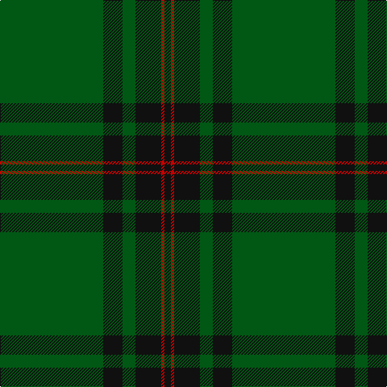

In pattern [GKGKRK](/patterns/gkgkrk/).

This was sourced from register-of-tartans.  It is a [6 stripes tartan](/stripes/stripes6/).

Original link https://www.tartanregister.gov.uk/tartanDetails.aspx?ref=1182

## Attestations

This cloth appears in 2 source records; the oldest owns this page.

- 01/01/1880 — Fife, Duke Of (register-of-tartans, [record](https://www.tartanregister.gov.uk/tartanDetails.aspx?ref=1182))
- 1880 — Fife (District) (tartans-authority, [record](http://www.tartansauthority.com/tartan-ferret/display/790/))

## Thread count
G/128 K24 G16 K32 R4 K/8

## Palette
Each colour and its ΔE from the base-6 reference it is a variant of.

| Colour | Shade | Base | ΔE (OKLab) |
|---|---|---|---|
| G | <code style="background-color:#005814;">#005814</code> `#005814` | G <code style="background-color:#006400;">#006400</code> | 0.04 |
| K | <code style="background-color:#101010;">#101010</code> `#101010` | K <code style="background-color:#000000;">#000000</code> | 0.17 |
| R | <code style="background-color:#C80000;">#C80000</code> `#C80000` | R <code style="background-color:#C80000;">#C80000</code> | 0.00 |

# Sample pattern

ID: /setts/s6/g128k24g16k32r4k8-g005814-k101010-rc80000/
