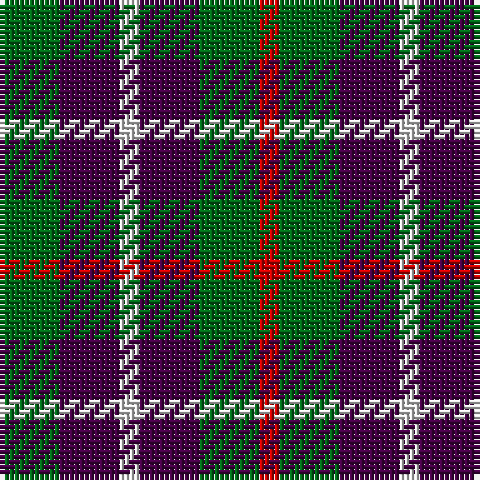

In pattern [GBWBGR](/patterns/gbwbgr/).

This was sourced from register-of-tartans.  It is a [6 stripes tartan](/stripes/stripes6/).

Original link https://www.tartanregister.gov.uk/tartanDetails.aspx?ref=4680

## Thread count
G/12 DP12 LN4 DP12 G12 R/4

## Palette
Each colour and its ΔE from the base-6 reference it is a variant of.

| Colour | Shade | Base | ΔE (OKLab) |
|---|---|---|---|
| DG | <code style="background-color:#003820;">#003820</code> `#003820` | G <code style="background-color:#006100;">#006100</code> | 0.15 |
| DP | <code style="background-color:#440044;">#440044</code> `#440044` | B <code style="background-color:#2A418A;">#2A418A</code> | 0.18 |
| G | <code style="background-color:#006818;">#006818</code> `#006818` | G <code style="background-color:#006100;">#006100</code> | 0.02 |
| LN | <code style="background-color:#E0E0E0;">#E0E0E0</code> `#E0E0E0` | W <code style="background-color:#F7F7F7;">#F7F7F7</code> | 0.07 |
| R | <code style="background-color:#C80000;">#C80000</code> `#C80000` | R <code style="background-color:#CC0000;">#CC0000</code> | 0.01 |

# Sample pattern

## Nearest tartans

The nearest existing variants by ΔTartan distance.

1. [Wilson's No.137](/setts/s8/g12b6k6b6k6b6g12r4-b780078-g006818-k101010-rc80000/) — ΔT 1.08
1. [Austin (Wilson's No 173)](/setts/s5/b6k6b6g12y4-b5a008c-g005020-k101010-ye8c000/) — ΔT 1.24
1. [Austin / Wilson's No 137](/setts/s5/b6k6b6g12r4-b800080-g008000-k000000-rc00000/) — ΔT 1.25
1. [Wilson's No.173](/setts/s8/g12b6k6b6k6b6g12ka4-b780078-g285800-k101010-ka000000/) — ΔT 1.31
1. [Boxer Beauty](/setts/s7/k26g56y26g56k36w36k26-g603800-k101010-wffffff-ycc7f32/) — ΔT 1.31
1. [Canyon County Idaho Sheriff](/setts/s6/k50y50w10y50k50r10-k101010-rc80000-wf8f8f8-ya08858/) — ΔT 1.33
1. [Boxer Beauty](/setts/s7/k26g56y26g56k36w36k26-g603800-k101010-wfcfcfc-ydc943c/) — ΔT 1.34
1. [Austin / Wilson's No 173](/setts/s5/b6k6b6g12y4-b800080-g008000-k000000-yf0c000/) — ΔT 1.34
1. [Creek Indian Nation](/setts/s5/b24g48y12b12r24-b2c2c80-g006818-rc80000-ye8c000/) — ΔT 1.40
1. [Chivas Regal](/setts/s5/b12k12b12r28y6-b003c64-k101010-rb03000-ye8c000/) — ΔT 1.42

## Neighbour map

Every grey dot is one of 15726 variants placed by the first two principal components of the ΔTartan feature space (44% of its variance). Red is this tartan; blue dots are its nearest — click one to open its page.

<svg viewBox="0 0 640 380" role="img" style="max-width:100%;height:auto;border:1px solid #e0e0e0;border-radius:4px;display:block" xmlns="http://www.w3.org/2000/svg"><image href="/nn/cloud.v1.png" width="640" height="380"/><a href="/setts/s8/g12b6k6b6k6b6g12r4-b780078-g006818-k101010-rc80000/"><circle cx="131.3" cy="293.7" r="4" fill="#3465a4"><title>Wilson's No.137</title></circle></a><a href="/setts/s5/b6k6b6g12y4-b5a008c-g005020-k101010-ye8c000/"><circle cx="92.6" cy="303.7" r="4" fill="#3465a4"><title>Austin (Wilson's No 173)</title></circle></a><a href="/setts/s5/b6k6b6g12r4-b800080-g008000-k000000-rc00000/"><circle cx="85.1" cy="294.8" r="4" fill="#3465a4"><title>Austin / Wilson's No 137</title></circle></a><a href="/setts/s8/g12b6k6b6k6b6g12ka4-b780078-g285800-k101010-ka000000/"><circle cx="135.1" cy="298.1" r="4" fill="#3465a4"><title>Wilson's No.173</title></circle></a><a href="/setts/s7/k26g56y26g56k36w36k26-g603800-k101010-wffffff-ycc7f32/"><circle cx="84.6" cy="299.8" r="4" fill="#3465a4"><title>Boxer Beauty</title></circle></a><a href="/setts/s6/k50y50w10y50k50r10-k101010-rc80000-wf8f8f8-ya08858/"><circle cx="187.4" cy="255.8" r="4" fill="#3465a4"><title>Canyon County Idaho Sheriff</title></circle></a><a href="/setts/s7/k26g56y26g56k36w36k26-g603800-k101010-wfcfcfc-ydc943c/"><circle cx="83.3" cy="299.1" r="4" fill="#3465a4"><title>Boxer Beauty</title></circle></a><a href="/setts/s5/b6k6b6g12y4-b800080-g008000-k000000-yf0c000/"><circle cx="71.2" cy="290.7" r="4" fill="#3465a4"><title>Austin / Wilson's No 173</title></circle></a><a href="/setts/s5/b24g48y12b12r24-b2c2c80-g006818-rc80000-ye8c000/"><circle cx="143.7" cy="273.0" r="4" fill="#3465a4"><title>Creek Indian Nation</title></circle></a><a href="/setts/s5/b12k12b12r28y6-b003c64-k101010-rb03000-ye8c000/"><circle cx="160.7" cy="268.5" r="4" fill="#3465a4"><title>Chivas Regal</title></circle></a><circle cx="148.9" cy="297.0" r="5" fill="#c00000"/></svg>

ID: /setts/s6/g12b12w4b12g12r4-b440044-g006818-rc80000-we0e0e0/
