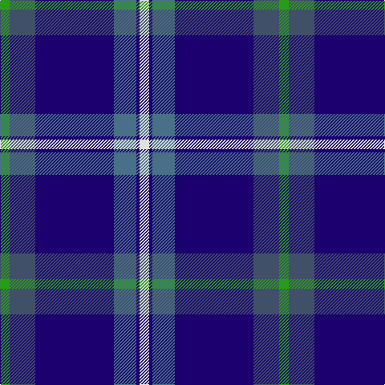

In pattern [GBBBBW](/patterns/gbbbbw/).

This was sourced from tartans-authority.  It is a [6 stripes tartan](/stripes/stripes6/).

Original link http://www.tartansauthority.com/tartan-ferret/display/8277/

## Thread count
G/12 N32 DB98 B28 DB4 LN/12

## Palette
Each colour and its ΔE from the base-6 reference it is a variant of.

| Colour | Shade | Base | ΔE (OKLab) |
|---|---|---|---|
| B | <code style="background-color:#487088;">#487088</code> `#487088` | B <code style="background-color:#2A418A;">#2A418A</code> | 0.15 |
| DB | <code style="background-color:#1C0070;">#1C0070</code> `#1C0070` | B <code style="background-color:#2A418A;">#2A418A</code> | 0.14 |
| G | <code style="background-color:#289C18;">#289C18</code> `#289C18` | G <code style="background-color:#006100;">#006100</code> | 0.19 |
| LN | <code style="background-color:#E0E0E0;">#E0E0E0</code> `#E0E0E0` | W <code style="background-color:#F7F7F7;">#F7F7F7</code> | 0.07 |
| N | <code style="background-color:#405068;">#405068</code> `#405068` | B <code style="background-color:#2A418A;">#2A418A</code> | 0.09 |

# Sample pattern

## Nearest tartans

The nearest existing variants by ΔTartan distance.

1. [Saint Margaret of Scotland Youth Group](/setts/s8/b60ba10b6ba66y16k6ba16w4-b7a378b-ba000080-k101010-wffffff-y86c67c/) — ΔT 1.24
1. [Widows Sons Scotland Dress](/setts/s6/w12g16k12g24b75y4-b5a008c-g003c14-k101010-wc8c8c8-ye0a126/) — ΔT 1.26
1. [Raith Rovers F.C.](/setts/s8/b12w4g4w6b48r2ba70r4-b000050-ba304080-g30a010-rc00000-we0e0e0/) — ΔT 1.27
1. [Boxing Scotland](/setts/s8/b52r4ba32b46ba32r4w4y2-b141e46-ba3c82af-rc80000-wffffff-yffe600/) — ΔT 1.28
1. [Aberdeen Academy of Performing Arts](/setts/s6/b8ba4bb6b48bc48w6-b1c1c50-ba9058d8-bb440044-bc1870a4-wffffff/) — ΔT 1.29
1. [Gamblin Thompson (Personal)](/setts/s6/b8g52r8k24ba92w4-b2888c4-ba2c2c80-g408060-k101010-rc80000-wfcfcfc/) — ΔT 1.31
1. [Kirkcaldy](/setts/s6/b46w6k20r4ba90y2-b2888c4-ba2c2c80-k101010-rc80000-we0e0e0-ye8c000/) — ΔT 1.34
1. [U.S. Forces Thurso (Military)](/setts/s7/b80r6k20y4ya30w4ya8-b1c0070-k101010-r880000-wfcfcfc-yd09800-ya7ca8cc/) — ΔT 1.35
1. [World Fed. of Bldg Contractors (Corp](/setts/s5/r4b38ba12bb88w4-b000064-ba346488-bb6478b0-rc82800-wc8c8c8/) — ΔT 1.36
1. [MacNeil - 1994 (Personal)](/setts/s5/b60k24ba24k4w6-b3850c8-ba003c64-k101010-wfcfcfc/) — ΔT 1.37

## Neighbour map

Every grey dot is one of 15726 variants placed by the first two principal components of the ΔTartan feature space (44% of its variance). Red is this tartan; blue dots are its nearest — click one to open its page.

<svg viewBox="0 0 640 380" role="img" style="max-width:100%;height:auto;border:1px solid #e0e0e0;border-radius:4px;display:block" xmlns="http://www.w3.org/2000/svg"><image href="/nn/cloud.v1.png" width="640" height="380"/><a href="/setts/s8/b60ba10b6ba66y16k6ba16w4-b7a378b-ba000080-k101010-wffffff-y86c67c/"><circle cx="275.2" cy="154.0" r="4" fill="#3465a4"><title>Saint Margaret of Scotland Youth Group</title></circle></a><a href="/setts/s6/w12g16k12g24b75y4-b5a008c-g003c14-k101010-wc8c8c8-ye0a126/"><circle cx="288.8" cy="159.7" r="4" fill="#3465a4"><title>Widows Sons Scotland Dress</title></circle></a><a href="/setts/s8/b12w4g4w6b48r2ba70r4-b000050-ba304080-g30a010-rc00000-we0e0e0/"><circle cx="308.9" cy="117.8" r="4" fill="#3465a4"><title>Raith Rovers F.C.</title></circle></a><a href="/setts/s8/b52r4ba32b46ba32r4w4y2-b141e46-ba3c82af-rc80000-wffffff-yffe600/"><circle cx="318.4" cy="150.6" r="4" fill="#3465a4"><title>Boxing Scotland</title></circle></a><a href="/setts/s6/b8ba4bb6b48bc48w6-b1c1c50-ba9058d8-bb440044-bc1870a4-wffffff/"><circle cx="260.2" cy="184.5" r="4" fill="#3465a4"><title>Aberdeen Academy of Performing Arts</title></circle></a><a href="/setts/s6/b8g52r8k24ba92w4-b2888c4-ba2c2c80-g408060-k101010-rc80000-wfcfcfc/"><circle cx="263.4" cy="144.9" r="4" fill="#3465a4"><title>Gamblin Thompson (Personal)</title></circle></a><a href="/setts/s6/b46w6k20r4ba90y2-b2888c4-ba2c2c80-k101010-rc80000-we0e0e0-ye8c000/"><circle cx="320.5" cy="112.8" r="4" fill="#3465a4"><title>Kirkcaldy</title></circle></a><a href="/setts/s7/b80r6k20y4ya30w4ya8-b1c0070-k101010-r880000-wfcfcfc-yd09800-ya7ca8cc/"><circle cx="254.6" cy="118.8" r="4" fill="#3465a4"><title>U.S. Forces Thurso (Military)</title></circle></a><a href="/setts/s5/r4b38ba12bb88w4-b000064-ba346488-bb6478b0-rc82800-wc8c8c8/"><circle cx="367.2" cy="166.5" r="4" fill="#3465a4"><title>World Fed. of Bldg Contractors (Corp</title></circle></a><a href="/setts/s5/b60k24ba24k4w6-b3850c8-ba003c64-k101010-wfcfcfc/"><circle cx="276.5" cy="207.9" r="4" fill="#3465a4"><title>MacNeil - 1994 (Personal)</title></circle></a><circle cx="301.3" cy="155.7" r="5" fill="#c00000"/></svg>

ID: /setts/s6/g12b32ba98bb28ba4w12-b405068-ba1c0070-bb487088-g289c18-we0e0e0/
