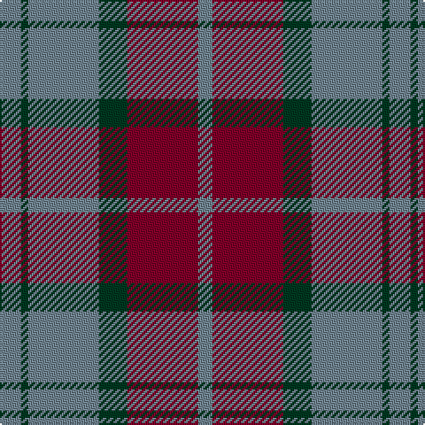

In pattern [GGGGRG](/patterns/ggggrg/).

This was sourced from register-of-tartans.  It is a [6 stripes tartan](/stripes/stripes6/).

Original link https://www.tartanregister.gov.uk/tartanDetails.aspx?ref=3515

## Thread count
LG/12 DG4 LG40 DG16 DR40 LG/8

## Palette
Each colour and its ΔE from the base-6 reference it is a variant of.

| Colour | Shade | Base | ΔE (OKLab) |
|---|---|---|---|
| DG | <code style="background-color:#003820;">#003820</code> `#003820` | G <code style="background-color:#006400;">#006400</code> | 0.16 |
| DR | <code style="background-color:#800028;">#800028</code> `#800028` | R <code style="background-color:#C80000;">#C80000</code> | 0.16 |
| LG | <code style="background-color:#708490;">#708490</code> `#708490` | G <code style="background-color:#006400;">#006400</code> | 0.22 |

# Sample pattern

## Nearest tartans

The nearest existing variants by ΔTartan distance.

1. [Fraser of Boblainy, Hugh](/setts/s5/b4r56g28b28r4-b2c2c80-g006818-rc85858/) — ΔT 0.94
1. [Glasgow #2](/setts/s7/g50r8b48r42g50r6b8-b2c4084-g005020-rc82828/) — ΔT 1.00
1. [GS Gaelic School (School)](/setts/s7/b30r5g30r22b30r5g4-b003c64-g006818-rc80000/) — ΔT 1.09
1. [Logan #5](/setts/s6/b18r6b2g18r6b2-b2c2c80-g006818-rc80000/) — ΔT 1.12
1. [Balfour blue & brown](/setts/s6/b36y4r12y4r38ra6-b304080-r806050-rac00000-yf0c000/) — ΔT 1.12
1. [Glasgow, City of](/setts/s7/g56r8b50r44g54r8b4-b780078-g006818-rc80000/) — ΔT 1.15
1. [Balfour #2](/setts/s6/b36y4g12y4g38r6-b2c2c80-g604000-rc80000-ye8c000/) — ΔT 1.19
1. [Balfour (Clan)](/setts/s6/b72y8g24y8g76r12-b2c2c80-g604000-rc80000-ye8c000/) — ΔT 1.19
1. [MacFadyen, MacBean (Old)](/setts/s7/b6r50b34r10g44r18b6-b304080-g008000-rc00000/) — ΔT 1.21
1. [MacFadyan (MacGregor Hastie)](/setts/s7/b6r50b34r10g44r18b6-b2c2c80-g006818-rc80000/) — ΔT 1.27

## Neighbour map

Every grey dot is one of 15726 variants placed by the first two principal components of the ΔTartan feature space (44% of its variance). Red is this tartan; blue dots are its nearest — click one to open its page.

<svg viewBox="0 0 640 380" role="img" style="max-width:100%;height:auto;border:1px solid #e0e0e0;border-radius:4px;display:block" xmlns="http://www.w3.org/2000/svg"><image href="/nn/cloud.v1.png" width="640" height="380"/><a href="/setts/s5/b4r56g28b28r4-b2c2c80-g006818-rc85858/"><circle cx="317.1" cy="223.2" r="4" fill="#3465a4"><title>Fraser of Boblainy, Hugh</title></circle></a><a href="/setts/s7/g50r8b48r42g50r6b8-b2c4084-g005020-rc82828/"><circle cx="280.5" cy="257.6" r="4" fill="#3465a4"><title>Glasgow #2</title></circle></a><a href="/setts/s7/b30r5g30r22b30r5g4-b003c64-g006818-rc80000/"><circle cx="269.0" cy="258.6" r="4" fill="#3465a4"><title>GS Gaelic School (School)</title></circle></a><a href="/setts/s6/b18r6b2g18r6b2-b2c2c80-g006818-rc80000/"><circle cx="258.9" cy="240.1" r="4" fill="#3465a4"><title>Logan #5</title></circle></a><a href="/setts/s6/b36y4r12y4r38ra6-b304080-r806050-rac00000-yf0c000/"><circle cx="315.8" cy="222.6" r="4" fill="#3465a4"><title>Balfour blue &amp; brown</title></circle></a><a href="/setts/s7/g56r8b50r44g54r8b4-b780078-g006818-rc80000/"><circle cx="298.3" cy="222.3" r="4" fill="#3465a4"><title>Glasgow, City of</title></circle></a><a href="/setts/s6/b36y4g12y4g38r6-b2c2c80-g604000-rc80000-ye8c000/"><circle cx="295.9" cy="216.1" r="4" fill="#3465a4"><title>Balfour #2</title></circle></a><a href="/setts/s6/b72y8g24y8g76r12-b2c2c80-g604000-rc80000-ye8c000/"><circle cx="295.9" cy="216.1" r="4" fill="#3465a4"><title>Balfour (Clan)</title></circle></a><a href="/setts/s7/b6r50b34r10g44r18b6-b304080-g008000-rc00000/"><circle cx="268.3" cy="234.6" r="4" fill="#3465a4"><title>MacFadyen, MacBean (Old)</title></circle></a><a href="/setts/s7/b6r50b34r10g44r18b6-b2c2c80-g006818-rc80000/"><circle cx="266.0" cy="232.8" r="4" fill="#3465a4"><title>MacFadyan (MacGregor Hastie)</title></circle></a><circle cx="313.8" cy="244.2" r="5" fill="#c00000"/></svg>

ID: /setts/s6/g12ga4g40ga16r40g8-g708490-ga003820-r800028/
