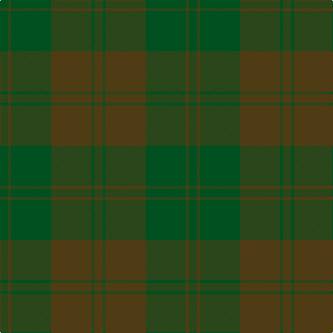

In pattern [GGGGGG](/patterns/gggggg/).

This was sourced from register-of-tartans.  It is a [6 stripes tartan](/stripes/stripes6/).

Original link https://www.tartanregister.gov.uk/tartanDetails.aspx?ref=1604

## Thread count
G/12 T4 G58 T58 G4 T/12

## Palette
Each colour and its ΔE from the base-6 reference it is a variant of.

| Colour | Shade | Base | ΔE (OKLab) |
|---|---|---|---|
| G | <code style="background-color:#005020;">#005020</code> `#005020` | G <code style="background-color:#006400;">#006400</code> | 0.08 |
| T | <code style="background-color:#503C14;">#503C14</code> `#503C14` | G <code style="background-color:#006400;">#006400</code> | 0.15 |

# Sample pattern

## Nearest tartans

The nearest existing variants by ΔTartan distance.

1. [Harmony, 12](/setts/s6/g12r4g58r58g4r12-g808080-r806050/) — ΔT 2.18
1. [Black Spirit Fashion Tartan Tartan Number: 10119. Earliest known date: ACS Tartan See products available Copyright © Blair Urquhart, Comrie, 2015](/setts/s7/k34ka8k26ka8k6ka90k6-k010204-ka121617/) — ΔT 2.80
1. [Bouncing Blackie (Personal)](/setts/s6/b13ba13g21b34ba55bb3-b14143c-ba1c1c1c-bb441800-g003820/) — ΔT 3.09
1. [Wicklow Irish County Tartan Tartan Number: 2265. Earliest known date: 1995 One of a series of Irish District tartans designed by Polly Wittering of the House of Edgar, with colours reminiscent of the Country with soft warm colours dominating. See products available Copyright © Blair Urquhart, Comrie, 2015](/setts/s10/b4ba4bb4ba48bc4bb12ba6b24ba8bb4-b3c6060-ba646c84-bb644c40-bc0070a4/) — ΔT 3.14
1. [Loch Garth](/setts/s4/r48ra24r8y4-r806050-ra906030-yf0c000/) — ΔT 3.20
1. [Bute Heather, Ancient Wth'd (Fashion](/setts/s11/y10b4g16b2g16b8g8b12g36ya2y10-b5c5c5c-g707070-ya08858-yaa0a0a0/) — ΔT 3.20
1. [Harmony 13](/setts/s6/b20g2b2g20b36g10-b3c82af-g808080/) — ΔT 3.24
1. [Dark Island](/setts/s16/k8b4k86b40k8b4k4b8k4b4k8b40k86b4k8b4-b282828-k101010/) — ΔT 3.37
1. [Harmony, No 13](/setts/s6/b20g2b2g20b36g10-b5480b0-g808080/) — ΔT 3.44
1. [MacKinnon Htg (Clan)](/setts/s7/g4ga32g32ga4g32ga32g4-g604000-ga006818/) — ΔT 3.47

## Neighbour map

Every grey dot is one of 15726 variants placed by the first two principal components of the ΔTartan feature space (44% of its variance). Red is this tartan; blue dots are its nearest — click one to open its page.

<svg viewBox="0 0 640 380" role="img" style="max-width:100%;height:auto;border:1px solid #e0e0e0;border-radius:4px;display:block" xmlns="http://www.w3.org/2000/svg"><image href="/nn/cloud.v1.png" width="640" height="380"/><a href="/setts/s6/g12r4g58r58g4r12-g808080-r806050/"><circle cx="626.0" cy="337.9" r="4" fill="#3465a4"><title>Harmony, 12</title></circle></a><a href="/setts/s7/k34ka8k26ka8k6ka90k6-k010204-ka121617/"><circle cx="626.0" cy="330.3" r="4" fill="#3465a4"><title>Black Spirit Fashion Tartan Tartan Number: 10119. Earliest known date: ACS Tartan See products available Copyright © Blair Urquhart, Comrie, 2015</title></circle></a><a href="/setts/s6/b13ba13g21b34ba55bb3-b14143c-ba1c1c1c-bb441800-g003820/"><circle cx="524.1" cy="328.5" r="4" fill="#3465a4"><title>Bouncing Blackie (Personal)</title></circle></a><a href="/setts/s10/b4ba4bb4ba48bc4bb12ba6b24ba8bb4-b3c6060-ba646c84-bb644c40-bc0070a4/"><circle cx="547.2" cy="276.3" r="4" fill="#3465a4"><title>Wicklow Irish County Tartan Tartan Number: 2265. Earliest known date: 1995 One of a series of Irish District tartans designed by Polly Wittering of the House of Edgar, with colours reminiscent of the Country with soft warm colours dominating. See products available Copyright © Blair Urquhart, Comrie, 2015</title></circle></a><a href="/setts/s4/r48ra24r8y4-r806050-ra906030-yf0c000/"><circle cx="620.4" cy="337.3" r="4" fill="#3465a4"><title>Loch Garth</title></circle></a><a href="/setts/s11/y10b4g16b2g16b8g8b12g36ya2y10-b5c5c5c-g707070-ya08858-yaa0a0a0/"><circle cx="556.8" cy="272.2" r="4" fill="#3465a4"><title>Bute Heather, Ancient Wth'd (Fashion</title></circle></a><a href="/setts/s6/b20g2b2g20b36g10-b3c82af-g808080/"><circle cx="626.0" cy="347.5" r="4" fill="#3465a4"><title>Harmony 13</title></circle></a><a href="/setts/s16/k8b4k86b40k8b4k4b8k4b4k8b40k86b4k8b4-b282828-k101010/"><circle cx="626.0" cy="276.1" r="4" fill="#3465a4"><title>Dark Island</title></circle></a><a href="/setts/s6/b20g2b2g20b36g10-b5480b0-g808080/"><circle cx="626.0" cy="357.7" r="4" fill="#3465a4"><title>Harmony, No 13</title></circle></a><a href="/setts/s7/g4ga32g32ga4g32ga32g4-g604000-ga006818/"><circle cx="443.0" cy="318.1" r="4" fill="#3465a4"><title>MacKinnon Htg (Clan)</title></circle></a><circle cx="619.3" cy="349.2" r="5" fill="#c00000"/></svg>

ID: /setts/s6/g12ga4g58ga58g4ga12-g005020-ga503c14/
