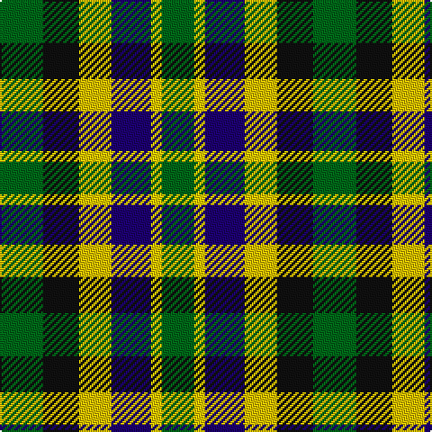

This page is one **sett** — a single exact thread-count. It belongs to the [tartan](/tartans/g12k10ya9db11y3g9/)
(the same proportion at any scale), whose colour order is pattern [GKYBYG](/stripes/gkybyg/).

Sourced from tartans-authority.  It is a [6 stripe tartan](/stripes/stripes6/).

Original link http://www.tartansauthority.com/tartan-ferret/display/10892/

## Thread count
G/24 K20 Ya18 DB22 Y6 G/18

## Palette
Each colour and the base-6 reference it is a variant of.

| Colour | Shade | Base |
|---|---|---|
| DB | <code style="background-color:#1C0070;">#1C0070</code> `oklch(26.3% 0.162 277.1)` <small>#1C0070</small> | B <code style="background-color:#2A418A;">#2A418A</code> |
| G | <code style="background-color:#006818;">#006818</code> `oklch(45.0% 0.142 145.0)` <small>#006818</small> | G <code style="background-color:#006100;">#006100</code> |
| K | <code style="background-color:#101010;">#101010</code> `oklch(17.3% 0.000 89.9)` <small>#101010</small> | K <code style="background-color:#000000;">#000000</code> |
| Y | <code style="background-color:#FCCC00;">#FCCC00</code> `oklch(86.2% 0.176 91.5)` <small>#FCCC00</small> | Y <code style="background-color:#F2BF00;">#F2BF00</code> |
| Ya | <code style="background-color:#E8C000;">#E8C000</code> `oklch(81.9% 0.168 93.7)` <small>#E8C000</small> | Y <code style="background-color:#F2BF00;">#F2BF00</code> |

# Sample pattern

## Nearest tartans

The nearest existing variants by ΔTartan distance, with this tartan at the top so the swatches line up against it.

ΔTartan

Tartan

Sett

—

<a href="/ttd/edit/#slug=g12k10ly9db11ly3g9~x2">Centeno-Oxford</a> <a class="nn-out" href="/setts/s6/g12k10ly9db11ly3g9~x2/" title="open its dictionary page">↗</a>

0.83

<a href="/ttd/edit/#slug=k10ly9db11g12w3g9~x2">Centeno-Oxford (Personal)</a> <a class="nn-out" href="/setts/s6/k10ly9db11g12w3g9~x2/" title="open its dictionary page">↗</a>

1.44

<a href="/ttd/edit/#slug=k19t10p19g40ly10">Gallowater, Old</a> <a class="nn-out" href="/setts/s5/k19t10p19g40ly10/" title="open its dictionary page">↗</a>

1.46

<a href="/ttd/edit/#slug=r2db4k4g4lb1g4k4g4lb1~x4">Arrol</a> <a class="nn-out" href="/setts/s9/r2db4k4g4lb1g4k4g4lb1~x4/" title="open its dictionary page">↗</a>

1.54

<a href="/ttd/edit/#slug=b8k11w3k11g12g10m2~x2">Loch Katrine</a> <a class="nn-out" href="/setts/s7/b8k11w3k11g12g10m2~x2/" title="open its dictionary page">↗</a>

1.58

<a href="/ttd/edit/#slug=k19t10dp19g40ly10">Gallowater Old District Tartan Tartan Number: 1025. Earliest known date: 1819 Both 'Old' and 'New' appear in Wilson's 1819 pattern book. See products available Copyright © Blair Urquhart, Comrie, 2015</a> <a class="nn-out" href="/setts/s5/k19t10dp19g40ly10/" title="open its dictionary page">↗</a>

1.58

<a href="/ttd/edit/#slug=k12w12k12w12g13w8dr6g4dr5">Burns Heritage Check</a> <a class="nn-out" href="/setts/s9/k12w12k12w12g13w8dr6g4dr5/" title="open its dictionary page">↗</a>

1.58

<a href="/ttd/edit/#slug=k4lo9k13g6lo3g9w4~x2">Ramsay (Orange)</a> <a class="nn-out" href="/setts/s7/k4lo9k13g6lo3g9w4~x2/" title="open its dictionary page">↗</a>

1.60

<a href="/ttd/edit/#slug=db8g11k3g11m12k10ly2~x2">Scottish Parliament</a> <a class="nn-out" href="/setts/s7/db8g11k3g11m12k10ly2~x2/" title="open its dictionary page">↗</a>

1.68

<a href="/ttd/edit/#slug=g5dg5g5db5db5dg10w2~x8">Pollard (2014)</a> <a class="nn-out" href="/setts/s7/g5dg5g5db5db5dg10w2~x8/" title="open its dictionary page">↗</a>

1.68

<a href="/ttd/edit/#slug=k3g10k10r3db8w3~x2">Russell (Clan)</a> <a class="nn-out" href="/setts/s6/k3g10k10r3db8w3~x2/" title="open its dictionary page">↗</a>

## Neighbour map

Every grey dot is one of 14299 variants placed by the first two principal components of the ΔTartan feature space (44% of its variance). Red is this tartan; blue dots are its nearest — click one to open its page.

<svg viewBox="0 0 640 380" role="img" style="max-width:100%;height:auto;border:1px solid #e0e0e0;border-radius:4px;display:block" xmlns="http://www.w3.org/2000/svg"><image href="/nn/cloud.v1.png" width="640" height="380"/><a href="/setts/s6/k10ly9db11g12w3g9~x2/"><circle cx="29.0" cy="268.4" r="4" fill="#3465a4"><title>Centeno-Oxford (Personal)</title></circle></a><a href="/setts/s5/k19t10p19g40ly10/"><circle cx="86.9" cy="245.6" r="4" fill="#3465a4"><title>Gallowater, Old</title></circle></a><a href="/setts/s9/r2db4k4g4lb1g4k4g4lb1~x4/"><circle cx="76.8" cy="250.3" r="4" fill="#3465a4"><title>Arrol</title></circle></a><a href="/setts/s7/b8k11w3k11g12g10m2~x2/"><circle cx="92.4" cy="235.2" r="4" fill="#3465a4"><title>Loch Katrine</title></circle></a><a href="/setts/s5/k19t10dp19g40ly10/"><circle cx="108.8" cy="255.8" r="4" fill="#3465a4"><title>Gallowater Old District Tartan Tartan Number: 1025. Earliest known date: 1819 Both 'Old' and 'New' appear in Wilson's 1819 pattern book. See products available Copyright © Blair Urquhart, Comrie, 2015</title></circle></a><a href="/setts/s9/k12w12k12w12g13w8dr6g4dr5/"><circle cx="42.2" cy="259.8" r="4" fill="#3465a4"><title>Burns Heritage Check</title></circle></a><a href="/setts/s7/k4lo9k13g6lo3g9w4~x2/"><circle cx="95.1" cy="254.7" r="4" fill="#3465a4"><title>Ramsay (Orange)</title></circle></a><a href="/setts/s7/db8g11k3g11m12k10ly2~x2/"><circle cx="74.6" cy="227.3" r="4" fill="#3465a4"><title>Scottish Parliament</title></circle></a><a href="/setts/s7/g5dg5g5db5db5dg10w2~x8/"><circle cx="67.9" cy="250.1" r="4" fill="#3465a4"><title>Pollard (2014)</title></circle></a><a href="/setts/s6/k3g10k10r3db8w3~x2/"><circle cx="67.4" cy="257.5" r="4" fill="#3465a4"><title>Russell (Clan)</title></circle></a><circle cx="46.7" cy="274.7" r="5" fill="#c00000"/></svg>

ID: /setts/s6/g12k10ly9db11ly3g9~x2/
