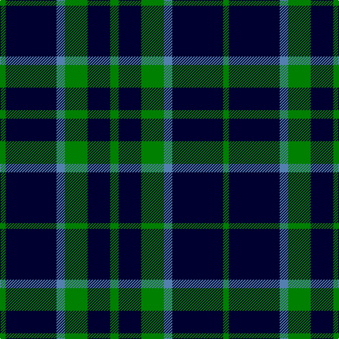

In pattern [GKBGKG](/patterns/gkbgkg/).

This was sourced from weddslist.  It is a [6 stripes tartan](/stripes/stripes6/).

Original link http://www.weddslist.com/cgi-bin/tartans/pg.pl?source=sts

## Thread count
G/8 DB72 B12 G32 DB32 G/12

## Palette
Each colour and its ΔE from the base-6 reference it is a variant of.

| Colour | Shade | Base | ΔE (OKLab) |
|---|---|---|---|
| B | <code style="background-color:#5480B0;">#5480B0</code> `#5480B0` | B <code style="background-color:#2C4084;">#2C4084</code> | 0.20 |
| DB | <code style="background-color:#000030;">#000030</code> `#000030` | K <code style="background-color:#000000;">#000000</code> | 0.17 |
| G | <code style="background-color:#008000;">#008000</code> `#008000` | G <code style="background-color:#006400;">#006400</code> | 0.09 |

# Sample pattern

## Nearest tartans

The nearest existing variants by ΔTartan distance.

1. [Campbell of Loch Awe](/setts/s5/k4b22k52g22k4-b1474b4-g006818-k101010/) — ΔT 1.43
1. [Frame (Edinburgh) (Personal)](/setts/s7/k32g30k8b24k44w4k12-b2888c4-g006818-k101010-wfcfcfc/) — ΔT 1.45
1. [St. Dennis & Cranley School](/setts/s7/b4g48b16w4b16g16b4-b1c0070-g006818-wc0c0c0/) — ΔT 1.48
1. [Campbell of Lochawe](/setts/s5/k4b22k52g22k4-b304080-g008000-k000000/) — ΔT 1.53
1. [MacIntyre L](/setts/s6/g4b12r3b12g32w4-b000064-g004c00-rc80000-wd0d0d0/) — ΔT 1.55
1. [Slanj (Corporate)](/setts/s6/r8k56b6k6b50k6-b1474b4-k101010-r9c68a4/) — ΔT 1.56
1. [Martin's Own](/setts/s8/k40b4k8b4k16b40g4b8-b5c8ca8-g289c18-k101010/) — ΔT 1.56
1. [Hamilton Green Hunting](/setts/s5/b32g8b32g60w8-b1c0070-g006818-wc0c0c0/) — ΔT 1.57
1. [Wild Highlanders (Corporate)](/setts/s7/k72w6k20w6g56r12k36-g00643c-k101010-r901c38-wfcfcfc/) — ΔT 1.59
1. [Burberry Blue](/setts/s5/y18k18y18k60r6-k000034-r8c0000-yb0b0b0/) — ΔT 1.60

## Neighbour map

Every grey dot is one of 15726 variants placed by the first two principal components of the ΔTartan feature space (44% of its variance). Red is this tartan; blue dots are its nearest — click one to open its page.

<svg viewBox="0 0 640 380" role="img" style="max-width:100%;height:auto;border:1px solid #e0e0e0;border-radius:4px;display:block" xmlns="http://www.w3.org/2000/svg"><image href="/nn/cloud.v1.png" width="640" height="380"/><a href="/setts/s5/k4b22k52g22k4-b1474b4-g006818-k101010/"><circle cx="348.3" cy="240.8" r="4" fill="#3465a4"><title>Campbell of Loch Awe</title></circle></a><a href="/setts/s7/k32g30k8b24k44w4k12-b2888c4-g006818-k101010-wfcfcfc/"><circle cx="303.9" cy="231.1" r="4" fill="#3465a4"><title>Frame (Edinburgh) (Personal)</title></circle></a><a href="/setts/s7/b4g48b16w4b16g16b4-b1c0070-g006818-wc0c0c0/"><circle cx="367.2" cy="221.9" r="4" fill="#3465a4"><title>St. Dennis &amp; Cranley School</title></circle></a><a href="/setts/s5/k4b22k52g22k4-b304080-g008000-k000000/"><circle cx="321.1" cy="232.6" r="4" fill="#3465a4"><title>Campbell of Lochawe</title></circle></a><a href="/setts/s6/g4b12r3b12g32w4-b000064-g004c00-rc80000-wd0d0d0/"><circle cx="298.2" cy="215.7" r="4" fill="#3465a4"><title>MacIntyre L</title></circle></a><a href="/setts/s6/r8k56b6k6b50k6-b1474b4-k101010-r9c68a4/"><circle cx="320.9" cy="225.1" r="4" fill="#3465a4"><title>Slanj (Corporate)</title></circle></a><a href="/setts/s8/k40b4k8b4k16b40g4b8-b5c8ca8-g289c18-k101010/"><circle cx="307.8" cy="207.4" r="4" fill="#3465a4"><title>Martin's Own</title></circle></a><a href="/setts/s5/b32g8b32g60w8-b1c0070-g006818-wc0c0c0/"><circle cx="280.7" cy="268.9" r="4" fill="#3465a4"><title>Hamilton Green Hunting</title></circle></a><a href="/setts/s7/k72w6k20w6g56r12k36-g00643c-k101010-r901c38-wfcfcfc/"><circle cx="327.3" cy="207.6" r="4" fill="#3465a4"><title>Wild Highlanders (Corporate)</title></circle></a><a href="/setts/s5/y18k18y18k60r6-k000034-r8c0000-yb0b0b0/"><circle cx="350.8" cy="237.1" r="4" fill="#3465a4"><title>Burberry Blue</title></circle></a><circle cx="336.5" cy="246.7" r="5" fill="#c00000"/></svg>

ID: /setts/s6/g12k32g32b12k72g8-b5480b0-g008000-k000030/
