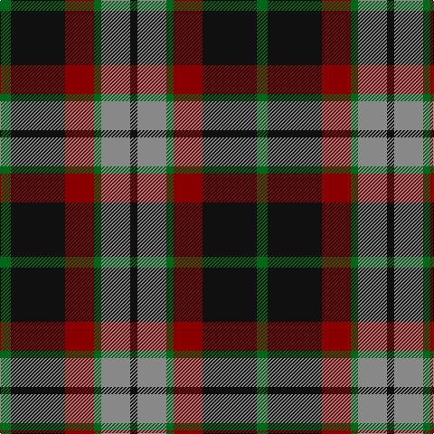

In pattern [GKRGRK](/patterns/gkrgrk/).

This was sourced from tartans-authority.  It is a [6 stripes tartan](/stripes/stripes6/).

Original link http://www.tartansauthority.com/tartan-ferret/display/5429/

## Attestations

This cloth appears in 2 source records; the oldest owns this page.

- pre 2002 — Lindsay Htg (Clan?) (tartans-authority, [record](http://www.tartansauthority.com/tartan-ferret/display/5429/))
- undated — Lindsay Hunting Clan/Family Tartan Tartan Number: 5429. Earliest known date: pre 2002 Sample in STA Johnston Collection. The history of this is not known and it may just be a fashion tartan from Pringles. The sett is the same as Thompson. See products available Copyright © Blair Urquhart, Comrie, 2015 (house-of-tartan, [record](http://www.house-of-tartan.scotland.net/house/TartanViewjs.asp?colr=Def&tnam=5429))

## Thread count
G/12 K60 DR32 G8 N32 K/8

## Palette
Each colour and its ΔE from the base-6 reference it is a variant of.

| Colour | Shade | Base | ΔE (OKLab) |
|---|---|---|---|
| DR | <code style="background-color:#880000;">#880000</code> `#880000` | R <code style="background-color:#CC0000;">#CC0000</code> | 0.15 |
| G | <code style="background-color:#006818;">#006818</code> `#006818` | G <code style="background-color:#006100;">#006100</code> | 0.02 |
| K | <code style="background-color:#101010;">#101010</code> `#101010` | K <code style="background-color:#000000;">#000000</code> | 0.17 |
| N | <code style="background-color:#888888;">#888888</code> `#888888` | R <code style="background-color:#CC0000;">#CC0000</code> | 0.24 |

# Sample pattern

## Nearest tartans

The nearest existing variants by ΔTartan distance.

1. [Thompson Black (Fashion)](/setts/s6/g12k60r32g8ra32k8-g006818-k101010-rc80000-ra888888/) — ΔT 0.52
1. [Portrait, The](/setts/s6/b8r44b8k44b64w8-b441800-k101010-ra07c58-we8ccb8/) — ΔT 0.59
1. [Eyre (Personal)](/setts/s6/r6b24r8g36r12k4-b202060-g006818-k101010-rc80000/) — ΔT 0.78
1. [MacMillan - 2002 (Black - Unofficial](/setts/s6/g6k62r34g12y36k6-g004810-k101010-r880000-ybc8c00/) — ΔT 0.85
1. [MacArthur of Milton Hunting Clan Tartan Tartan Number: 700. Earliest known date: 1823 This is the older of the two MacArthur setts, which links the clan with the Campbells. See products available Copyright © Blair Urquhart, Comrie, 2015](/setts/s6/g28b4g4k16ba18k4-b2c2c80-ba780078-g006818-k101010/) — ΔT 0.89
1. [British Hills](/setts/s5/r8g68r32b32y8-b2c4084-g003c14-rff0000-ye8c000/) — ΔT 1.07
1. [Ardmore (Fashion)](/setts/s8/k42r4k16w4r32b12k4b16-b5c5c5c-k101010-ra07c58-we0e0e0/) — ΔT 1.08
1. [Denny Hunting](/setts/s6/k8g10k4g10r34b4-b00008c-g004c00-k000000-r8c0000/) — ΔT 1.09
1. [MacTavish #2](/setts/s6/b8r48ba8b24k24b8-b5c8ca8-ba1c0070-k101010-r880000/) — ΔT 1.11
1. [MacTavish Hunting](/setts/s6/b8g56ga12b24k24b6-b5c8ca8-g603800-ga006818-k101010/) — ΔT 1.12

## Neighbour map

Every grey dot is one of 15726 variants placed by the first two principal components of the ΔTartan feature space (44% of its variance). Red is this tartan; blue dots are its nearest — click one to open its page.

<svg viewBox="0 0 640 380" role="img" style="max-width:100%;height:auto;border:1px solid #e0e0e0;border-radius:4px;display:block" xmlns="http://www.w3.org/2000/svg"><image href="/nn/cloud.v1.png" width="640" height="380"/><a href="/setts/s6/g12k60r32g8ra32k8-g006818-k101010-rc80000-ra888888/"><circle cx="199.7" cy="222.8" r="4" fill="#3465a4"><title>Thompson Black (Fashion)</title></circle></a><a href="/setts/s6/b8r44b8k44b64w8-b441800-k101010-ra07c58-we8ccb8/"><circle cx="231.5" cy="224.8" r="4" fill="#3465a4"><title>Portrait, The</title></circle></a><a href="/setts/s6/r6b24r8g36r12k4-b202060-g006818-k101010-rc80000/"><circle cx="213.7" cy="221.9" r="4" fill="#3465a4"><title>Eyre (Personal)</title></circle></a><a href="/setts/s6/g6k62r34g12y36k6-g004810-k101010-r880000-ybc8c00/"><circle cx="216.4" cy="209.9" r="4" fill="#3465a4"><title>MacMillan - 2002 (Black - Unofficial</title></circle></a><a href="/setts/s6/g28b4g4k16ba18k4-b2c2c80-ba780078-g006818-k101010/"><circle cx="218.8" cy="242.0" r="4" fill="#3465a4"><title>MacArthur of Milton Hunting Clan Tartan Tartan Number: 700. Earliest known date: 1823 This is the older of the two MacArthur setts, which links the clan with the Campbells. See products available Copyright © Blair Urquhart, Comrie, 2015</title></circle></a><a href="/setts/s5/r8g68r32b32y8-b2c4084-g003c14-rff0000-ye8c000/"><circle cx="219.7" cy="221.6" r="4" fill="#3465a4"><title>British Hills</title></circle></a><a href="/setts/s8/k42r4k16w4r32b12k4b16-b5c5c5c-k101010-ra07c58-we0e0e0/"><circle cx="237.2" cy="196.5" r="4" fill="#3465a4"><title>Ardmore (Fashion)</title></circle></a><a href="/setts/s6/k8g10k4g10r34b4-b00008c-g004c00-k000000-r8c0000/"><circle cx="265.3" cy="214.7" r="4" fill="#3465a4"><title>Denny Hunting</title></circle></a><a href="/setts/s6/b8r48ba8b24k24b8-b5c8ca8-ba1c0070-k101010-r880000/"><circle cx="191.2" cy="233.8" r="4" fill="#3465a4"><title>MacTavish #2</title></circle></a><a href="/setts/s6/b8g56ga12b24k24b6-b5c8ca8-g603800-ga006818-k101010/"><circle cx="235.5" cy="227.2" r="4" fill="#3465a4"><title>MacTavish Hunting</title></circle></a><circle cx="210.8" cy="230.7" r="5" fill="#c00000"/></svg>

ID: /setts/s6/g12k60r32g8ra32k8-g006818-k101010-r880000-ra888888/
