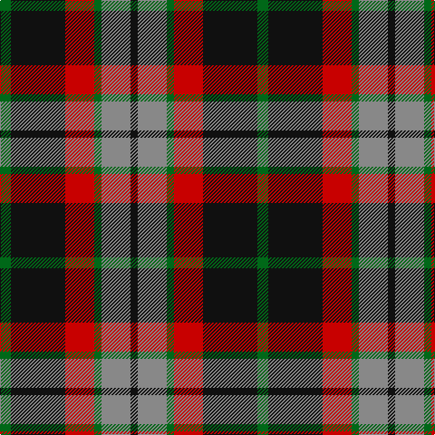

In pattern [GKRGRK](/patterns/gkrgrk/).

This was sourced from tartans-authority.  It is a [6 stripes tartan](/stripes/stripes6/).

Original link http://www.tartansauthority.com/tartan-ferret/display/3596/

## Attestations

This cloth appears in 2 source records; the oldest owns this page.

- pre 1987 — Thompson Black (Fashion) (tartans-authority, [record](http://www.tartansauthority.com/tartan-ferret/display/3596/))
- undated — Thompson Black (register-of-tartans, [record](https://www.tartanregister.gov.uk/tartanDetails.aspx?ref=5196))

## Thread count
G/12 K60 R32 G8 N32 K/8

## Palette
Each colour and its ΔE from the base-6 reference it is a variant of.

| Colour | Shade | Base | ΔE (OKLab) |
|---|---|---|---|
| G | <code style="background-color:#006818;">#006818</code> `#006818` | G <code style="background-color:#006400;">#006400</code> | 0.02 |
| K | <code style="background-color:#101010;">#101010</code> `#101010` | K <code style="background-color:#000000;">#000000</code> | 0.17 |
| N | <code style="background-color:#888888;">#888888</code> `#888888` | R <code style="background-color:#C80000;">#C80000</code> | 0.24 |
| R | <code style="background-color:#C80000;">#C80000</code> `#C80000` | R <code style="background-color:#C80000;">#C80000</code> | 0.00 |

# Sample pattern

## Nearest tartans

The nearest existing variants by ΔTartan distance.

1. [Lindsay Htg (Clan?)](/setts/s6/g12k60r32g8ra32k8-g006818-k101010-r880000-ra888888/) — ΔT 0.52
1. [Portrait, The](/setts/s6/b8r44b8k44b64w8-b441800-k101010-ra07c58-we8ccb8/) — ΔT 0.62
1. [MacMillan - 2002 (Black - Unofficial](/setts/s6/g6k62r34g12y36k6-g004810-k101010-r880000-ybc8c00/) — ΔT 0.74
1. [British Hills](/setts/s5/r8g68r32b32y8-b2c4084-g003c14-rff0000-ye8c000/) — ΔT 0.75
1. [Eyre (Personal)](/setts/s6/r6b24r8g36r12k4-b202060-g006818-k101010-rc80000/) — ΔT 0.92
1. [Wcwm 759-3](/setts/s6/w10r68k48r8ra48r8-k000000-r8c8c8c-ra8c0000-wc8c8c8/) — ΔT 0.98
1. [Daks](/setts/s8/r6k14r4w4ra24k4ra4r6-k000000-r806050-ra906030-we0e0e0/) — ΔT 0.99
1. [Manson Family Tartan Tartan Number: 987. Earliest known date: 1983 The official recording of the sett shows the letter G for the dark green stripe. In heraldic terms this means 'Gules' - red. The designer, Hugh Kirkwood Rankine, clearly intended dark green and this is reproduced here. See products available Copyright © Blair Urquhart, Comrie, 2015](/setts/s8/g2r18g6k6g6r2k18w2-g006818-k101010-rc80000-we0e0e0/) — ΔT 1.00
1. [Montrose](/setts/s9/b4k4r28g30k16b14r28k4b4-b4367ae-g11450d-k000000-raa0000/) — ΔT 1.03
1. [Montrose](/setts/s9/b2k2r14g15k8b7r14k2b2-b4367ae-g11450d-k000000-raa0000/) — ΔT 1.03

## Neighbour map

Every grey dot is one of 15726 variants placed by the first two principal components of the ΔTartan feature space (44% of its variance). Red is this tartan; blue dots are its nearest — click one to open its page.

<svg viewBox="0 0 640 380" role="img" style="max-width:100%;height:auto;border:1px solid #e0e0e0;border-radius:4px;display:block" xmlns="http://www.w3.org/2000/svg"><image href="/nn/cloud.v1.png" width="640" height="380"/><a href="/setts/s6/g12k60r32g8ra32k8-g006818-k101010-r880000-ra888888/"><circle cx="210.8" cy="230.7" r="4" fill="#3465a4"><title>Lindsay Htg (Clan?)</title></circle></a><a href="/setts/s6/b8r44b8k44b64w8-b441800-k101010-ra07c58-we8ccb8/"><circle cx="231.5" cy="224.8" r="4" fill="#3465a4"><title>Portrait, The</title></circle></a><a href="/setts/s6/g6k62r34g12y36k6-g004810-k101010-r880000-ybc8c00/"><circle cx="216.4" cy="209.9" r="4" fill="#3465a4"><title>MacMillan - 2002 (Black - Unofficial</title></circle></a><a href="/setts/s5/r8g68r32b32y8-b2c4084-g003c14-rff0000-ye8c000/"><circle cx="219.7" cy="221.6" r="4" fill="#3465a4"><title>British Hills</title></circle></a><a href="/setts/s6/r6b24r8g36r12k4-b202060-g006818-k101010-rc80000/"><circle cx="213.7" cy="221.9" r="4" fill="#3465a4"><title>Eyre (Personal)</title></circle></a><a href="/setts/s6/w10r68k48r8ra48r8-k000000-r8c8c8c-ra8c0000-wc8c8c8/"><circle cx="189.6" cy="203.8" r="4" fill="#3465a4"><title>Wcwm 759-3</title></circle></a><a href="/setts/s8/r6k14r4w4ra24k4ra4r6-k000000-r806050-ra906030-we0e0e0/"><circle cx="173.0" cy="203.3" r="4" fill="#3465a4"><title>Daks</title></circle></a><a href="/setts/s8/g2r18g6k6g6r2k18w2-g006818-k101010-rc80000-we0e0e0/"><circle cx="201.4" cy="192.4" r="4" fill="#3465a4"><title>Manson Family Tartan Tartan Number: 987. Earliest known date: 1983 The official recording of the sett shows the letter G for the dark green stripe. In heraldic terms this means 'Gules' - red. The designer, Hugh Kirkwood Rankine, clearly intended dark green and this is reproduced here. See products available Copyright © Blair Urquhart, Comrie, 2015</title></circle></a><a href="/setts/s9/b4k4r28g30k16b14r28k4b4-b4367ae-g11450d-k000000-raa0000/"><circle cx="182.4" cy="202.9" r="4" fill="#3465a4"><title>Montrose</title></circle></a><a href="/setts/s9/b2k2r14g15k8b7r14k2b2-b4367ae-g11450d-k000000-raa0000/"><circle cx="182.4" cy="202.9" r="4" fill="#3465a4"><title>Montrose</title></circle></a><circle cx="199.7" cy="222.8" r="5" fill="#c00000"/></svg>

ID: /setts/s6/g12k60r32g8ra32k8-g006818-k101010-rc80000-ra888888/
