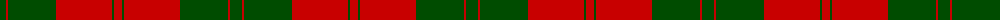
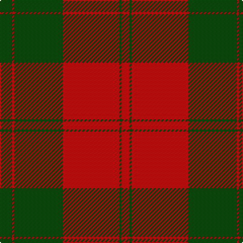

In pattern [GRGRGR](/patterns/grgrgr/).

This was sourced from weddslist.  It is a [6 stripes tartan](/stripes/stripes6/).

Original link http://www.weddslist.com/cgi-bin/tartans/pg.pl?source=rb

## Thread count
G/12 R2 G48 R56 G2 R/8

## Palette
Each colour and its ΔE from the base-6 reference it is a variant of.

| Colour | Shade | Base | ΔE (OKLab) |
|---|---|---|---|
| G | <code style="background-color:#004C00;">#004C00</code> `#004C00` | G <code style="background-color:#006100;">#006100</code> | 0.07 |
| R | <code style="background-color:#C80000;">#C80000</code> `#C80000` | R <code style="background-color:#CC0000;">#CC0000</code> | 0.01 |

# Sample pattern

## Nearest tartans

The nearest existing variants by ΔTartan distance.

1. [Erskine (Green & Red) Clan Tartan Tartan Number: 891. Earliest known date: 1842 The Erskine clan or family originated in Renfrewshire. The first published version of the tartan appeared in the Vestiarium Scoticum, a romantic history of Scottish dress produced in 1842 by the Sobieski brothers. Cunningham tartan, published in the same work, differs only in the addition of a white stripe between the narrow green lines. Cunningham was one of the names adopted by the MacGregors, and this provides a tenuous connection which might explain the origin of the design. See products available Copyright © Blair Urquhart, Comrie, 2015](/setts/s6/g12r2g48r56g2r8-g006818-rc80000/) — ΔT 0.48
1. [Erskine (Vestiarium Scoticum)](/setts/s6/g12r2g48r56g2r8-g00643c-rc80000/) — ΔT 0.65
1. [Erskine](/setts/s6/g12r2g48r56g2r8-g008000-rc00000/) — ΔT 0.83
1. [Erskine](/setts/s6/g12r2g48r56g2r8-g11450d-raa0000/) — ΔT 1.02
1. [MacQuarrie](/setts/s6/r32g2r2g2r8g24-g004c00-rc80000/) — ΔT 1.21
1. [MacQuarrie 7](/setts/s6/r32g2r2g2r8g24-g004010-rc00000/) — ΔT 1.25
1. [MacQuarrie #5](/setts/s6/r64g4r4g4r16g48-g006818-rc80000/) — ΔT 1.26
1. [Unidentified Cant #09](/setts/s8/r44b2g26r3b2r3g26b2-b2c2c80-g006818-rc80000/) — ΔT 1.35
1. [MacGregor of Glenstrae](/setts/s5/g16r4g18r32g2-g005020-rdc0000/) — ΔT 1.36
1. [MacGregor of Glen Straye Htg Clan Tartan Tartan Number: 866. Earliest known date: 1842 This sett appears in the text of the Vestiarium but is not illustrated. Glen Straye (Glenstrae) lies in the heart of Campbell country and was the scene of a noteable period in the history of Clan Gregor which led to the prosciption of the name. See products available Copyright © Blair Urquhart, Comrie, 2015](/setts/s5/g16r4g18r32g2-g006818-rc80000/) — ΔT 1.39

## Neighbour map

Every grey dot is one of 15726 variants placed by the first two principal components of the ΔTartan feature space (44% of its variance). Red is this tartan; blue dots are its nearest — click one to open its page.

<svg viewBox="0 0 640 380" role="img" style="max-width:100%;height:auto;border:1px solid #e0e0e0;border-radius:4px;display:block" xmlns="http://www.w3.org/2000/svg"><image href="/nn/cloud.v1.png" width="640" height="380"/><a href="/setts/s6/g12r2g48r56g2r8-g006818-rc80000/"><circle cx="438.9" cy="196.0" r="4" fill="#3465a4"><title>Erskine (Green &amp; Red) Clan Tartan Tartan Number: 891. Earliest known date: 1842 The Erskine clan or family originated in Renfrewshire. The first published version of the tartan appeared in the Vestiarium Scoticum, a romantic history of Scottish dress produced in 1842 by the Sobieski brothers. Cunningham tartan, published in the same work, differs only in the addition of a white stripe between the narrow green lines. Cunningham was one of the names adopted by the MacGregors, and this provides a tenuous connection which might explain the origin of the design. See products available Copyright © Blair Urquhart, Comrie, 2015</title></circle></a><a href="/setts/s6/g12r2g48r56g2r8-g00643c-rc80000/"><circle cx="444.9" cy="198.1" r="4" fill="#3465a4"><title>Erskine (Vestiarium Scoticum)</title></circle></a><a href="/setts/s6/g12r2g48r56g2r8-g008000-rc00000/"><circle cx="431.8" cy="193.9" r="4" fill="#3465a4"><title>Erskine</title></circle></a><a href="/setts/s6/g12r2g48r56g2r8-g11450d-raa0000/"><circle cx="462.4" cy="209.4" r="4" fill="#3465a4"><title>Erskine</title></circle></a><a href="/setts/s6/r32g2r2g2r8g24-g004c00-rc80000/"><circle cx="453.7" cy="213.0" r="4" fill="#3465a4"><title>MacQuarrie</title></circle></a><a href="/setts/s6/r32g2r2g2r8g24-g004010-rc00000/"><circle cx="456.6" cy="215.2" r="4" fill="#3465a4"><title>MacQuarrie 7</title></circle></a><a href="/setts/s6/r64g4r4g4r16g48-g006818-rc80000/"><circle cx="458.5" cy="214.8" r="4" fill="#3465a4"><title>MacQuarrie #5</title></circle></a><a href="/setts/s8/r44b2g26r3b2r3g26b2-b2c2c80-g006818-rc80000/"><circle cx="375.5" cy="168.8" r="4" fill="#3465a4"><title>Unidentified Cant #09</title></circle></a><a href="/setts/s5/g16r4g18r32g2-g005020-rdc0000/"><circle cx="383.2" cy="238.9" r="4" fill="#3465a4"><title>MacGregor of Glenstrae</title></circle></a><a href="/setts/s5/g16r4g18r32g2-g006818-rc80000/"><circle cx="395.4" cy="246.5" r="4" fill="#3465a4"><title>MacGregor of Glen Straye Htg Clan Tartan Tartan Number: 866. Earliest known date: 1842 This sett appears in the text of the Vestiarium but is not illustrated. Glen Straye (Glenstrae) lies in the heart of Campbell country and was the scene of a noteable period in the history of Clan Gregor which led to the prosciption of the name. See products available Copyright © Blair Urquhart, Comrie, 2015</title></circle></a><circle cx="434.7" cy="194.5" r="5" fill="#c00000"/></svg>

ID: /setts/s6/g12r2g48r56g2r8-g004c00-rc80000/
