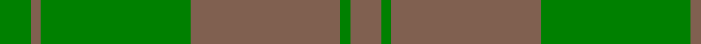

In pattern [GRGRGR](/patterns/grgrgr/).

This was sourced from weddslist.  It is a [6 stripes tartan](/stripes/stripes6/).

Original link http://www.weddslist.com/cgi-bin/tartans/pg.pl?source=sts

## Thread count
G/12 LT4 G58 LT58 G4 LT/12

## Palette
Each colour and its ΔE from the base-6 reference it is a variant of.

| Colour | Shade | Base | ΔE (OKLab) |
|---|---|---|---|
| G | <code style="background-color:#008000;">#008000</code> `#008000` | G <code style="background-color:#006400;">#006400</code> | 0.09 |
| LT | <code style="background-color:#806050;">#806050</code> `#806050` | R <code style="background-color:#C80000;">#C80000</code> | 0.17 |

# Sample pattern

## Nearest tartans

The nearest existing variants by ΔTartan distance.

1. [Spring Morning (Fashion)](/setts/s4/g4ga36g36y4-g006818-ga74846c-yd09800/) — ΔT 1.62
1. [Spring Morning](/setts/s6/g36ga36y4ga36g36ga4-g74846c-ga006818-yd09800/) — ΔT 1.82
1. [Erskine Hunting](/setts/s6/g10ga6g48ga48g6ga10-g003820-ga006818/) — ΔT 1.97
1. [Glen Boig](/setts/s5/g74r18g6b18r6-b401000-g006020-r806050/) — ΔT 1.98
1. [Confederate Artillery (Military)](/setts/s6/g4r28g16r6g24ra4-g006818-ra0783c-ra8c0000/) — ΔT 2.02
1. [Barbie's Moss Plaid (Yellow & Green)](/setts/s6/g6y6g40y40g40y6-g5c6428-ybc8c00/) — ΔT 2.04
1. [Celtic 2009 (Sports)](/setts/s5/g80ga30gb8ga8gb8-g006818-ga003820-gb408060/) — ΔT 2.11
1. [Donachie of Brockloch Htg (Clan)](/setts/s10/g48r4g4ga80g50ga4g4r4g4ga40-g487048-ga003820-r880000/) — ΔT 2.15
1. [Carnet (Fashion)](/setts/s6/k24g12k12g44k4g8-g004c00-k28140c/) — ΔT 2.20
1. [Colonial Marine (Corporate)](/setts/s4/g112ga26y26y10-g006818-ga604000-ybc8c00/) — ΔT 2.23

## Neighbour map

Every grey dot is one of 15726 variants placed by the first two principal components of the ΔTartan feature space (44% of its variance). Red is this tartan; blue dots are its nearest — click one to open its page.

<svg viewBox="0 0 640 380" role="img" style="max-width:100%;height:auto;border:1px solid #e0e0e0;border-radius:4px;display:block" xmlns="http://www.w3.org/2000/svg"><image href="/nn/cloud.v1.png" width="640" height="380"/><a href="/setts/s4/g4ga36g36y4-g006818-ga74846c-yd09800/"><circle cx="412.5" cy="303.5" r="4" fill="#3465a4"><title>Spring Morning (Fashion)</title></circle></a><a href="/setts/s6/g36ga36y4ga36g36ga4-g74846c-ga006818-yd09800/"><circle cx="401.3" cy="311.8" r="4" fill="#3465a4"><title>Spring Morning</title></circle></a><a href="/setts/s6/g10ga6g48ga48g6ga10-g003820-ga006818/"><circle cx="475.2" cy="326.1" r="4" fill="#3465a4"><title>Erskine Hunting</title></circle></a><a href="/setts/s5/g74r18g6b18r6-b401000-g006020-r806050/"><circle cx="491.4" cy="262.6" r="4" fill="#3465a4"><title>Glen Boig</title></circle></a><a href="/setts/s6/g4r28g16r6g24ra4-g006818-ra0783c-ra8c0000/"><circle cx="384.9" cy="291.0" r="4" fill="#3465a4"><title>Confederate Artillery (Military)</title></circle></a><a href="/setts/s6/g6y6g40y40g40y6-g5c6428-ybc8c00/"><circle cx="478.8" cy="310.1" r="4" fill="#3465a4"><title>Barbie's Moss Plaid (Yellow &amp; Green)</title></circle></a><a href="/setts/s5/g80ga30gb8ga8gb8-g006818-ga003820-gb408060/"><circle cx="485.4" cy="293.7" r="4" fill="#3465a4"><title>Celtic 2009 (Sports)</title></circle></a><a href="/setts/s10/g48r4g4ga80g50ga4g4r4g4ga40-g487048-ga003820-r880000/"><circle cx="442.4" cy="213.6" r="4" fill="#3465a4"><title>Donachie of Brockloch Htg (Clan)</title></circle></a><a href="/setts/s6/k24g12k12g44k4g8-g004c00-k28140c/"><circle cx="504.3" cy="310.6" r="4" fill="#3465a4"><title>Carnet (Fashion)</title></circle></a><a href="/setts/s4/g112ga26y26y10-g006818-ga604000-ybc8c00/"><circle cx="459.0" cy="274.0" r="4" fill="#3465a4"><title>Colonial Marine (Corporate)</title></circle></a><circle cx="479.7" cy="275.3" r="5" fill="#c00000"/></svg>

ID: /setts/s6/g12r4g58r58g4r12-g008000-r806050/
