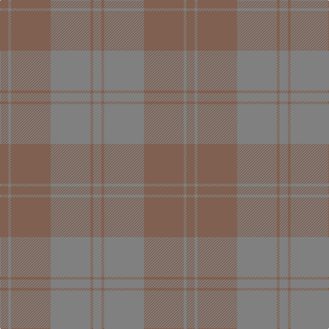

In pattern [GRGRGR](/patterns/grgrgr/).

This was sourced from weddslist.  It is a [6 stripes tartan](/stripes/stripes6/).

Original link http://www.weddslist.com/cgi-bin/tartans/pg.pl?source=sts

## Thread count
LT/12 N4 LT58 N58 LT4 N/12

## Palette
Each colour and its ΔE from the base-6 reference it is a variant of.

| Colour | Shade | Base | ΔE (OKLab) |
|---|---|---|---|
| LT | <code style="background-color:#806050;">#806050</code> `#806050` | R <code style="background-color:#CC0000;">#CC0000</code> | 0.17 |
| N | <code style="background-color:#808080;">#808080</code> `#808080` | G <code style="background-color:#006100;">#006100</code> | 0.23 |

# Sample pattern

## Nearest tartans

The nearest existing variants by ΔTartan distance.

1. [Harmony 11 #2](/setts/s6/g12ga4g58ga58g4ga12-g005020-ga503c14/) — ΔT 2.18
1. [Harmony, No 13](/setts/s6/b20g2b2g20b36g10-b5480b0-g808080/) — ΔT 2.26
1. [Harmony 13](/setts/s6/b20g2b2g20b36g10-b3c82af-g808080/) — ΔT 2.32
1. [Wicklow Irish County Tartan Tartan Number: 2265. Earliest known date: 1995 One of a series of Irish District tartans designed by Polly Wittering of the House of Edgar, with colours reminiscent of the Country with soft warm colours dominating. See products available Copyright © Blair Urquhart, Comrie, 2015](/setts/s10/g4b4ga4b48ba4ga12b6g24b8ga4-b646c84-ba0070a4-g3c6060-ga644c40/) — ΔT 2.61
1. [Bute Heather, Ancient Wth'd (Fashion](/setts/s11/y10b4g16b2g16b8g8b12g36ya2y10-b5c5c5c-g707070-ya08858-yaa0a0a0/) — ΔT 2.67
1. [Loch Garth](/setts/s4/r48ra24r8y4-r806050-ra906030-yf0c000/) — ΔT 2.70
1. [Miyuki, House Check Tan, 1004A](/setts/s8/r6r16ra6r40ra40rb6ra16rb6-r806050-ra906030-rbc00000/) — ΔT 2.79
1. [McKerrell of Hillhouse Dress](/setts/s6/b96r56w8r56b96y6-b5c8ca8-r888888-we0e0e0-ye8c000/) — ΔT 2.96
1. [Burns' Birthplace (Commem)](/setts/s7/r12ra12r12ra12r48ra36y12-rc04c08-raac7000-ybc8c00/) — ΔT 3.47
1. [Outlander #3](/setts/s4/g112b56y48b16-b5c5c5c-g808080-ya08858/) — ΔT 3.48

## Neighbour map

Every grey dot is one of 15726 variants placed by the first two principal components of the ΔTartan feature space (44% of its variance). Red is this tartan; blue dots are its nearest — click one to open its page.

<svg viewBox="0 0 640 380" role="img" style="max-width:100%;height:auto;border:1px solid #e0e0e0;border-radius:4px;display:block" xmlns="http://www.w3.org/2000/svg"><image href="/nn/cloud.v1.png" width="640" height="380"/><a href="/setts/s6/g12ga4g58ga58g4ga12-g005020-ga503c14/"><circle cx="619.3" cy="349.2" r="4" fill="#3465a4"><title>Harmony 11 #2</title></circle></a><a href="/setts/s6/b20g2b2g20b36g10-b5480b0-g808080/"><circle cx="626.0" cy="357.7" r="4" fill="#3465a4"><title>Harmony, No 13</title></circle></a><a href="/setts/s6/b20g2b2g20b36g10-b3c82af-g808080/"><circle cx="626.0" cy="347.5" r="4" fill="#3465a4"><title>Harmony 13</title></circle></a><a href="/setts/s10/g4b4ga4b48ba4ga12b6g24b8ga4-b646c84-ba0070a4-g3c6060-ga644c40/"><circle cx="547.2" cy="276.3" r="4" fill="#3465a4"><title>Wicklow Irish County Tartan Tartan Number: 2265. Earliest known date: 1995 One of a series of Irish District tartans designed by Polly Wittering of the House of Edgar, with colours reminiscent of the Country with soft warm colours dominating. See products available Copyright © Blair Urquhart, Comrie, 2015</title></circle></a><a href="/setts/s11/y10b4g16b2g16b8g8b12g36ya2y10-b5c5c5c-g707070-ya08858-yaa0a0a0/"><circle cx="556.8" cy="272.2" r="4" fill="#3465a4"><title>Bute Heather, Ancient Wth'd (Fashion</title></circle></a><a href="/setts/s4/r48ra24r8y4-r806050-ra906030-yf0c000/"><circle cx="620.4" cy="337.3" r="4" fill="#3465a4"><title>Loch Garth</title></circle></a><a href="/setts/s8/r6r16ra6r40ra40rb6ra16rb6-r806050-ra906030-rbc00000/"><circle cx="551.2" cy="358.7" r="4" fill="#3465a4"><title>Miyuki, House Check Tan, 1004A</title></circle></a><a href="/setts/s6/b96r56w8r56b96y6-b5c8ca8-r888888-we0e0e0-ye8c000/"><circle cx="548.3" cy="309.6" r="4" fill="#3465a4"><title>McKerrell of Hillhouse Dress</title></circle></a><a href="/setts/s7/r12ra12r12ra12r48ra36y12-rc04c08-raac7000-ybc8c00/"><circle cx="514.6" cy="366.0" r="4" fill="#3465a4"><title>Burns' Birthplace (Commem)</title></circle></a><a href="/setts/s4/g112b56y48b16-b5c5c5c-g808080-ya08858/"><circle cx="436.3" cy="362.3" r="4" fill="#3465a4"><title>Outlander #3</title></circle></a><circle cx="626.0" cy="337.9" r="5" fill="#c00000"/></svg>

ID: /setts/s6/g12r4g58r58g4r12-g808080-r806050/
