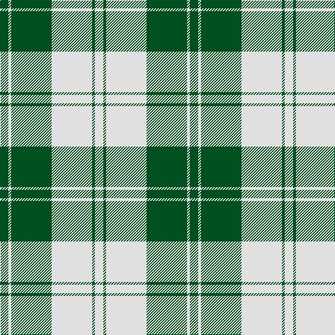

In pattern [GWGWGW](/patterns/gwgwgw/).

This was sourced from register-of-tartans.  It is a [6 stripes tartan](/stripes/stripes6/).

Original link https://www.tartanregister.gov.uk/tartanDetails.aspx?ref=1126

## Thread count
G/12 LN4 G58 LN58 G4 LN/12

## Palette
Each colour and its ΔE from the base-6 reference it is a variant of.

| Colour | Shade | Base | ΔE (OKLab) |
|---|---|---|---|
| G | <code style="background-color:#005020;">#005020</code> `#005020` | G <code style="background-color:#006400;">#006400</code> | 0.08 |
| LN | <code style="background-color:#E0E0E0;">#E0E0E0</code> `#E0E0E0` | W <code style="background-color:#F4F4F0;">#F4F4F0</code> | 0.06 |

# Sample pattern

## Nearest tartans

The nearest existing variants by ΔTartan distance.

1. [Erskine Green Clan Tartan Tartan Number: 941. Earliest known date: pre 2003 A sample of this tartan was recorded by the Scottish Tartans Society during the period 1970 to 1990. See products available Copyright © Blair Urquhart, Comrie, 2015](/setts/s6/g12w4g58w58g4w12-g006818-we0e0e0/) — ΔT 0.59
1. [Erskine, Green (Dance)](/setts/s6/g12w4g58w58g4w12-g006818-wfcfcfc/) — ΔT 0.78
1. [Erskine, Green](/setts/s6/g12w4g58w58g4w12-g008000-we0e0e0/) — ΔT 1.19
1. [MacMugen](/setts/s6/b9w48b12w9b36w6-b003c64-wfcf0c8/) — ΔT 1.46
1. [Erskine (Black and White)](/setts/s6/k12w6k54w54k6w12-k101010-wfcfcfc/) — ΔT 1.56
1. [Erskine, Grey](/setts/s6/b12w4b50w50b4w12-b505050-wc0c0c0/) — ΔT 1.61
1. [Wallace Green Dress Fashion Tartan Tartan Number: 2212. Earliest known date: pre 2004 A dancers tartan based on the Wallace See products available Copyright © Blair Urquhart, Comrie, 2015](/setts/s6/w48g48w4g48w48y4-g006818-we0e0e0-ya08858/) — ΔT 1.64
1. [Bundy, Dress Black Personal)](/setts/s8/g4g4w4g60w60g4w4g4-g006818-wf8f8f8/) — ΔT 1.64
1. [Forbes Dress (Clans Originaux)](/setts/s7/w12b6w40k4w6k50w6-b1474b4-k101010-wfcfcfc/) — ΔT 1.65
1. [Stutterheim](/setts/s6/k4y18b44k3y10k4-b565c76-k101010-yecdc8e/) — ΔT 1.66

## Neighbour map

Every grey dot is one of 15726 variants placed by the first two principal components of the ΔTartan feature space (44% of its variance). Red is this tartan; blue dots are its nearest — click one to open its page.

<svg viewBox="0 0 640 380" role="img" style="max-width:100%;height:auto;border:1px solid #e0e0e0;border-radius:4px;display:block" xmlns="http://www.w3.org/2000/svg"><image href="/nn/cloud.v1.png" width="640" height="380"/><a href="/setts/s6/g12w4g58w58g4w12-g006818-we0e0e0/"><circle cx="332.4" cy="204.3" r="4" fill="#3465a4"><title>Erskine Green Clan Tartan Tartan Number: 941. Earliest known date: pre 2003 A sample of this tartan was recorded by the Scottish Tartans Society during the period 1970 to 1990. See products available Copyright © Blair Urquhart, Comrie, 2015</title></circle></a><a href="/setts/s6/g12w4g58w58g4w12-g006818-wfcfcfc/"><circle cx="319.6" cy="197.5" r="4" fill="#3465a4"><title>Erskine, Green (Dance)</title></circle></a><a href="/setts/s6/g12w4g58w58g4w12-g008000-we0e0e0/"><circle cx="340.3" cy="207.6" r="4" fill="#3465a4"><title>Erskine, Green</title></circle></a><a href="/setts/s6/b9w48b12w9b36w6-b003c64-wfcf0c8/"><circle cx="294.5" cy="229.7" r="4" fill="#3465a4"><title>MacMugen</title></circle></a><a href="/setts/s6/k12w6k54w54k6w12-k101010-wfcfcfc/"><circle cx="294.5" cy="217.3" r="4" fill="#3465a4"><title>Erskine (Black and White)</title></circle></a><a href="/setts/s6/b12w4b50w50b4w12-b505050-wc0c0c0/"><circle cx="356.6" cy="221.8" r="4" fill="#3465a4"><title>Erskine, Grey</title></circle></a><a href="/setts/s6/w48g48w4g48w48y4-g006818-we0e0e0-ya08858/"><circle cx="273.3" cy="225.4" r="4" fill="#3465a4"><title>Wallace Green Dress Fashion Tartan Tartan Number: 2212. Earliest known date: pre 2004 A dancers tartan based on the Wallace See products available Copyright © Blair Urquhart, Comrie, 2015</title></circle></a><a href="/setts/s8/g4g4w4g60w60g4w4g4-g006818-wf8f8f8/"><circle cx="293.5" cy="145.6" r="4" fill="#3465a4"><title>Bundy, Dress Black Personal)</title></circle></a><a href="/setts/s7/w12b6w40k4w6k50w6-b1474b4-k101010-wfcfcfc/"><circle cx="281.0" cy="173.0" r="4" fill="#3465a4"><title>Forbes Dress (Clans Originaux)</title></circle></a><a href="/setts/s6/k4y18b44k3y10k4-b565c76-k101010-yecdc8e/"><circle cx="304.6" cy="179.1" r="4" fill="#3465a4"><title>Stutterheim</title></circle></a><circle cx="326.4" cy="201.9" r="5" fill="#c00000"/></svg>

ID: /setts/s6/g12w4g58w58g4w12-g005020-we0e0e0/
