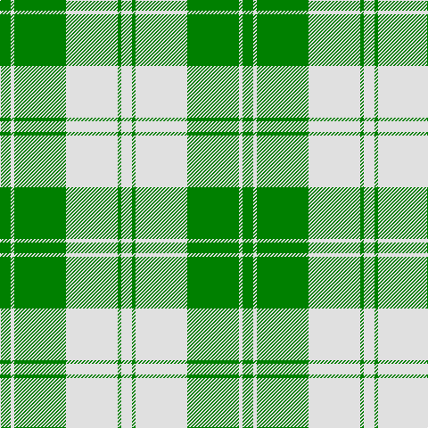

In pattern [GWGWGW](/patterns/gwgwgw/).

This was sourced from weddslist.  It is a [6 stripes tartan](/stripes/stripes6/).

Original link http://www.weddslist.com/cgi-bin/tartans/pg.pl?source=sts

## Thread count
G/12 LN4 G58 LN58 G4 LN/12

## Palette
Each colour and its ΔE from the base-6 reference it is a variant of.

| Colour | Shade | Base | ΔE (OKLab) |
|---|---|---|---|
| G | <code style="background-color:#008000;">#008000</code> `#008000` | G <code style="background-color:#006100;">#006100</code> | 0.10 |
| LN | <code style="background-color:#E0E0E0;">#E0E0E0</code> `#E0E0E0` | W <code style="background-color:#F7F7F7;">#F7F7F7</code> | 0.07 |

# Sample pattern

## Nearest tartans

The nearest existing variants by ΔTartan distance.

1. [Erskine Green Clan Tartan Tartan Number: 941. Earliest known date: pre 2003 A sample of this tartan was recorded by the Scottish Tartans Society during the period 1970 to 1990. See products available Copyright © Blair Urquhart, Comrie, 2015](/setts/s6/g12w4g58w58g4w12-g006818-we0e0e0/) — ΔT 0.60
1. [Erskine, Green (Dance)](/setts/s6/g12w4g58w58g4w12-g006818-wfcfcfc/) — ΔT 0.84
1. [Erskine Green](/setts/s6/g12w4g58w58g4w12-g005020-we0e0e0/) — ΔT 1.19
1. [Wallace Green Dress Fashion Tartan Tartan Number: 2212. Earliest known date: pre 2004 A dancers tartan based on the Wallace See products available Copyright © Blair Urquhart, Comrie, 2015](/setts/s6/w48g48w4g48w48y4-g006818-we0e0e0-ya08858/) — ΔT 1.63
1. [Bundy, Dress Black Personal)](/setts/s8/g4g4w4g60w60g4w4g4-g006818-wf8f8f8/) — ΔT 1.67
1. [Lewis, Green (Dance)](/setts/s4/g8w70ga62w8-g003820-ga006818-wf0e0c8/) — ΔT 1.73
1. [O'Neill](/setts/s9/w4g2w4r12w20g12w4r2w4-g008000-r806050-we0e0e0/) — ΔT 2.03
1. [Cunningham Dress Green (Dance)](/setts/s7/w10g4w68g68k4g4y8-g289c18-k101010-wf8f8f8-ye8c000/) — ΔT 2.04
1. [Burns (Fashion)](/setts/s6/w60b24w4b12r12w4-b3c3c3c-rb0781c-wf8f4d0/) — ΔT 2.04
1. [Fallow Deer, The](/setts/s6/r12w68r44w8r44w8-r9c8000-wf8f4d0/) — ΔT 2.05

## Neighbour map

Every grey dot is one of 15726 variants placed by the first two principal components of the ΔTartan feature space (44% of its variance). Red is this tartan; blue dots are its nearest — click one to open its page.

<svg viewBox="0 0 640 380" role="img" style="max-width:100%;height:auto;border:1px solid #e0e0e0;border-radius:4px;display:block" xmlns="http://www.w3.org/2000/svg"><image href="/nn/cloud.v1.png" width="640" height="380"/><a href="/setts/s6/g12w4g58w58g4w12-g006818-we0e0e0/"><circle cx="332.4" cy="204.3" r="4" fill="#3465a4"><title>Erskine Green Clan Tartan Tartan Number: 941. Earliest known date: pre 2003 A sample of this tartan was recorded by the Scottish Tartans Society during the period 1970 to 1990. See products available Copyright © Blair Urquhart, Comrie, 2015</title></circle></a><a href="/setts/s6/g12w4g58w58g4w12-g006818-wfcfcfc/"><circle cx="319.6" cy="197.5" r="4" fill="#3465a4"><title>Erskine, Green (Dance)</title></circle></a><a href="/setts/s6/g12w4g58w58g4w12-g005020-we0e0e0/"><circle cx="326.4" cy="201.9" r="4" fill="#3465a4"><title>Erskine Green</title></circle></a><a href="/setts/s6/w48g48w4g48w48y4-g006818-we0e0e0-ya08858/"><circle cx="273.3" cy="225.4" r="4" fill="#3465a4"><title>Wallace Green Dress Fashion Tartan Tartan Number: 2212. Earliest known date: pre 2004 A dancers tartan based on the Wallace See products available Copyright © Blair Urquhart, Comrie, 2015</title></circle></a><a href="/setts/s8/g4g4w4g60w60g4w4g4-g006818-wf8f8f8/"><circle cx="293.5" cy="145.6" r="4" fill="#3465a4"><title>Bundy, Dress Black Personal)</title></circle></a><a href="/setts/s4/g8w70ga62w8-g003820-ga006818-wf0e0c8/"><circle cx="282.4" cy="233.4" r="4" fill="#3465a4"><title>Lewis, Green (Dance)</title></circle></a><a href="/setts/s9/w4g2w4r12w20g12w4r2w4-g008000-r806050-we0e0e0/"><circle cx="286.0" cy="192.9" r="4" fill="#3465a4"><title>O'Neill</title></circle></a><a href="/setts/s7/w10g4w68g68k4g4y8-g289c18-k101010-wf8f8f8-ye8c000/"><circle cx="280.2" cy="141.9" r="4" fill="#3465a4"><title>Cunningham Dress Green (Dance)</title></circle></a><a href="/setts/s6/w60b24w4b12r12w4-b3c3c3c-rb0781c-wf8f4d0/"><circle cx="323.2" cy="169.7" r="4" fill="#3465a4"><title>Burns (Fashion)</title></circle></a><a href="/setts/s6/r12w68r44w8r44w8-r9c8000-wf8f4d0/"><circle cx="346.2" cy="241.9" r="4" fill="#3465a4"><title>Fallow Deer, The</title></circle></a><circle cx="340.3" cy="207.6" r="5" fill="#c00000"/></svg>

ID: /setts/s6/g12w4g58w58g4w12-g008000-we0e0e0/
