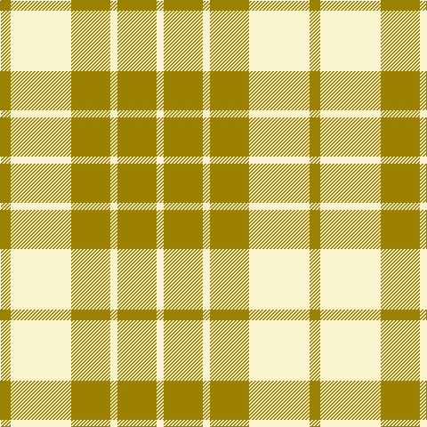

In pattern [GWGWGW](/patterns/gwgwgw/).

This was sourced from register-of-tartans.  It is a [6 stripes tartan](/stripes/stripes6/).

Original link https://www.tartanregister.gov.uk/tartanDetails.aspx?ref=1147

## Thread count
LG/12 LY68 LG44 LY8 LG44 LY/8

## Palette
Each colour and its ΔE from the base-6 reference it is a variant of.

| Colour | Shade | Base | ΔE (OKLab) |
|---|---|---|---|
| LG | <code style="background-color:#9C8000;">#9C8000</code> `#9C8000` | G <code style="background-color:#006400;">#006400</code> | 0.21 |
| LY | <code style="background-color:#F8F4D0;">#F8F4D0</code> `#F8F4D0` | W <code style="background-color:#F4F4F0;">#F4F4F0</code> | 0.04 |

# Sample pattern

ID: /setts/s6/g12w68g44w8g44w8-g9c8000-wf8f4d0/
